# DEVELOPMENT_PLAN.md

> **Project:** MISJustice Alliance Firm — Autonomous Legal Research Platform
> **Version:** 1.0
> **Date:** 2026-04-27
> **Status:** Draft — Ready for Review

---

## Executive Summary

This document defines the phased development plan for transforming the MISJustice Alliance Firm into a fully autonomous, containerized multi-agent legal research platform. The plan covers:

1. **System Architecture** — Seven-layer platform design with Docker Compose service topology, network segmentation, and data-flow orchestration.
2. **Ansible Deployment Framework** — Infrastructure-as-code extension of `openclaw-ansible` with hardened roles for core services, agents, platform, and security.
3. **CrewAI Agent Development** — Conversion of 13 existing agent scaffolds into production CrewAI crews with tool bindings, memory backends, and testing strategy.
4. **Paperclip Control Plane Integration** — Registration of all agents as Paperclip employees, heartbeat adapter design, Hermes human-in-the-loop interface, and audit-trail security.

All components are modular, run in Docker containers, and are deployable via Ansible playbooks to Tailscale-secured infrastructure at `100.106.20.102:3100`.

---

## Phase Roadmap

| Phase | Duration | Deliverable | Owner | Dependencies |
|---|---|---|---|---|
| **P0** — Foundation | 2 weeks | Docker Compose stack running locally; MCAS + PostgreSQL + Redis | DevOps | — |
| **P1** — Agent Framework | 3 weeks | CrewAI orchestrator with 5 crews; all 13 agent definitions; tool wrappers | Backend | P0 |
| **P2** — Platform Layer | 2 weeks | Paperclip company configured; heartbeat adapters; Hermes integration | Integration | P1 |
| **P3** — Hardening | 2 weeks | Ansible playbooks; Tailscale ACLs; secret rotation; audit trails | DevOps | P2 |
| **P4** — E2E Validation | 2 weeks | Integration test suite; staging deployment; operator runbooks | QA / All | P3 |
| **P5** — Production | 1 week | Production cutover; monitoring; backup verification | DevOps | P4 |

**Total Estimated Timeline:** 12 weeks

---

## Table of Contents

- [Section 1 — System Architecture](docs/plan-sections/01-architecture.md)
- [Section 2 — Ansible Deployment Framework](docs/plan-sections/02-deployment.md)
- [Section 3 — CrewAI Agent Development](docs/plan-sections/03-agents.md)
- [Section 4 — Paperclip Control Plane Integration](docs/plan-sections/04-integration.md)

---

*The following sections were authored by a parallel kimi development team and are preserved inline for single-document portability.*


---

# Section 1 — System Architecture

> **Scope:** High-level structural design of the MISJustice Alliance Firm multi-agent platform.  
> **Exclusions:** Implementation source code, Ansible playbooks, CrewAI agent internal logic.  
> **Version:** 1.0  
> **Date:** 2026-04-27

---

## 1.1 Architectural Overview

The MISJustice Alliance Firm operates as a **seven-layer autonomous legal research and advocacy platform**. The architecture separates human interfaces, governance, orchestration, sandboxed execution, agent frameworks, research infrastructure, and the data plane into distinct layers with explicit trust boundaries.

| Layer | Name | Primary Components |
|---|---|---|
| L1 | Human Interface | Hermes Agent, Vane, Open Web UI, n8n HITL |
| L2 | Control Plane | Paperclip — org chart, budgets, approvals, audit |
| L3 | Orchestration | OpenClaw Gateway, CrewAI AMP Suite |
| L4 | Runtime / Sandbox | NemoClaw (NVIDIA-sandboxed agents), OpenShell |
| L5 | Agent Framework | LangChain / LangSmith, agent skill modules |
| L6 | Memory · Research · Search | MemoryPalace, SearXNG, AutoResearchClaw |
| L7 | Data Plane | MCAS, OpenRAG, LawGlance, LiteLLM, Ollama |

All layers communicate across **Docker bridge networks** inside the host and egress through a **Tailscale overlay** (100.106.20.102/32) for encrypted site-to-site connectivity. No component relies on hardcoded credentials; all secrets are injected at runtime via environment variables or Docker secrets.

---

## 1.2 High-Level System Diagram

### 1.2.1 Component Topology

```mermaid
flowchart TB
    subgraph Tailscale["Tailscale Overlay Network (100.106.20.102)"]
        direction TB
        TS[("Tailscale Sidecar<br/>ts-misjustice")]
    end

    subgraph Human["L1 — Human Interface"]
        direction LR
        HERMES["Hermes Agent<br/>(Human-facing TUI / Web)"]
        VANE["Vane<br/>(Operator Research UI)"]
        N8N["n8n<br/>(HITL Approval Workflows)"]
    end

    subgraph Control["L2 — Control Plane"]
        PAPER["Paperclip<br/>(Tasks, Budgets, Approvals)"]
    end

    subgraph Orch["L3 — Orchestration"]
        direction LR
        OC["OpenClaw Gateway<br/>(Agent Dispatch)"]
        CREW["CrewAI Orchestrator<br/>(Crew Composition)"]
    end

    subgraph Sandbox["L4 — Runtime / Sandbox"]
        NEMO["NemoClaw<br/>(NVIDIA GPU Sandbox)"]
    end

    subgraph Agents["L5 — Agent Framework (13 Agents)"]
        direction TB
        LEX["Lex — Lead Counsel"]
        LEX2["Mira — Legal Researcher"]
        LEX3["Casey — Case Investigator"]
        LEX4["Iris — Document Analyst"]
        LEX5["Avery — Intake Coordinator"]
        LEX6["Ollie — Paralegal"]
        LEX7["Rae — Rights Advocate"]
        LEX8["Sol — Systems Liaison"]
        LEX9["Quill — Brief Writer"]
        LEX10["Citation — Citation Auditor"]
        LEX11["Chronology — Timeline Agent"]
        LEX12["Social Media Manager"]
        LEX13["Webmaster"]
    end

    subgraph Data["L7 — Data Plane"]
        direction TB
        MCAS["MCAS<br/>(Django/DRF + PostgreSQL)"]
        RAG["OpenRAG<br/>(Vector + Graph)"]
        LG["LawGlance<br/>(Public Legal RAG)"]
        LSG["Legal Source Gateway<br/>(Upstream normalizer)"]
        MCP["legal-research-mcp<br/>(MCP Server)"]
        LIT["LiteLLM Proxy"]
        SEAR["SearXNG"]
        REDIS["Redis<br/>(Broker / Cache)"]
        MINIO["MinIO<br/>(Object Store)"]
        NEO["Neo4j<br/>(Citation Graph)"]
        QDRANT["Qdrant<br/>(Vector Store)"]
        ES["Elasticsearch"]
    end

    HERMES -->|HTTP| PAPER
    VANE -->|HTTP| SEAR
    VANE -->|HTTP| LIT
    N8N -->|Webhook| PAPER
    N8N -->|Webhook| MCAS

    PAPER -->|REST| OC
    PAPER -->|REST| CREW

    OC -->|gRPC/HTTP| NEMO
    OC -->|Crew dispatch| CREW
    CREW -->|Tool calls| Agents

    LEX -->|MCAS API| MCAS
    LEX2 -->|MCP| MCP
    LEX3 -->|MCAS API| MCAS
    LEX4 -->|MCAS API| MCAS
    LEX5 -->|MCAS API| MCAS
    LEX6 -->|MCAS API| MCAS
    LEX7 -->|MCAS API| MCAS
    LEX8 -->|Tool orchestration| MCP
    LEX8 -->|MCAS API| MCAS
    LEX9 -->|MCAS API| MCAS
    LEX10 -->|MCP| MCP
    LEX10 -->|LawGlance API| LG
    LEX11 -->|MCAS API| MCAS
    LEX12 -->|MCAS API| MCAS
    LEX13 -->|MCAS API| MCAS

    MCP -->|Upstream| LSG
    MCP -->|Search| SEAR
    MCP -->|LLM| LIT

    LG -->|RAG| QDRANT
    LG -->|Cache| REDIS
    RAG -->|Vector| QDRANT
    RAG -->|Graph| NEO
    RAG -->|Full-text| ES

    MCAS -->|Relational| PG[(PostgreSQL)]
    MCAS -->|Cache| REDIS
    MCAS -->|Objects| MINIO

    TS <-->|Encrypted tunnel| OC
    TS <-->|Encrypted tunnel| HERMES
    TS <-->|Encrypted tunnel| VANE
```

### 1.2.2 Data-Flow Patterns

| Pattern | Flow | Protocol | Notes |
|---|---|---|---|
| **Intake** | Human → Hermes → Paperclip → Avery → MCAS | HTTP/REST | Creates Tier-1 matter record; human approves tier assignment |
| **Research** | Lex/Mira → MCP → legal-source-gateway → SearXNG | MCP / HTTP | Scoped search tokens; results cached in Redis |
| **Drafting** | Quill → MCAS (read) → LawGlance (abstract query) → MCAS (write) | HTTP/REST | LawGlance receives **only** abstract legal questions; PII guard enforced |
| **Citation Audit** | Citation → MCP → LiteLLM → Source verification → MCAS audit log | MCP / HTTP | Hallucination check before Lex sign-off |
| **Publication** | Lex approves → Paperclip → n8n HITL → Webmaster / Social Media Manager | Webhook / HTTP | External publish gated by dual approval |
| **Sandboxed Execution** | OpenClaw → NemoClaw → GPU runtime → Isolated egress | gRPC / HTTP | Network/fs/process policies enforced by NVIDIA OpenShell |

---

## 1.3 Docker Compose Application Stack

The production runtime is defined as a single Docker Compose application with **three bridge networks** and **twelve core services**. Persistent data is stored in named volumes.

### 1.3.1 Compose Service Inventory

| Service | Image / Build | Ports (Host:Container) | Networks | Depends On |
|---|---|---|---|---|
| `mcas` | `services/mcas/Dockerfile` | `8001:8000` | `frontend`, `backend` | postgres, redis, minio |
| `postgres` | `postgres:16-alpine` | `5432:5432` | `backend` | — |
| `legal-research-mcp` | `services/legal-research-mcp/Dockerfile` | `8002:8000` | `backend`, `agent-net` | redis, searxng, litellm-proxy |
| `legal-source-gateway` | `services/legal-source-gateway/Dockerfile` | `8003:8000` | `backend` | elasticsearch, redis |
| `lawglance` | `services/lawglance/Dockerfile` | `8501:8501` | `backend`, `agent-net` | redis |
| `vane` | `services/vane/Dockerfile` | `3001:3000` | `frontend`, `backend` | searxng, litellm-proxy |
| `crewai-orchestrator` | `crewAI/Dockerfile` | `8081:8080` | `agent-net`, `backend` | redis, mcas, litellm-proxy |
| `openclaw-gateway` | `ghcr.io/nemoguard/openclaw:latest` | `8080:8080` | `frontend`, `agent-net` | redis, crewai-orchestrator |
| `nemoclaw-sandbox` | `ghcr.io/nemoguard/nemoclaw:latest` | `—` (no host bind) | `agent-net` | openclaw-gateway |
| `hermes-agent` | `agents/hermes/Dockerfile` | `3000:3000` | `frontend` | openclaw-gateway, paperclip |
| `paperclip` | `ghcr.io/paperclip/paperclip:latest` | `3002:3000` | `frontend`, `backend` | postgres, redis |
| `redis` | `redis:7-alpine` | `6379:6379` | `backend`, `agent-net` | — |
| `tailscale-sidecar` | `tailscale/tailscale:latest` | `—` | `frontend`, `agent-net` | — |

### 1.3.2 Network Design

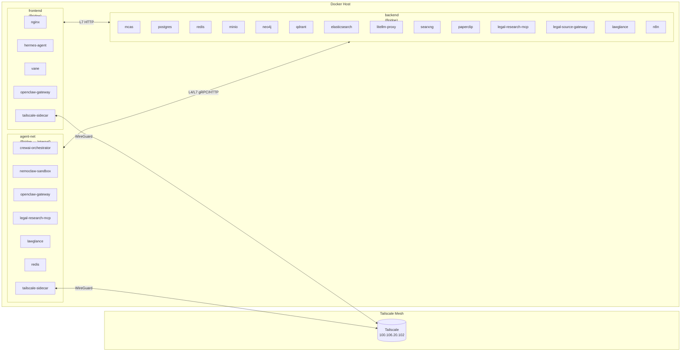

### 1.3.3 Network Definitions

| Network | Driver | Internal | CIDR / Scope | Purpose |
|---|---|---|---|---|
| `frontend` | bridge | no | `172.28.0.0/16` | Human-facing ingress, reverse proxy, Tailscale sidecar |
| `backend` | bridge | no | `172.29.0.0/16` | Core data plane: databases, caches, object stores, APIs |
| `agent-net` | bridge | **yes** | `172.30.0.0/16` | Inter-agent communication, orchestrator-to-sandbox, MCP traffic |

**Design rationale:**
- `frontend` carries only TLS-terminated or Tailscale-encrypted traffic from operators and external webhooks.
- `backend` isolates databases and storage from direct external exposure; only `mcas`, `paperclip`, and `n8n` speak to `postgres`.
- `agent-net` is **internal-only** (no host port bindings) to prevent accidental external exposure of agent tool calls, MCP sessions, or sandbox runtime APIs.

### 1.3.4 Volume Persistence

| Volume | Driver | Mounted By | Retention |
|---|---|---|---|
| `postgres_data` | local | postgres | Permanent — case records, audit logs, Paperclip state |
| `redis_data` | local | redis | Ephemeral with AOF — session/cache survives restart |
| `minio_data` | local | minio | Permanent — documents, evidence files, exports |
| `neo4j_data` | local | neo4j | Permanent — citation graph, legal reasoning chains |
| `qdrant_data` | local | qdrant | Permanent — vector embeddings for OpenRAG |
| `elasticsearch_data` | local | elasticsearch | Permanent — full-text legal document index |
| `lawglance_chroma` | local | lawglance | Permanent — public legal corpus embeddings |
| `paperclip_data` | local | paperclip | Permanent — task history, budgets, audit context |
| `n8n_data` | local | n8n | Permanent — workflow definitions, execution history |

---

## 1.4 Service Architecture Details

### 1.4.1 MCAS (MISJustice Case & Advocacy Server)

- **Role:** Authoritative system of record for all case data, matters, events, documents, and tasks.
- **Stack:** Django 4.2 + Django REST Framework + PostgreSQL 16.
- **API Surface:** RESTful JSON over HTTP; OAuth2 JWT bearer tokens; agent-scoped access control.
- **Data Handling:** Field-level AES-256 encryption for Tier-0/1 PII; document paths reference MinIO object keys.
- **Integration Points:**
  - All 13 agents read/write matter state via DRF.
  - Webhooks notify Paperclip and n8n on matter lifecycle transitions.
  - Audit logs stream to PostgreSQL and Paperclip audit context.

### 1.4.2 legal-research-mcp (MCP Server)

- **Role:** Model Context Protocol server exposing legal research tools to agents.
- **Stack:** Python FastMCP or TypeScript MCP SDK.
- **Tools:** Statute retrieval, case law search, citation formatting, source verification.
- **Integration Points:**
  - Consumed by Sol, Mira, Citation, and Lex via MCP client connections.
  - Upstream calls routed to `legal-source-gateway` and SearXNG.
  - LLM synthesis routed through `litellm-proxy` for token accounting and tier blocking.

### 1.4.3 legal-source-gateway

- **Role:** Normalization layer between upstream legal data providers (CourtListener, Free Law Project, government repositories) and the firm’s internal services.
- **Stack:** Python/Node.js adapter service.
- **Integration Points:**
  - Ingests bulk data feeds into Elasticsearch and Neo4j.
  - Serves normalized citations to `legal-research-mcp`.
  - No direct agent access; all traffic flows through MCP.

### 1.4.4 LawGlance

- **Role:** Public legal information RAG microservice.
- **Stack:** LangChain + ChromaDB + Redis cache; optional Ollama backend.
- **Data Boundary:** **Public legal materials only.** Tier-0/1 content is rejected at the adapter PII guard.
- **Integration Points:**
  - Queried by Mira, Lex, and Citation for abstract statutory questions.
  - Redis cache namespaced per agent tier to prevent cross-agent pollution.

### 1.4.5 Vane

- **Role:** Human-facing conversational research interface (Perplexity-style).
- **Stack:** Node.js / Python frontend + backend.
- **Access Scope:** Tier-2/3 material only for document upload; T4-admin search via SearXNG.
- **Integration Points:**
  - SearXNG for ad-hoc web Q&A.
  - LiteLLM proxy for LLM inference.
  - Open Notebook export for research output.

### 1.4.6 CrewAI Orchestrator

- **Role:** Crew composition and intra-crew message routing.
- **Stack:** CrewAI framework container.
- **Integration Points:**
  - Receives dispatch from OpenClaw gateway.
  - Manages parallel agent execution (Mira + Iris + Chronology during Research stage).
  - Publishes task completion events to Redis pub/sub for Paperclip consumption.

### 1.4.7 OpenClaw Gateway

- **Role:** Agent workflow dispatch and crew invocation gateway.
- **Stack:** OpenClaw runtime container.
- **Integration Points:**
  - Accepts tasks from Paperclip control plane.
  - Routes execution to CrewAI or NemoClaw sandbox based on classification ceiling.
  - Callback webhooks return run state to Paperclip.

### 1.4.8 NemoClaw Sandbox

- **Role:** GPU-accelerated, sandboxed agent runtime with network/fs/process policy enforcement.
- **Stack:** NVIDIA OpenShell + container runtime.
- **Security Model:**
  - No direct outbound internet; egress proxied through OpenClaw.
  - Filesystem restricted to ephemeral workspaces; no host mounts.
  - GPU access controlled by cgroup and NVIDIA Container Toolkit.
- **Integration Points:**
  - Receives sandboxed workloads from OpenClaw gateway.
  - Returns sandbox exit codes, logs, and artifacts to OpenClaw.

### 1.4.9 Hermes Agent (Human Interface)

- **Role:** Primary human operator interface for the firm.
- **Stack:** Containerized TUI and web interface.
- **Integration Points:**
  - Authenticates operators and routes instructions to Paperclip.
  - Displays agent status, task queues, and approval gates.
  - No direct database access; all operations mediated by Paperclip or MCAS APIs.

### 1.4.10 Paperclip Control Plane

- **Role:** Supervisory governance layer — org chart, issues, budgets, approvals, audit logs.
- **Stack:** Paperclip open-source control plane container.
- **Integration Points:**
  - REST API consumed by Hermes and OpenClaw.
  - Webhook callbacks to n8n for HITL approval routing.
  - Budget telemetry ingested from LiteLLM cost streams.

### 1.4.11 Redis (Message Broker)

- **Role:** Task queue, caching layer, session store, and pub/sub bus.
- **Stack:** Redis 7 with AOF persistence and LRU eviction.
- **Integration Points:**
  - CrewAI task queue via Redis Streams or List.
  - LawGlance query cache with per-agent-tier namespacing.
  - MCAS session and rate-limit storage.
  - Paperclip heartbeat and status pub/sub.

### 1.4.12 Tailscale Sidecar

- **Role:** Encrypted mesh networking sidecar for site-to-site and remote operator access.
- **Stack:** Tailscale userspace networking container.
- **Integration Points:**
  - Exposes `frontend` and `agent-net` services over the Tailscale tailnet.
  - Authenticated device policy restricts which operators and remote peers can reach Hermes, Vane, and OpenClaw.
  - No direct data plane access; acts as an encrypted transport overlay.

---

## 1.5 Agent-to-Service Data Flow

### 1.5.1 Workflow Stage Mapping

The firm operates four canonical workflow stages. Each stage defines which agents run, which services they touch, and the data classification ceiling enforced.

#### Stage 1 — Intake

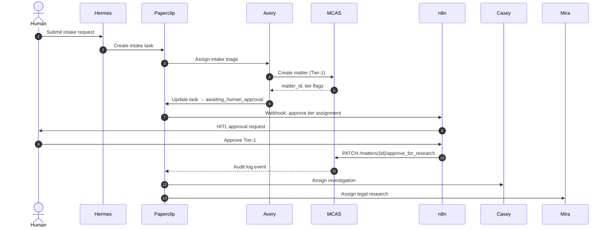

#### Stage 2 — Research

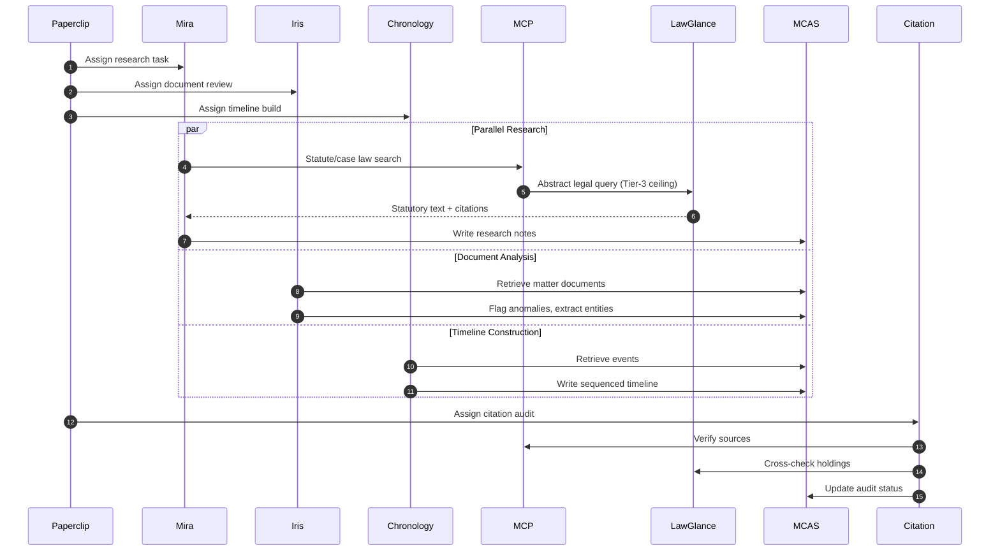

#### Stage 3 — Drafting

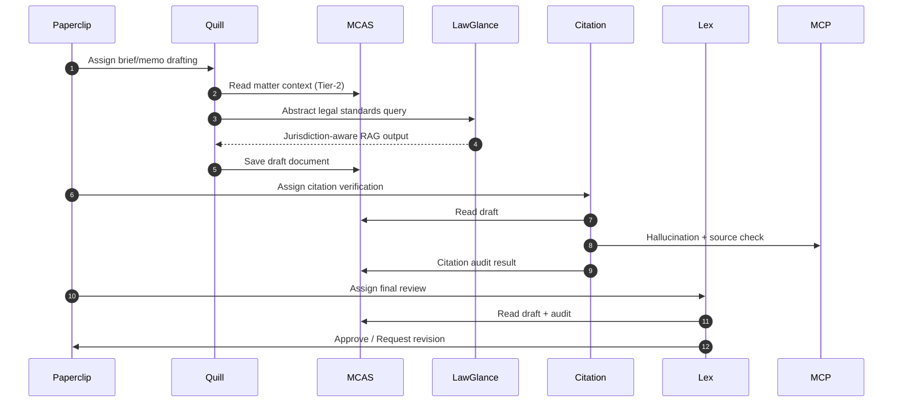

#### Stage 4 — Advocacy

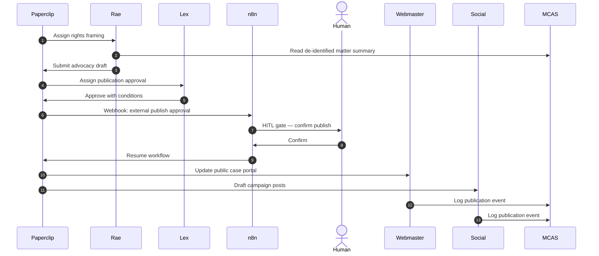

### 1.5.2 Service Dependency Matrix

| Agent | MCAS | MCP | LawGlance | SearXNG (via MCP) | LiteLLM | Redis | Paperclip |
|---|---|---|---|---|---|---|---|
| Lex | R/W | — | Query | — | — | — | R/W |
| Mira | R/W | Query | Query | Query | Via MCP | — | R/W |
| Casey | R/W | — | — | — | — | — | R/W |
| Iris | R/W | — | — | — | — | — | R/W |
| Avery | R/W | — | — | — | — | — | R/W |
| Ollie | R/W | — | — | — | — | — | R/W |
| Rae | R/W | — | — | — | — | — | R/W |
| Sol | R/W | Orchestrate | — | — | — | — | R/W |
| Quill | R/W | — | Query | — | — | — | R/W |
| Citation | R/W | Query | Query | Query | Via MCP | — | R/W |
| Chronology | R/W | — | — | — | — | — | R/W |
| Social Media Manager | R/W | — | — | — | — | — | R/W |
| Webmaster | R/W | — | — | — | — | — | R/W |

---

## 1.6 Security Boundaries

### 1.6.1 Tiered Data Classification

All data in the firm is classified into four tiers. Each tier determines where data may reside, which agents may access it, and which network paths it may traverse.

| Tier | Label | Storage | Encryption | Agent Access | Network |
|---|---|---|---|---|---|
| **Tier 0** | Privileged / PII | Proton Mail / E2EE only; **never enters agent pipelines** | Client-side E2EE | None | Out-of-band only |
| **Tier 1** | Restricted PII | MCAS PostgreSQL (field-level encrypted) | AES-256 at field level | Lex, Avery, Casey, Iris | `backend` only |
| **Tier 2** | De-identified | MCAS + OpenRAG + MinIO | AES-256 at rest | All 13 agents | `backend` + `agent-net` |
| **Tier 3** | Public-safe | LawGlance corpus, public portal, exports | TLS in transit | Mira, Lex, Citation, Quill, Webmaster, Social Media Manager | `frontend` + `backend` |

**Rules:**
- Tier-0 material is never stored in Docker volumes, Redis, or any agent context window.
- Tier-1 material exits MCAS only over authenticated, encrypted APIs with agent-scoped JWTs.
- Tier-2 material may enter agent pipelines and vector stores but must be de-identified (no names, addresses, case numbers).
- Tier-3 material is the only tier permitted in LawGlance queries, public portals, and external publications.

### 1.6.2 Sandboxing & Runtime Isolation

| Layer | Mechanism | Enforcement |
|---|---|---|
| **Container** | Docker bridge networks + `internal: true` on `agent-net` | Prevents accidental external exposure of agent APIs |
| **Process** | NemoClaw / OpenShell seccomp-bpf + cgroup v2 | Restricts syscalls, CPU/memory limits, no host namespace sharing |
| **Network** | NemoClaw egress proxy through OpenClaw | Blocked direct outbound; all traffic inspected and logged |
| **Filesystem** | Ephemeral overlayfs per sandbox task | No host bind mounts; artifacts extracted via signed tarball |
| **GPU** | NVIDIA Container Toolkit + MIG (optional) | GPU time-sliced or partitioned per sandbox instance |

### 1.6.3 Network Policies

```mermaid
flowchart TB
    subgraph INGRESS["Ingress Policy"]
        direction TB
        IN1["nginx → frontend:80/443<br/>Allowed: Any (TLS)"]
        IN2["Tailscale → frontend<br/>Allowed: Authenticated tailnet peers only"]
        IN3["agent-net<br/>Allowed: No host port bindings"]
    end
    subgraph EGRESS["Egress Policy"]
        direction TB
        OUT1["frontend → Internet<br/>Allowed: nginx, Tailscale sidecar"]
        OUT2["backend → Internet<br/>Denied by default; SearXNG + LiteLLM proxy whitelisted"]
        OUT3["agent-net → Internet<br/>Denied; all egress via OpenClaw gateway proxy"]
    end
    subgraph INTER["Inter-Service Policy"]
        direction TB
        IS1["mcas ↔ postgres<br/>Allowed: backend net only"]
        IS2["lawglance ↔ qdrant<br/>Allowed: backend net only"]
        IS3["nemoclaw ↔ openclaw<br/>Allowed: agent-net only"]
        IS4["hermes ↔ paperclip<br/>Allowed: frontend net only"]
    end
```

### 1.6.4 Authentication & Authorization

| Component | Auth Method | Identity Source |
|---|---|---|
| Human operators | OAuth2 / SSO | Hermes login → Paperclip org chart |
| Agent-to-MCAS | JWT Bearer | MCAS token endpoint; scopes per agent role |
| Agent-to-MCP | MCP protocol auth | Session-scoped tokens issued by Sol |
| OpenClaw dispatch | mTLS + API key | Paperclip ↔ OpenClaw pre-shared credentials |
| Tailscale mesh | WireGuard + ACL | Tailscale control plane; device tagging by role |

### 1.6.5 Audit & Compliance

| Event | Log Destination | Retention |
|---|---|---|
| Matter creation / tier change | MCAS audit table + Paperclip issue comment | 7 years |
| Agent search query (hashed) | MCP adapter log + Paperclip budget telemetry | 2 years |
| LawGlance query (agent, jurisdiction) | LawGlance adapter log | 1 year |
| External publication | MCAS + Paperclip + n8n execution log | 7 years |
| HITL approval / rejection | n8n execution log + Paperclip comment | 7 years |
| LiteLLM token usage | LiteLLM telemetry → Paperclip budget | 2 years |
| Sandbox execution | NemoClaw stdout/stderr → OpenClaw → Paperclip | 90 days |

---

## 1.7 Deployment Topology

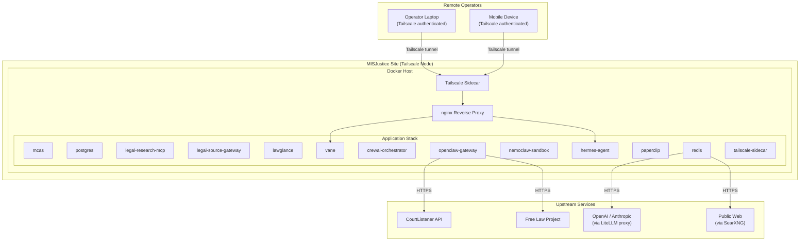

---

## 1.8 Scalability & Resilience Notes

| Concern | Strategy |
|---|---|
| **Stateless services** | MCAS, legal-research-mcp, legal-source-gateway, lawglance, vane, OpenClaw gateway are horizontally scalable behind nginx or a load balancer. |
| **Stateful services** | PostgreSQL, Redis, Neo4j, Qdrant, Elasticsearch use named volumes and should be replicated via their native clustering mechanisms (not Docker Compose replication). |
| **GPU sandbox** | NemoClaw is singleton per GPU node. Multiple sandbox instances require multiple GPU workers or NVIDIA MIG partitioning. |
| **CrewAI orchestrator** | Single coordinator per crew; multiple crews may run concurrently if Redis queue depth permits. |
| **Tailscale** | Sidecar is stateless; multiple site nodes may join the same tailnet for multi-region presence. |

---

## 1.9 Key Files & References

| Document | Path | Purpose |
|---|---|---|
| Agent roster & rules | `AGENTS.md` | Canonical agent definitions and orchestration rules |
| Data classification policy | `policies/DATA_CLASSIFICATION.md` | Tier definitions and handling rules |
| Search token policy | `policies/SEARCH_TOKEN_POLICY.md` | Agent-scoped SearXNG/LiteLLM access tiers |
| Incident response | `policies/INCIDENT_RESPONSE.md` | Security incident procedures |
| MCAS specification | `services/mcas/README.md` | Case server API and data model |
| LawGlance integration | `services/lawglance/README.md` | Public legal RAG service boundary |
| Vane configuration | `services/vane/vane.yaml` | Operator UI runtime settings |
| Paperclip implementation | `docs/PAPERCLIP_IMPLEMENTATION.md` | Control plane adapter map and handoff workflows |
| Docker Compose (local dev) | `docker-compose.yml` | Full local stack with additional data services |

---

*MISJustice Alliance — Legal Research. Civil Rights. Public Record.*

---

# 02 — Ansible Deployment Framework

This section defines the infrastructure-as-code deployment strategy for the Misjustice Alliance Firm. The framework extends `openclaw-ansible` with four new role families and formalizes environment progression from development through production.

---

## 1. Extended Role Architecture

The deployment extends the baseline `openclaw-ansible` roles (`tailscale`, `user`, `docker`, `firewall`, `nodejs`, `openclaw`) with a `misjustice-*` role hierarchy.

| Role Family | Role Name | Purpose | Depends On |
|-------------|-----------|---------|------------|
| **Baseline** | `tailscale` | WireGuard mesh VPN, exit nodes, ACL tags | — |
| | `user` | Service accounts, SSH hardening, sudoers | — |
| | `docker` | Docker CE, Buildx, compose plugin, daemon hardening | `user` |
| | `firewall` | UFW + `DOCKER-USER` iptables chain, default-deny | — |
| | `nodejs` | Node.js LTS, corepack, pnpm setup | — |
| | `openclaw` | Base OpenClaw container on `127.0.0.1` | `docker`, `firewall` |
| **Core** | `misjustice-core` | MCAS runtime, PostgreSQL, Redis, persistent volumes | `docker`, `firewall` |
| **Agents** | `misjustice-agents` | CrewAI orchestrator containers, agent worker pools | `misjustice-core` |
| **Platform** | `misjustice-platform` | Paperclip (UI/API), Hermes (message bus), reverse proxy | `misjustice-core`, `tailscale` |
| **Security** | `misjustice-security` | Secret generation, encryption key rotation, HashiCorp Vault Agent (optional) | `misjustice-core` |

### Role Directory Convention

```
roles/
  <role-name>/
    tasks/
      main.yml          # entry point
      preflight.yml     # idempotency checks, assertions
      install.yml       # package/container operations
      configure.yml     # templated configs
      verify.yml        # post-apply health probes
    handlers/
      main.yml          # service restarts, firewall reloads
    templates/
      *.j2              # config files, systemd units, env files
    defaults/
      main.yml          # safe defaults (override in group_vars)
    vars/
      main.yml          # internal constants (version pins, paths)
    files/
      static assets     # CA certs, hardening scripts
    meta/
      main.yml          # role dependencies
```

> **Rule**: Every role under `misjustice-*` must implement `preflight.yml` and `verify.yml` to guarantee idempotency and observable outcomes.

---

## 2. New Ansible Roles

### 2.1 `misjustice-core`

| Sub-component | Responsibility | Binding / Exposure |
|---------------|----------------|--------------------|
| `mcas` | MCAS (Multi-Channel Application Server) primary runtime | `127.0.0.1:3000` |
| `postgres` | Relational state, CrewAI memory, audit logs | `127.0.0.1:5432` |
| `redis` | Task queues, agent pub/sub, session cache | `127.0.0.1:6379` |
| `volumes` | Named Docker volumes for data durability | — |

**Pseudocode Structure**:
```yaml
# tasks/main.yml
- import_tasks: preflight.yml   # assert Docker API reachable, disk > threshold
- import_tasks: volumes.yml     # ensure named volumes exist (idempotent)
- import_tasks: network.yml     # create 'misjustice' bridge network
- import_tasks: postgres.yml    # templated compose service, env from vault
- import_tasks: redis.yml       # templated compose service, persistence on
- import_tasks: mcas.yml        # depends on postgres+redis healthy
- import_tasks: verify.yml      # wait_for port, pg_isready, redis-cli ping
```

**Key Defaults**:
- PostgreSQL: 16-alpine, `POSTGRES_USER=misjustice`, `POSTGRES_DB=firm`
- Redis: 7-alpine, `appendonly=yes`, maxmemory policy `allkeys-lru`
- All containers bound to `127.0.0.1`; no published host ports exposed externally.

---

### 2.2 `misjustice-agents`

| Sub-component | Responsibility |
|---------------|----------------|
| `orchestrator` | CrewAI flow scheduler, task graph execution |
| `worker-pool` | Horizontal agent workers (CPU-bound tasks) |
| `executor` | Sandboxed execution gateway (NemoClaw OpenShell) |

**Pseudocode Structure**:
```yaml
# tasks/main.yml
- import_tasks: preflight.yml        # assert misjustice-core healthy
- import_tasks: executor.yml         # NemoClaw sandbox, blueprint YAML policies
- import_tasks: worker-pool.yml      # scaled via 'agent_replicas' variable
- import_tasks: orchestrator.yml     # depends on executor + redis
- import_tasks: verify.yml           # HTTP health endpoint, queue depth check
```

**Key Defaults**:
- `agent_replicas: 2` (dev), `4` (staging), `8` (prod)
- Blueprint policies mounted read-only into executor container
- Workers auto-register with orchestrator via Redis discovery

---

### 2.3 `misjustice-platform`

| Sub-component | Responsibility | Binding / Exposure |
|---------------|----------------|--------------------|
| `paperclip` | Firm UI and public API (target: `100.106.20.102:3100`) | `127.0.0.1:3100` inside host; Tailscale serves |
| `hermes` | Internal message bus, webhook ingress, event routing | `127.0.0.1:4100` |
| `reverse-proxy` | Caddy or Traefik (Dockerized), routes to Paperclip/Hermes | `127.0.0.1:80/443` |

**Pseudocode Structure**:
```yaml
# tasks/main.yml
- import_tasks: preflight.yml      # assert Tailscale IP assigned if prod
- import_tasks: hermes.yml         # message bus container
- import_tasks: paperclip.yml      # UI container, env vars for API_BASE
- import_tasks: reverse-proxy.yml  # Caddyfile/Traefik dynamic config from template
- import_tasks: tailscale-serve.yml # register 127.0.0.1:3100 as tailscale serve
- import_tasks: verify.yml         # curl 200 on Tailscale IP:3100/healthz
```

**Key Defaults**:
- Paperclip binds `127.0.0.1:3100`; Tailscale `serve` exposes it on the mesh.
- Caddy automatic HTTPS disabled (Tailscale handles TLS via mesh).
- Hermes webhook receiver validates HMAC signatures using key from `misjustice-security`.

---

### 2.4 `misjustice-security`

| Sub-component | Responsibility |
|---------------|----------------|
| `secrets` | Generate or retrieve DB passwords, API keys, signing secrets |
| `encryption-keys` | Age or OpenPGP key pairs for data-at-rest and backup encryption |
| `vault-agent` *(optional)* | HashiCorp Vault Agent sidecar for dynamic secrets (future) |
| `rotation` | Key rotation orchestration: generate new, re-encrypt, revoke old |

**Pseudocode Structure**:
```yaml
# tasks/main.yml
- import_tasks: preflight.yml      # assert entropy available, age installed
- import_tasks: secrets.yml        # write env files with 0600, root-owned
- import_tasks: encryption-keys.yml # age-keygen if keys absent
- import_tasks: rotation.yml       # triggered by 'security_rotate=true' flag
- import_tasks: verify.yml         # checksum validation, key readability
```

**Key Defaults**:
- Secrets written to `/opt/misjustice/secrets/.env.<service>`
- Encryption keys stored at `/opt/misjustice/keys/` with `0400` permissions
- Rotation is manual-gated; never auto-executes on standard playbook runs.

---

## 3. Inventory Structure

```
inventories/
  dev/
    hosts.yml
    group_vars/
      all.yml
      docker.yml
      tailscale.yml
    host_vars/
      dev-node-01.yml
  staging/
    hosts.yml
    group_vars/
      all.yml
      docker.yml
      tailscale.yml
    host_vars/
      stg-node-01.yml
  prod/
    hosts.yml
    group_vars/
      all.yml
      docker.yml
      tailscale.yml
    host_vars/
      prod-node-01.yml
```

### Environment Topology

| Environment | Host Count | Tailscale ACL Tag | Purpose |
|-------------|-----------|-------------------|---------|
| `dev` | 1 | `tag:openclaw-dev` | Local feature validation, destructive testing |
| `staging` | 1 | `tag:openclaw-staging` | Pre-release integration, load simulation |
| `prod` | 1 (current) | `tag:openclaw-prod` | Live firm operations at `100.106.20.102` |

### Sample `inventories/prod/hosts.yml`

```yaml
all:
  children:
    firm_hosts:
      hosts:
        prod-node-01:
          ansible_host: 100.106.20.102
          ansible_user: deploy
          tailscale_ip: 100.106.20.102
          firm_role: primary
      vars:
        env: prod
        deploy_branch: main
```

> **Rule**: All access is over Tailscale SSH (`100.x.x.x`). Direct public IP SSH is blocked by `firewall` role.

---

## 4. Variable Definitions (`group_vars`)

### 4.1 `inventories/*/group_vars/all.yml`

```yaml
---
# Firm identity
firm_name: misjustice-alliance
firm_domain: "{{ 'dev.' if env == 'dev' else 'staging.' if env == 'staging' else '' }}firm.internal"

# Deployment control
deploy_branch: main
deploy_force_pull: false

# Version pins (immutable tags only)
mcas_version: "1.2.3"
paperclip_version: "2.0.1"
hermes_version: "0.9.4"
nemoclaw_version: "0.5.0"

# Resource limits (Docker)
postgres_memory: "512m"
redis_memory: "256m"
mcas_memory: "1g"
agent_worker_memory: "2g"

# Replicas
agent_replicas: "{{ 2 if env == 'dev' else 4 if env == 'staging' else 8 }}"

# Paths
install_base: /opt/misjustice
data_path: "{{ install_base }}/data"
secrets_path: "{{ install_base }}/secrets"
keys_path: "{{ install_base }}/keys"
logs_path: "{{ install_base }}/logs"

# Feature flags
enable_nemoclaw_sandbox: true
enable_vault_agent: false
enable_backup_encryption: true
```

### 4.2 `inventories/*/group_vars/docker.yml`

```yaml
---
docker_daemon_options:
  log-driver: json-file
  log-opts:
    max-size: "10m"
    max-file: "3"
  live-restore: true
  userland-proxy: false
  iptables: true
  bridge: none  # disable default bridge; use custom 'misjustice' network

docker_compose_version: "v2.27.0"
```

### 4.3 `inventories/*/group_vars/tailscale.yml`

```yaml
---
tailscale_auth_key: "{{ lookup('env', 'TS_AUTH_KEY') }}"  # injected via CI/CD
tailscale_tags:
  - "tag:openclaw-{{ env }}"

tailscale_extra_args:
  - "--ssh"
  - "--accept-dns=true"
  - "--advertise-exit-node=false"

tailscale_serve_routes:
  - src: "100.106.20.102:3100"
    dst: "127.0.0.1:3100"
    proto: tcp
```

### 4.4 Secret Variables (`host_vars` or vaulted `group_vars`)

Secrets are **never** committed plaintext. Use `ansible-vault` or environment injection at runtime.

```yaml
---
# ansible-vault encrypted
postgres_password: "{{ vault_postgres_password }}"
redis_password: "{{ vault_redis_password }}"
hermes_signing_secret: "{{ vault_hermes_secret }}"
paperclip_api_key: "{{ vault_paperclip_key }}"
age_private_key: "{{ vault_age_private_key }}"
```

---

## 5. Playbook Execution Order

### 5.1 Main Playbook: `deploy-firm.yml`

```yaml
# Pseudocode — execution order
- name: Baseline Infrastructure
  hosts: firm_hosts
  become: yes
  roles:
    - role: tailscale
      tags: [network, baseline]
    - role: user
      tags: [baseline]
    - role: docker
      tags: [baseline, docker]
    - role: firewall
      tags: [baseline, security]
    - role: nodejs
      tags: [baseline]
    - role: openclaw
      tags: [baseline, openclaw]

- name: Misjustice Core Services
  hosts: firm_hosts
  become: yes
  roles:
    - role: misjustice-security
      tags: [security, secrets]
    - role: misjustice-core
      tags: [core, data]

- name: Misjustice Agent Layer
  hosts: firm_hosts
  become: yes
  roles:
    - role: misjustice-agents
      tags: [agents, ai]

- name: Misjustice Platform Layer
  hosts: firm_hosts
  become: yes
  roles:
    - role: misjustice-platform
      tags: [platform, web]
```

### 5.2 Idempotency Guarantees

| Guarantee | Mechanism |
|-----------|-----------|
| **Container images** | Pin immutable digests or semver tags; `docker_image` with `source: pull` and `force_source: "{{ deploy_force_pull }}"` |
| **Config files** | Template modules with `validate` parameter (e.g., `caddy adapt --config %s`) |
| **Named volumes** | `docker_volume` with `state: present`; data never destroyed on re-run |
| **Secrets** | `stat` check before generation; skip if file exists and `security_rotate=false` |
| **Firewall rules** | UFW `rule` with `delete: false` enforcement; `DOCKER-USER` chain managed via `iptables` idempotent insert |
| **Service state** | Handlers triggered only on config change; `systemd` units use `Restart=unless-stopped` |
| **Tailscale** | Check `tailscale status` before re-authentication; idempotent `tailscale up` args |

### 5.3 Tag-Based Targeted Runs

```bash
# Full deployment
ansible-playbook -i inventories/prod deploy-firm.yml

# Rotate secrets only
ansible-playbook -i inventories/prod deploy-firm.yml --tags security -e security_rotate=true

# Update only platform containers
ansible-playbook -i inventories/prod deploy-firm.yml --tags platform -e deploy_force_pull=true

# Re-apply firewall rules after ACL change
ansible-playbook -i inventories/prod deploy-firm.yml --tags firewall
```

---

## 6. Rollback Strategy & Health Verification

### 6.1 Rollback Architecture

Every deployment creates a **version snapshot** before mutation:

| Artifact | Snapshot Method | Retention |
|----------|----------------|-----------|
| Docker images | Tagged with `{{ deploy_timestamp }}` prior to pull | Last 5 per service |
| Compose configs | Copied to `{{ install_base }}/backups/compose-{{ timestamp }}.yml` | Last 10 |
| Database | Pre-deploy `pg_dump` to encrypted object storage | Last 3 |
| Environment | `.env` files copied to `{{ secrets_path }}/backup/` | Last 5 |

### 6.2 Rollback Playbook: `rollback-firm.yml`

```yaml
# Pseudocode — rollback execution
- name: Assert rollback target exists
  # validate snapshot manifest for target version

- name: Stop current platform services
  # docker compose down for platform + agents (keep core running)

- name: Restore previous compose configuration
  # copy backed-up compose file into place

- name: Pull previous image tag
  # docker_image pull with rollback_tag

- name: Restart services with restored config
  # docker compose up -d

- name: Verify rollback health
  # import verify.yml from each role
```

**Trigger Conditions**:
- Manual: `ansible-playbook rollback-firm.yml -e rollback_to=<timestamp>`
- Automatic: If health checks fail for > 5 minutes post-deploy

### 6.3 Health Check Verification

| Layer | Check | Interval | Failure Action |
|-------|-------|----------|----------------|
| **Infrastructure** | Docker daemon responsive | Every 60s | Alert, retry ×3 |
| **Core** | PostgreSQL `pg_isready`, Redis `PING` | Every 30s | Restart container, alert |
| **Agents** | Orchestrator `/healthz` HTTP 200 | Every 30s | Scale worker pool to 0, alert |
| **Platform** | Paperclip `/healthz` via Tailscale IP | Every 30s | Trigger automatic rollback |
| **Security** | Secret file permissions `0400` | Every 5m | Correct permissions, alert |
| **End-to-End** | Synthetic login + task creation flow | Every 5m | Page on-call |

**Verification Pseudocode** (integrated into each role's `verify.yml`):
```yaml
# tasks/verify.yml pattern
- name: Wait for service port
  ansible.builtin.wait_for:
    host: 127.0.0.1
    port: "{{ service_port }}"
    timeout: 60

- name: HTTP health probe
  ansible.builtin.uri:
    url: "http://127.0.0.1:{{ service_port }}/healthz"
    status_code: 200
  retries: 5
  delay: 10

- name: Register health outcome
  ansible.builtin.set_fact:
    health_results: "{{ health_results | default({}) | combine({inventory_hostname: 'pass'}) }}"
```

---

## 7. Tailscale Integration

### 7.1 Network Model

All firm hosts exist on a private Tailscale mesh (`tailnet`). No ports are exposed to the public internet.

```
[Admin Workstation] ──Tailscale SSH──► [prod-node-01 : 100.106.20.102]
                                          │
                                          ├── 127.0.0.1:3100  Paperclip (via tailscale serve)
                                          ├── 127.0.0.1:4100  Hermes (internal only)
                                          ├── 127.0.0.1:5432  PostgreSQL (internal only)
                                          └── 127.0.0.1:6379  Redis (internal only)
```

### 7.2 Tailscale ACL Tags

| Tag | Devices | Capabilities |
|-----|---------|--------------|
| `tag:openclaw-prod` | Production node | Accept SSH from `group:ops`, serve 3100 |
| `tag:openclaw-staging` | Staging node | Accept SSH from `group:ops`, serve 3100 |
| `tag:openclaw-dev` | Dev node | Accept SSH from `group:dev`, serve 3100 |

### 7.3 Tailscale Serve / Funnel Policy

- **Serve**: Paperclip (`127.0.0.1:3100`) is exposed via `tailscale serve` on the node's Tailscale IP.
- **Funnel**: Disabled by default. If public ingress is required for webhooks, enable selectively via ACLs, not playbook default.
- **DNS**: Magic DNS enabled (`prod-node-01.tailnet-name.ts.net`) for internal service discovery if Hermes requires hostname-based routing.

### 7.4 Ansible Variables for Tailscale

```yaml
# group_vars/tailscale.yml
tailscale_enable_ssh: true
tailscale_serve_enabled: true
tailscale_serve_services:
  paperclip:
    source: "tcp/100.106.20.102:3100"
    destination: "tcp/127.0.0.1:3100"
    funnel: false
```

### 7.5 Operational Commands

```bash
# Verify mesh connectivity from control node
ansible all -i inventories/prod -m ping

# Check Tailscale status on remote
ansible prod-node-01 -i inventories/prod -a "tailscale status"

# View active serves
ansible prod-node-01 -i inventories/prod -a "tailscale serve status"
```

---

## 8. CI/CD Integration Points

| Stage | Ansible Integration | Secrets Source |
|-------|---------------------|----------------|
| **Build** | None (build occurs in GitHub Actions, pushes to registry) | — |
| **Deploy Dev** | `ansible-playbook -i inventories/dev` on merge to `develop` | Repository secrets (`TS_AUTH_KEY_DEV`) |
| **Deploy Staging** | `ansible-playbook -i inventories/staging` on tag `v*-rc.*` | Repository secrets (`TS_AUTH_KEY_STAGING`) |
| **Deploy Prod** | `ansible-playbook -i inventories/prod` manual approval gate | Vault / 1Password (`TS_AUTH_KEY_PROD`) |
| **Rollback** | `ansible-playbook rollback-firm.yml` on pipeline failure or manual trigger | Same as deploy stage |

---

## 9. Security Hardening Checklist

- [ ] All containers bind to `127.0.0.1`; no `0.0.0.0` exposure.
- [ ] `DOCKER-USER` iptables chain drops unexpected ingress before Docker's own rules.
- [ ] UFW default-deny incoming; allow only Tailscale UDP/41641 and loopback.
- [ ] Secrets files are `0600`, owned by root, stored outside volume mounts.
- [ ] Encryption keys (`age`) generated on-host, never transmitted over Ansible unless vaulted.
- [ ] Node.js and Docker installed from official APT repositories with GPG verification.
- [ ] Tailscale ACLs restrict SSH to `group:ops` for production.

---

## 10. Operational Runbooks (Reference)

| Scenario | Command / Action |
|----------|------------------|
| Full deploy | `ansible-playbook -i inventories/prod deploy-firm.yml` |
| Deploy single role | `ansible-playbook ... --tags platform` |
| View logs | `ansible ... -a "docker logs misjustice-paperclip-1"` |
| Restart service | `ansible ... -a "docker compose -f /opt/misjustice/compose.yml restart paperclip"` |
| Rotate secrets | `ansible-playbook ... --tags security -e security_rotate=true` |
| Rollback | `ansible-playbook -i inventories/prod rollback-firm.yml -e rollback_to=20260427-144721` |
| Health check | `ansible-playbook -i inventories/prod deploy-firm.yml --tags verify` |

---

*Document Version: 1.0*
*Applies to: openclaw-ansible >= 2.0, NemoClaw >= 0.5*

---

# Section 3 — CrewAI Agent Development

> **Scope:** Agent framework design, crew orchestration, task definitions, tool wrappers, and testing strategy for the MISJustice Alliance Firm.  
> **Exclusions:** Infrastructure, deployment, full Python implementation, frontend code.  
> **Version:** 1.0  
> **Date:** 2026-04-27

---

## 3.1 CrewAI Project Structure

The firm’s CrewAI runtime lives in `crewai-orchestrator/` (container: `crewai-orchestrator`). Source is organised into functional layers that mirror CrewAI’s native conventions while adding firm-specific boundaries (MCP, MCAS, tier gating, and NemoClaw policy enforcement).

```
crewai-orchestrator/
├── pyproject.toml                  # Dependencies: crewai, mcp, httpx, pydantic
├── src/
│   └── misjustice_crews/
│       ├── __init__.py
│       ├── config/
│       │   ├── __init__.py
│       │   ├── llm_config.py       # LiteLLM proxy routing, fallback chains
│       │   ├── memory_config.py    # LanceDB / Qdrant / Redis backends per agent tier
│       │   └── settings.py         # Pydantic-settings: env var validation
│       ├── agents/
│       │   ├── __init__.py
│       │   ├── lex.py              # Lead Counsel
│       │   ├── mira.py             # Legal Researcher
│       │   ├── casey.py            # Case Investigator
│       │   ├── iris.py             # Document Analyst
│       │   ├── avery.py            # Intake Coordinator
│       │   ├── ollie.py            # Paralegal
│       │   ├── rae.py              # Rights Advocate
│       │   ├── sol.py              # Systems Liaison / tool orchestrator
│       │   ├── quill.py            # Brief Writer
│       │   ├── citation.py         # Citation Auditor
│       │   ├── chronology.py       # Timeline Agent
│       │   ├── social_media_manager.py
│       │   └── webmaster.py
│       ├── crews/
│       │   ├── __init__.py
│       │   ├── intake_crew.py
│       │   ├── research_crew.py
│       │   ├── drafting_crew.py
│       │   ├── advocacy_crew.py
│       │   └── support_crew.py
│       ├── tasks/
│       │   ├── __init__.py
│       │   ├── intake_tasks.py
│       │   ├── research_tasks.py
│       │   ├── drafting_tasks.py
│       │   ├── advocacy_tasks.py
│       │   └── support_tasks.py
│       ├── tools/
│       │   ├── __init__.py
│       │   ├── mcas_tools.py       # DRF CRUD wrappers + entity helpers
│       │   ├── mcp_tool_factory.py # MCPToolWrapper factory per legal-research-mcp
│       │   ├── web_search_tools.py # SearXNG wrapper (tier-scoped)
│       │   ├── document_tools.py   # OCR, anomaly detection, PII redaction
│       │   └── custom_tools.py     # Firm-specific: timeline builder, citation formatter
│       └── main.py                 # OpenClaw dispatch entrypoint
├── tests/
│   ├── unit/
│   │   ├── test_tools/
│   │   └── test_agents/
│   └── integration/
│       ├── test_intake_crew.py
│       ├── test_research_crew.py
│       ├── test_drafting_crew.py
│       ├── test_advocacy_crew.py
│       └── test_support_crew.py
└── Dockerfile
```

**Design rules:**
- One Python module per agent under `agents/`. Each module exports a factory function `create_<name>()` that returns a configured `Agent` instance.
- One Python module per crew under `crews/`. Each module exports a factory function `create_<crew_name>()` that returns a configured `Crew` instance.
- Task modules under `tasks/` export `Task` objects with explicit `context` dependencies; they are wired into crews by the crew factory, not by global import side-effects.
- All tool modules under `tools/` expose CrewAI `BaseTool` subclasses. MCP tools are dynamically wrapped via `MCPToolWrapper` at crew creation time, not at module import time.

---

## 3.2 Agent Definitions

Each agent is defined by a **role**, **goal**, **backstory**, **LLM configuration**, **tool inventory**, and **memory policy**. The definitions below are canonical; they are the single source of truth for the CrewAI runtime and for NemoClaw policy enforcement.

### 3.2.1 Agent Roster Summary

| # | Agent | Role | Primary Crew | Data Tier | MCP Access |
|---|---|---|---|---|---|
| 1 | **Lex** | Lead Counsel | Drafting (lead) | T1–T2 | Query only |
| 2 | **Mira** | Legal Researcher | Research | T1–T3 | Full |
| 3 | **Casey** | Case Investigator | Intake / Research | T1–T2 | — |
| 4 | **Iris** | Document Analyst | Research | T1–T2 | — |
| 5 | **Avery** | Intake Coordinator | Intake | T1 | — |
| 6 | **Ollie** | Paralegal | Support | T1–T2 | — |
| 7 | **Rae** | Rights Advocate | Advocacy | T2–T3 | — |
| 8 | **Sol** | Systems Liaison | Support (lead) | T1–T3 | Orchestrate |
| 9 | **Quill** | Brief Writer | Drafting | T2–T3 | — |
| 10 | **Citation** | Citation Auditor | Drafting / Research | T1–T3 | Full |
| 11 | **Chronology** | Timeline Agent | Research | T1–T2 | — |
| 12 | **Social Media Manager** | Public Advocate | Advocacy | T3 | — |
| 13 | **Webmaster** | Site Manager | Advocacy | T3 | — |

### 3.2.2 LLM Configuration Matrix

All LLM traffic routes through the **LiteLLM proxy** (`litellm-proxy` on `backend` network). Agents never hold provider API keys. Temperature and max tokens are tuned per role.

| Agent | Primary Model | Fallback Model | Temperature | Max Tokens | Timeout |
|---|---|---|---|---|---|
| Lex | `anthropic/claude-3-5-sonnet-20241022` | `openai/gpt-4o` | 0.2 | 8192 | 180s |
| Mira | `anthropic/claude-3-5-sonnet-20241022` | `openai/gpt-4o` | 0.1 | 4096 | 120s |
| Casey | `openai/gpt-4o` | `anthropic/claude-3-5-sonnet-20241022` | 0.1 | 4096 | 120s |
| Iris | `openai/gpt-4o-mini` | `openai/gpt-4o` | 0.1 | 4096 | 120s |
| Avery | `openai/gpt-4o` | `anthropic/claude-3-5-sonnet-20241022` | 0.1 | 4096 | 120s |
| Ollie | `openai/gpt-4o-mini` | `openai/gpt-4o` | 0.1 | 4096 | 90s |
| Rae | `anthropic/claude-3-5-sonnet-20241022` | `openai/gpt-4o` | 0.3 | 4096 | 120s |
| Sol | `openai/gpt-4o` | `anthropic/claude-3-5-sonnet-20241022` | 0.1 | 4096 | 120s |
| Quill | `anthropic/claude-3-5-sonnet-20241022` | `openai/gpt-4o` | 0.2 | 8192 | 180s |
| Citation | `openai/gpt-4o` | `anthropic/claude-3-5-sonnet-20241022` | 0.0 | 4096 | 120s |
| Chronology | `openai/gpt-4o-mini` | `openai/gpt-4o` | 0.1 | 4096 | 90s |
| Social Media Manager | `openai/gpt-4o-mini` | `openai/gpt-4o` | 0.4 | 2048 | 60s |
| Webmaster | `openai/gpt-4o-mini` | `openai/gpt-4o` | 0.2 | 4096 | 90s |

**Fallback behaviour:**
1. LiteLLM proxy returns `5xx` or times out.
2. CrewAI `LLM` class catches the exception and swaps to `fallback_model` for the current task.
3. If fallback also fails, the agent returns an error string; the crew’s `process` (sequential or hierarchical) determines whether to retry, halt, or escalate to Sol.

### 3.2.3 Detailed Agent Definitions

---

#### Lex — Lead Counsel

| Attribute | Definition |
|---|---|
| **Role** | Lead Counsel |
| **Goal** | Synthesise legal research, case facts, and procedural data into coherent strategy; author or approve all final briefs and external publications. |
| **Backstory** | Former public-interest litigator with deep constitutional and civil-rights experience. Lex does not tolerate unsupported conclusions. Every output must be defensible in adversarial review. |
| **Process** | `Process.hierarchical` — Lex acts as manager in Drafting Crew and Advocacy Crew. |
| **Memory** | Short-term: full context within a single crew execution. Long-term: matter-scoped Qdrant vector store (Tier-2 ceiling). |

```python
# Pseudocode — agents/lex.py
from crewai import Agent
from crewai.llm import LLM
from misjustice_crews.tools import mcas_tools, mcp_tool_factory

def create_lex(matter_id: str):
    return Agent(
        role="Lead Counsel",
        goal=(
            "Synthesise legal research, case facts, and procedural data into "
            "coherent strategy; author or approve all final briefs and external publications."
        ),
        backstory=(
            "Former public-interest litigator with deep constitutional and civil-rights "
            "experience. Lex does not tolerate unsupported conclusions. Every output must be "
            "defensible in adversarial review."
        ),
        llm=LLM(
            model="anthropic/claude-3-5-sonnet-20241022",
            temperature=0.2,
            max_tokens=8192,
            base_url="${LITELLM_PROXY_URL}",
            api_key="${LITELLM_API_KEY}",
        ),
        tools=[
            mcas_tools.MatterReadTool(matter_id),
            mcas_tools.DocumentReadTool(matter_id),
            mcas_tools.AuditLogWriteTool(agent_id="lex"),
            mcp_tool_factory.create("legal_research_mcp", "cases_get"),
            mcp_tool_factory.create("legal_research_mcp", "citations_resolve"),
        ],
        memory=True,
        verbose=True,
        allow_delegation=True,
        max_iter=5,
    )
```

---

#### Mira — Legal Researcher

| Attribute | Definition |
|---|---|
| **Role** | Legal Researcher |
| **Goal** | Retrieve controlling statutes, regulations, and precedent; analyse jurisdictional trends; produce annotated research memos with full provenance. |
| **Backstory** | Methodical research librarian turned AI. Mira believes a single missed case can lose a motion. She queries every source twice and cross-checks holdings. |
| **Process** | `Process.sequential` within Research Crew; runs in parallel with Iris and Chronology. |
| **Memory** | Session memory enabled; cross-session memory scoped to `research-index` in Qdrant. |

```python
# Pseudocode — agents/mira.py
from crewai import Agent
from crewai.llm import LLM
from misjustice_crews.tools import mcas_tools, mcp_tool_factory, web_search_tools

def create_mira(matter_id: str):
    return Agent(
        role="Legal Researcher",
        goal=(
            "Retrieve controlling statutes, regulations, and precedent; analyse "
            "jurisdictional trends; produce annotated research memos with full provenance."
        ),
        backstory=(
            "Methodical research librarian turned AI. Mira believes a single missed case "
            "can lose a motion. She queries every source twice and cross-checks holdings."
        ),
        llm=LLM(
            model="anthropic/claude-3-5-sonnet-20241022",
            temperature=0.1,
            max_tokens=4096,
            base_url="${LITELLM_PROXY_URL}",
            api_key="${LITELLM_API_KEY}",
        ),
        tools=[
            mcas_tools.ResearchMemoWriteTool(matter_id),
            mcp_tool_factory.create("legal_research_mcp", "cases_search"),
            mcp_tool_factory.create("legal_research_mcp", "cases_get"),
            mcp_tool_factory.create("legal_research_mcp", "statutes_lookup"),
            mcp_tool_factory.create("legal_research_mcp", "statutes_search"),
            mcp_tool_factory.create("legal_research_mcp", "regulations_current"),
            mcp_tool_factory.create("legal_research_mcp", "graph_expand"),
            web_search_tools.SearXNGSearchTool(tier="T3"),
        ],
        memory=True,
        verbose=True,
        allow_delegation=False,
        max_iter=5,
    )
```

---

#### Casey — Case Investigator

| Attribute | Definition |
|---|---|
| **Role** | Case Investigator |
| **Goal** | Gather facts, evaluate evidence credibility, summarise witness accounts, and flag evidentiary gaps for Lex. |
| **Backstory** | Ex-investigative journalist with a nose for inconsistency. Casey treats every complainant narrative as a hypothesis to be tested against documents and third-party records. |
| **Process** | `Process.sequential` within Intake Crew; collaborates with Avery. |
| **Memory** | Session memory only; no long-term persistence of investigation notes without human approval. |

```python
# Pseudocode — agents/casey.py
def create_casey(matter_id: str):
    return Agent(
        role="Case Investigator",
        goal=(
            "Gather facts, evaluate evidence credibility, summarise witness accounts, "
            "and flag evidentiary gaps for Lex."
        ),
        backstory=(
            "Ex-investigative journalist with a nose for inconsistency. Casey treats every "
            "complainant narrative as a hypothesis to be tested against documents and "
            "third-party records."
        ),
        llm=LLM(model="openai/gpt-4o", temperature=0.1, max_tokens=4096),
        tools=[
            mcas_tools.MatterReadTool(matter_id),
            mcas_tools.DocumentReadTool(matter_id),
            mcas_tools.EventReadTool(matter_id),
            mcas_tools.InvestigationNoteWriteTool(matter_id),
            web_search_tools.SearXNGSearchTool(tier="T1"),
        ],
        memory=True,
        allow_delegation=False,
        max_iter=4,
    )
```

---

#### Iris — Document Analyst

| Attribute | Definition |
|---|---|
| **Role** | Document Analyst |
| **Goal** | Review contracts, filings, and evidence documents; extract entities; flag anomalies; produce structured document summaries. |
| **Backstory** | Forensic accountant turned document reviewer. Iris can spot a forged signature or a redacted paragraph that should not have been redacted. |
| **Process** | `Process.sequential` within Research Crew; runs in parallel with Mira and Chronology. |
| **Memory** | Session memory enabled; long-term document embeddings stored in Qdrant `document-index`. |

```python
# Pseudocode — agents/iris.py
def create_iris(matter_id: str):
    return Agent(
        role="Document Analyst",
        goal=(
            "Review contracts, filings, and evidence documents; extract entities; "
            "flag anomalies; produce structured document summaries."
        ),
        backstory=(
            "Forensic accountant turned document reviewer. Iris can spot a forged signature "
            "or a redacted paragraph that should not have been redacted."
        ),
        llm=LLM(model="openai/gpt-4o-mini", temperature=0.1, max_tokens=4096),
        tools=[
            mcas_tools.DocumentReadTool(matter_id),
            mcas_tools.DocumentEntityExtractTool(matter_id),
            document_tools.OCRSubmitTool(),
            document_tools.AnomalyFlagTool(),
            document_tools.PIIRedactionCheckTool(),
        ],
        memory=True,
        allow_delegation=False,
        max_iter=4,
    )
```

---

#### Avery — Intake Coordinator

| Attribute | Definition |
|---|---|
| **Role** | Intake Coordinator |
| **Goal** | Triage all new matters; create foundational MCAS records; route cases to the correct crew; never conduct legal analysis. |
| **Backstory** | Seasoned legal intake specialist. Avery knows the difference between a case the firm can help and a case that needs referral—within three minutes of reading a form. |
| **Process** | `Process.sequential` within Intake Crew; first agent invoked on `new_matter_intake`. |
| **Memory** | Session memory enabled; cross-session memory scoped to `avery-matter-context` (Tier-1 floor). |

```python
# Pseudocode — agents/avery.py
def create_avery():
    return Agent(
        role="Intake Coordinator",
        goal=(
            "Triage all new matters; create foundational MCAS records; route cases to "
            "the correct crew; never conduct legal analysis."
        ),
        backstory=(
            "Seasoned legal intake specialist. Avery knows the difference between a case "
            "the firm can help and a case that needs referral—within three minutes of "
            "reading a form."
        ),
        llm=LLM(model="openai/gpt-4o", temperature=0.1, max_tokens=4096),
        tools=[
            mcas_tools.PersonCreateTool(),
            mcas_tools.OrganizationCreateTool(),
            mcas_tools.MatterCreateTool(),
            mcas_tools.EventCreateTool(),
            mcas_tools.DocumentCreateTool(),
            document_tools.OCRSubmitTool(),
            web_search_tools.SearXNGSearchTool(tier="T1"),
        ],
        memory=True,
        allow_delegation=False,
        max_iter=3,
    )
```

---

#### Ollie — Paralegal

| Attribute | Definition |
|---|---|
| **Role** | Paralegal |
| **Goal** | Prepare filings, track deadlines, complete forms, and maintain matter calendars. No legal advice. |
| **Backstory** | Detail-obsessed paralegal who colour-codes deadlines by risk. Ollie has never missed a statute-of-limitations date and intends to keep it that way. |
| **Process** | `Process.sequential` within Support Crew. |
| **Memory** | Session memory enabled; deadline reminders pushed to MCAS calendar API. |

```python
# Pseudocode — agents/ollie.py
def create_ollie(matter_id: str):
    return Agent(
        role="Paralegal",
        goal="Prepare filings, track deadlines, complete forms, and maintain matter calendars. No legal advice.",
        backstory=(
            "Detail-obsessed paralegal who colour-codes deadlines by risk. Ollie has never "
            "missed a statute-of-limitations date and intends to keep it that way."
        ),
        llm=LLM(model="openai/gpt-4o-mini", temperature=0.1, max_tokens=4096),
        tools=[
            mcas_tools.MatterReadTool(matter_id),
            mcas_tools.DeadlineCreateTool(matter_id),
            mcas_tools.FormDraftTool(matter_id),
            mcas_tools.CalendarEventTool(matter_id),
        ],
        memory=True,
        allow_delegation=False,
        max_iter=3,
    )
```

---

#### Rae — Rights Advocate

| Attribute | Definition |
|---|---|
| **Role** | Rights Advocate |
| **Goal** | Frame victim impact, civil rights violations, and policy context; draft advocacy narratives for public and legislative audiences. |
| **Backstory** | Community organiser turned legal advocate. Rae translates case facts into systemic change narratives without compromising client dignity or privacy. |
| **Process** | `Process.sequential` within Advocacy Crew; outputs require Lex sign-off before publication. |
| **Memory** | Session memory enabled; long-term memory in `advocacy-index` (Tier-3 only). |

```python
# Pseudocode — agents/rae.py
def create_rae(matter_id: str):
    return Agent(
        role="Rights Advocate",
        goal=(
            "Frame victim impact, civil rights violations, and policy context; draft "
            "advocacy narratives for public and legislative audiences."
        ),
        backstory=(
            "Community organiser turned legal advocate. Rae translates case facts into "
            "systemic change narratives without compromising client dignity or privacy."
        ),
        llm=LLM(model="anthropic/claude-3-5-sonnet-20241022", temperature=0.3, max_tokens=4096),
        tools=[
            mcas_tools.MatterReadDeidentifiedTool(matter_id),
            mcp_tool_factory.create("legal_research_mcp", "bills_search"),
            mcp_tool_factory.create("legal_research_mcp", "legislators_lookup"),
            web_search_tools.SearXNGSearchTool(tier="T3"),
        ],
        memory=True,
        allow_delegation=False,
        max_iter=4,
    )
```

---

#### Sol — Systems Liaison

| Attribute | Definition |
|---|---|
| **Role** | Systems Liaison |
| **Goal** | Orchestrate tool calls, manage MCP session lifecycle, broker inter-agent handoffs, and automate workflow plumbing so other agents focus on legal work. |
| **Backstory** | DevOps engineer turned agent. Sol speaks MCP, REST, and Redis pub/sub fluently. When a tool fails, Sol retries with exponential backoff and escalates only when exhausted. |
| **Process** | `Process.sequential` within Support Crew; also invoked by OpenClaw as a fallback handler. |
| **Memory** | Session memory enabled; system-state cache in Redis (ephemeral). |

```python
# Pseudocode — agents/sol.py
def create_sol():
    return Agent(
        role="Systems Liaison",
        goal=(
            "Orchestrate tool calls, manage MCP session lifecycle, broker inter-agent "
            "handoffs, and automate workflow plumbing so other agents focus on legal work."
        ),
        backstory=(
            "DevOps engineer turned agent. Sol speaks MCP, REST, and Redis pub/sub fluently. "
            "When a tool fails, Sol retries with exponential backoff and escalates only when exhausted."
        ),
        llm=LLM(model="openai/gpt-4o", temperature=0.1, max_tokens=4096),
        tools=[
            mcas_tools.HealthCheckTool(),
            mcp_tool_factory.create("legal_research_mcp", "cases_search"),
            mcp_tool_factory.create("legal_research_mcp", "statutes_lookup"),
            mcp_tool_factory.create("legal_research_mcp", "citations_resolve"),
            mcp_tool_factory.create("legal_research_mcp", "graph_expand"),
            custom_tools.RedisPublishTool(),
            custom_tools.WebhookDispatchTool(),
        ],
        memory=True,
        allow_delegation=True,
        max_iter=5,
    )
```

---

#### Quill — Brief Writer

| Attribute | Definition |
|---|---|
| **Role** | Brief Writer |
| **Goal** | Draft legal memos, motions, and briefs that are jurisdictionally accurate, procedurally compliant, and stylistically consistent with firm templates. |
| **Backstory** | Former clerk to a federal judge. Quill writes in IRAC without being told, cites every proposition, and never uses the passive voice when the active voice will do. |
| **Process** | `Process.sequential` within Drafting Crew; drafts are passed to Citation, then Lex. |
| **Memory** | Session memory enabled; template cache in Redis. |

```python
# Pseudocode — agents/quill.py
def create_quill(matter_id: str):
    return Agent(
        role="Brief Writer",
        goal=(
            "Draft legal memos, motions, and briefs that are jurisdictionally accurate, "
            "procedurally compliant, and stylistically consistent with firm templates."
        ),
        backstory=(
            "Former clerk to a federal judge. Quill writes in IRAC without being told, "
            "cites every proposition, and never uses the passive voice when the active voice will do."
        ),
        llm=LLM(model="anthropic/claude-3-5-sonnet-20241022", temperature=0.2, max_tokens=8192),
        tools=[
            mcas_tools.MatterReadTool(matter_id),
            mcas_tools.ResearchMemoReadTool(matter_id),
            mcas_tools.DocumentDraftWriteTool(matter_id),
            mcp_tool_factory.create("legal_research_mcp", "cases_get"),
            mcp_tool_factory.create("legal_research_mcp", "statutes_lookup"),
            document_tools.TemplateLoadTool(),
        ],
        memory=True,
        allow_delegation=False,
        max_iter=5,
    )
```

---

#### Citation — Citation Auditor

| Attribute | Definition |
|---|---|
| **Role** | Citation Auditor |
| **Goal** | Verify every legal citation for accuracy, formatting, and hallucination risk; reject any brief containing an unverified citation. |
| **Backstory** | Citation is the firm’s immune system. A single fabricated case can destroy credibility; Citation treats every footnote as a potential pathogen. |
| **Process** | `Process.sequential` within Drafting Crew; gate agent before Lex review. |
| **Memory** | Session memory enabled; no long-term persistence of audited content (privacy). |

```python
# Pseudocode — agents/citation.py
def create_citation(matter_id: str):
    return Agent(
        role="Citation Auditor",
        goal=(
            "Verify every legal citation for accuracy, formatting, and hallucination risk; "
            "reject any brief containing an unverified citation."
        ),
        backstory=(
            "Citation is the firm's immune system. A single fabricated case can destroy "
            "credibility; Citation treats every footnote as a potential pathogen."
        ),
        llm=LLM(model="openai/gpt-4o", temperature=0.0, max_tokens=4096),
        tools=[
            mcas_tools.DocumentReadTool(matter_id),
            mcp_tool_factory.create("legal_research_mcp", "citations_resolve"),
            mcp_tool_factory.create("legal_research_mcp", "cases_citation_lookup"),
            mcp_tool_factory.create("legal_research_mcp", "cases_get"),
            mcp_tool_factory.create("legal_research_mcp", "graph_expand"),
            custom_tools.CitationFormatTool(),
            custom_tools.HallucinationFlagTool(),
        ],
        memory=True,
        allow_delegation=False,
        max_iter=5,
    )
```

---

#### Chronology — Timeline Agent

| Attribute | Definition |
|---|---|
| **Role** | Timeline Agent |
| **Goal** | Sequence all matter events; detect date conflicts; produce a canonical timeline document for use by Quill and Lex. |
| **Backstory** | Historian by training. Chronology believes that causation is hidden in the gaps between dates. No two events with conflicting timestamps escape notice. |
| **Process** | `Process.sequential` within Research Crew; runs in parallel with Mira and Iris. |
| **Memory** | Session memory enabled; timeline state persisted to MCAS `Event` table. |

```python
# Pseudocode — agents/chronology.py
def create_chronology(matter_id: str):
    return Agent(
        role="Timeline Agent",
        goal=(
            "Sequence all matter events; detect date conflicts; produce a canonical "
            "timeline document for use by Quill and Lex."
        ),
        backstory=(
            "Historian by training. Chronology believes that causation is hidden in the "
            "gaps between dates. No two events with conflicting timestamps escape notice."
        ),
        llm=LLM(model="openai/gpt-4o-mini", temperature=0.1, max_tokens=4096),
        tools=[
            mcas_tools.EventReadTool(matter_id),
            mcas_tools.EventCreateTool(matter_id),
            mcas_tools.EventUpdateTool(matter_id),
            custom_tools.TimelineBuilderTool(),
            custom_tools.DateConflictDetectorTool(),
        ],
        memory=True,
        allow_delegation=False,
        max_iter=4,
    )
```

---

#### Social Media Manager — Public Advocate

| Attribute | Definition |
|---|---|
| **Role** | Public Advocate |
| **Goal** | Draft campaign posts, public narrative content, and outreach copy; ensure all external content is Tier-3 safe and Lex-approved. |
| **Backstory** | Veteran communications director. Social Media Manager knows that a tweet can be Exhibit A in a defamation suit, so every character is vetted. |
| **Process** | `Process.sequential` within Advocacy Crew; final publish gated by n8n HITL. |
| **Memory** | Session memory only; no persistent storage of draft posts. |

```python
# Pseudocode — agents/social_media_manager.py
def create_social_media_manager(matter_id: str):
    return Agent(
        role="Public Advocate",
        goal=(
            "Draft campaign posts, public narrative content, and outreach copy; ensure "
            "all external content is Tier-3 safe and Lex-approved."
        ),
        backstory=(
            "Veteran communications director. Social Media Manager knows that a tweet can "
            "be Exhibit A in a defamation suit, so every character is vetted."
        ),
        llm=LLM(model="openai/gpt-4o-mini", temperature=0.4, max_tokens=2048),
        tools=[
            mcas_tools.MatterReadDeidentifiedTool(matter_id),
            custom_tools.PostDraftTool(),
            custom_tools.Tier3SafetyCheckTool(),
        ],
        memory=True,
        allow_delegation=False,
        max_iter=3,
    )
```

---

#### Webmaster — Site Manager

| Attribute | Definition |
|---|---|
| **Role** | Site Manager |
| **Goal** | Update the public case portal; publish de-identified matter summaries; maintain SEO and accessibility compliance. |
| **Backstory** | Full-stack developer turned public-interest technologist. Webmaster treats every HTML tag as a potential liability and every alt-text as a civil-rights issue. |
| **Process** | `Process.sequential` within Advocacy Crew; publishes only after Lex + n8n approval. |
| **Memory** | Session memory only; content published to external CMS via API. |

```python
# Pseudocode — agents/webmaster.py
def create_webmaster(matter_id: str):
    return Agent(
        role="Site Manager",
        goal=(
            "Update the public case portal; publish de-identified matter summaries; "
            "maintain SEO and accessibility compliance."
        ),
        backstory=(
            "Full-stack developer turned public-interest technologist. Webmaster treats "
            "every HTML tag as a potential liability and every alt-text as a civil-rights issue."
        ),
        llm=LLM(model="openai/gpt-4o-mini", temperature=0.2, max_tokens=4096),
        tools=[
            mcas_tools.MatterReadDeidentifiedTool(matter_id),
            custom_tools.CMSPublishTool(),
            custom_tools.SEOSchemaTool(),
            custom_tools.AccessibilityLintTool(),
        ],
        memory=True,
        allow_delegation=False,
        max_iter=3,
    )
```

---

## 3.3 Crew Orchestration Design

Crews are composed using CrewAI’s `Crew` class. The firm uses **two process models**:
- **`Process.sequential`** — tasks run in order; downstream tasks receive upstream output via `context`.
- **`Process.hierarchical`** — a manager agent (Lex) delegates tasks to worker agents and reviews their output.

All crews are instantiated by factory functions in `crews/` and executed by OpenClaw dispatch or direct invocation from `main.py`.

### 3.3.1 Crew Composition Overview

| Crew | Process | Manager | Workers | Entry Trigger |
|---|---|---|---|---|
| **Intake Crew** | Sequential | — | Avery → Casey | `new_matter_intake` |
| **Research Crew** | Sequential | — | Mira ∥ Iris ∥ Chronology → Citation | `intake_accepted` |
| **Drafting Crew** | Hierarchical | Lex | Quill → Citation → Lex | `research_complete` |
| **Advocacy Crew** | Hierarchical | Lex | Rae → Social Media Manager + Webmaster | `brief_approved` |
| **Support Crew** | Sequential | — | Ollie → Sol | `deadline_due` or `tool_failure` |

> **Note:** Parallel execution (`∥`) is achieved by assigning tasks the same priority and omitting `context` dependencies between them. Citation’s audit task in Research Crew depends on the **combined** output of Mira, Iris, and Chronology.

### 3.3.2 Intake Crew

**Purpose:** Convert a human-submitted intake request into a structured, tier-classified MCAS matter record.

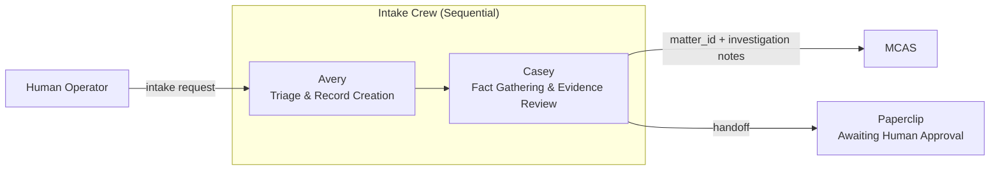

**Task flow:**
1. **Avery** creates `Person`, `Organization`, `Matter`, `Event`, and `Document` records (status=`draft`).
2. **Casey** reads the draft matter, evaluates evidence, writes investigation notes, and updates the matter with a preliminary tier proposal.
3. Output is written to MCAS and a Paperclip task is created awaiting human approval.

```python
# Pseudocode — crews/intake_crew.py
from crewai import Crew, Process
from misjustice_crews.agents import avery, casey
from misjustice_crews.tasks import intake_tasks

def create_intake_crew(intake_context: dict):
    agent_avery = avery.create_avery()
    agent_casey = casey.create_casey(matter_id=intake_context["matter_id"])

    task_triage = intake_tasks.TriageTask(
        agent=agent_avery,
        context=intake_context,
    )
    task_investigate = intake_tasks.InvestigateTask(
        agent=agent_casey,
        context={task_triage.output},  # sequential dependency
    )

    return Crew(
        agents=[agent_avery, agent_casey],
        tasks=[task_triage, task_investigate],
        process=Process.sequential,
        memory=True,
        verbose=True,
    )
```

### 3.3.3 Research Crew

**Purpose:** Produce a verified research dossier (statutes, case law, document analysis, timeline) before drafting begins.

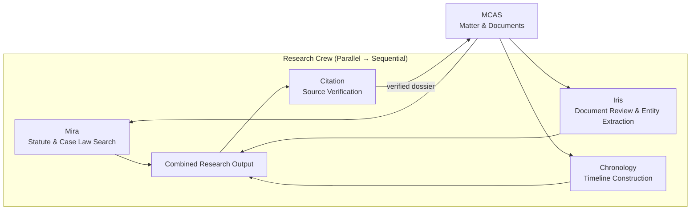

**Task flow:**
1. **Mira**, **Iris**, and **Chronology** run in parallel. Each reads from MCAS and writes to their respective output channels (research memos, document summaries, timeline records).
2. A **synthesis task** aggregates the three parallel outputs into a single research dossier object.
3. **Citation** audits every legal citation in the dossier using `citations_resolve` and `cases_citation_lookup`. Failed citations are flagged for human review.

```python
# Pseudocode — crews/research_crew.py
from crewai import Crew, Process
from misjustice_crews.agents import mira, iris, chronology, citation
from misjustice_crews.tasks import research_tasks

def create_research_crew(matter_id: str):
    agents = [
        mira.create_mira(matter_id),
        iris.create_iris(matter_id),
        chronology.create_chronology(matter_id),
        citation.create_citation(matter_id),
    ]
    tasks = [
        research_tasks.LegalResearchTask(agent=agents[0]),
        research_tasks.DocumentReviewTask(agent=agents[1]),
        research_tasks.TimelineBuildTask(agent=agents[2]),
        research_tasks.CitationAuditTask(
            agent=agents[3],
            context=[
                research_tasks.LegalResearchTask,
                research_tasks.DocumentReviewTask,
                research_tasks.TimelineBuildTask,
            ],
        ),
    ]
    return Crew(
        agents=agents,
        tasks=tasks,
        process=Process.sequential,  # parallel tasks have no inter-context deps
        memory=True,
        verbose=True,
    )
```

### 3.3.4 Drafting Crew

**Purpose:** Produce a citation-verified brief ready for Lex’s final sign-off.

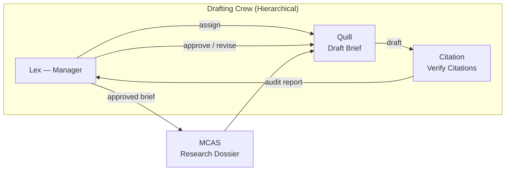

**Task flow:**
1. **Lex** (manager) reads the verified research dossier and delegates a brief-drafting task to **Quill**.
2. **Quill** drafts the brief using MCAS data and LawGlance (abstract queries only).
3. **Citation** audits the draft; if citations fail, the draft is returned to Quill with correction notes.
4. **Lex** reviews the audited draft and either approves it or requests revision.

```python
# Pseudocode — crews/drafting_crew.py
from crewai import Crew, Process
from misjustice_crews.agents import lex, quill, citation
from misjustice_crews.tasks import drafting_tasks

def create_drafting_crew(matter_id: str):
    agent_lex = lex.create_lex(matter_id)
    agent_quill = quill.create_quill(matter_id)
    agent_citation = citation.create_citation(matter_id)

    return Crew(
        agents=[agent_lex, agent_quill, agent_citation],
        tasks=[
            drafting_tasks.DraftBriefTask(agent=agent_quill),
            drafting_tasks.AuditCitationsTask(
                agent=agent_citation,
                context=[drafting_tasks.DraftBriefTask],
            ),
            drafting_tasks.FinalReviewTask(agent=agent_lex),
        ],
        process=Process.hierarchical,
        manager_agent=agent_lex,
        memory=True,
        verbose=True,
    )
```

### 3.3.5 Advocacy Crew

**Purpose:** Convert an approved brief into public advocacy content, gated by dual approval (Lex + human).

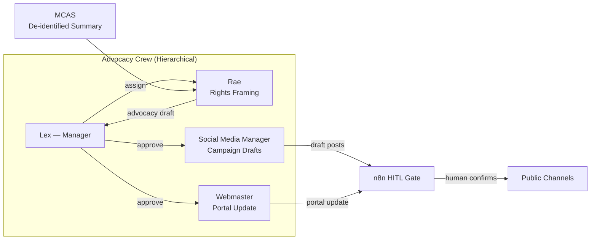

**Task flow:**
1. **Lex** (manager) assigns a rights-framing task to **Rae** using a de-identified matter summary.
2. **Rae** produces an advocacy narrative.
3. **Lex** approves the narrative and delegates parallel tasks to **Social Media Manager** (campaign drafts) and **Webmaster** (portal update).
4. Both external-facing outputs are routed through **n8n HITL** for human confirmation before publication.

```python
# Pseudocode — crews/advocacy_crew.py
from crewai import Crew, Process
from misjustice_crews.agents import lex, rae, social_media_manager, webmaster
from misjustice_crews.tasks import advocacy_tasks

def create_advocacy_crew(matter_id: str):
    agent_lex = lex.create_lex(matter_id)
    agent_rae = rae.create_rae(matter_id)
    agent_sm = social_media_manager.create_social_media_manager(matter_id)
    agent_wm = webmaster.create_webmaster(matter_id)

    return Crew(
        agents=[agent_lex, agent_rae, agent_sm, agent_wm],
        tasks=[
            advocacy_tasks.RightsFramingTask(agent=agent_rae),
            advocacy_tasks.CampaignDraftTask(
                agent=agent_sm,
                context=[advocacy_tasks.RightsFramingTask],
            ),
            advocacy_tasks.PortalUpdateTask(
                agent=agent_wm,
                context=[advocacy_tasks.RightsFramingTask],
            ),
            advocacy_tasks.PublicationApprovalTask(agent=agent_lex),
        ],
        process=Process.hierarchical,
        manager_agent=agent_lex,
        memory=True,
        verbose=True,
    )
```

### 3.3.6 Support Crew

**Purpose:** Handle paralegal tasks, deadline tracking, and system/tool recovery.

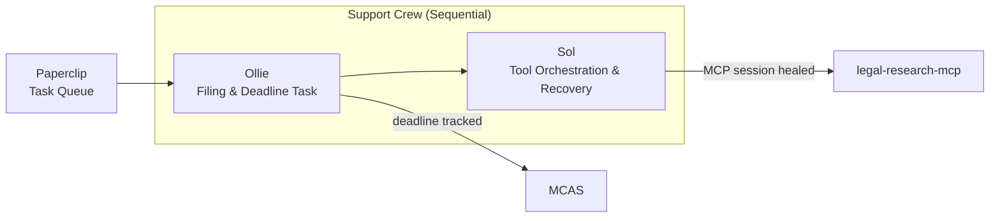

**Task flow:**
1. **Ollie** picks up filing-prep or deadline-tracking tasks from the Paperclip queue, writes to MCAS, and hands off to Sol if any tool integration is required.
2. **Sol** manages MCP session lifecycle, retries failed tool calls, and dispatches webhooks to n8n or Paperclip.

```python
# Pseudocode — crews/support_crew.py
from crewai import Crew, Process
from misjustice_crews.agents import ollie, sol
from misjustice_crews.tasks import support_tasks

def create_support_crew(matter_id: str, task_type: str):
    agent_ollie = ollie.create_ollie(matter_id)
    agent_sol = sol.create_sol()

    return Crew(
        agents=[agent_ollie, agent_sol],
        tasks=[
            support_tasks.ParalegalTask(agent=agent_ollie, task_type=task_type),
            support_tasks.ToolOrchestrationTask(
                agent=agent_sol,
                context=[support_tasks.ParalegalTask],
            ),
        ],
        process=Process.sequential,
        memory=True,
        verbose=True,
    )
```

---

## 3.4 Task Definitions

Tasks are defined as `Task` subclasses (or configured `Task` instances) in `tasks/`. Each task specifies an explicit `description`, `expected_output`, `agent`, `context` dependencies, and optional `output_json` / `output_pydantic` schemas.

### 3.4.1 Task Inventory by Crew

#### Intake Tasks

| Task ID | Agent | Description | Expected Output | Depends On |
|---|---|---|---|---|
| `TRIAGE-001` | Avery | Read intake form; create MCAS Person, Org, Matter, Event, Document records (draft). | `IntakeSummary` JSON with record IDs and tier proposals. | — |
| `INVESTIGATE-001` | Casey | Read draft matter; evaluate evidence credibility; summarise witness accounts; flag gaps. | `InvestigationReport` markdown with evidence matrix and tier recommendation. | `TRIAGE-001` |

#### Research Tasks

| Task ID | Agent | Description | Expected Output | Depends On |
|---|---|---|---|---|
| `RESEARCH-001` | Mira | Search statutes, case law, and regulations; produce annotated research memo. | `ResearchMemo` markdown with citations and provenance blocks. | — |
| `DOCReview-001` | Iris | Retrieve and review all matter documents; extract entities; flag anomalies. | `DocumentSummary` JSON per document + anomaly flags. | — |
| `TIMELINE-001` | Chronology | Retrieve all matter events; sequence chronologically; detect date conflicts. | `CanonicalTimeline` JSON with conflict warnings. | — |
| `CITEAUDIT-001` | Citation | Verify every citation in the combined research output; reject hallucinations. | `CitationAuditReport` JSON: `passed`, `failed`, `needs_human_review`. | `RESEARCH-001`, `DOCReview-001`, `TIMELINE-001` |

#### Drafting Tasks

| Task ID | Agent | Description | Expected Output | Depends On |
|---|---|---|---|---|
| `DRAFT-001` | Quill | Draft legal brief/memo using research dossier and firm templates. | `BriefDraft` markdown (IRAC structure, fully cited). | `CITEAUDIT-001` (research dossier) |
| `CITEAUDIT-002` | Citation | Verify every citation in the brief draft; format per Bluebook. | `CitationAuditReport` JSON. | `DRAFT-001` |
| `FINALREVIEW-001` | Lex | Review audited brief; approve or request revision with written feedback. | `BriefApproval` JSON: `status`, `revision_notes`, `approved_version_id`. | `CITEAUDIT-002` |

#### Advocacy Tasks

| Task ID | Agent | Description | Expected Output | Depends On |
|---|---|---|---|---|
| `ADVOCACY-001` | Rae | Frame victim impact and civil rights context; draft advocacy narrative. | `AdvocacyNarrative` markdown (Tier-3 safe). | `FINALREVIEW-001` |
| `CAMPAIGN-001` | Social Media Manager | Draft campaign posts based on approved advocacy narrative. | `CampaignDrafts` JSON array of posts with platform tags. | `ADVOCACY-001` |
| `PORTAL-001` | Webmaster | Update public case portal with de-identified summary and advocacy narrative. | `PortalUpdate` JSON: `url`, `published_at`, `checksum`. | `ADVOCACY-001` |
| `PUBAPPROVAL-001` | Lex | Review campaign drafts and portal update; approve for HITL gate. | `PublicationApproval` JSON: `status`, `conditions`. | `CAMPAIGN-001`, `PORTAL-001` |

#### Support Tasks

| Task ID | Agent | Description | Expected Output | Depends On |
|---|---|---|---|---|
| `PARALEGAL-001` | Ollie | Prepare filing, track deadline, or complete form per Paperclip task spec. | `ParalegalWorkProduct` JSON: `document_ref`, `deadline_id`, `status`. | — |
| `TOOLFIX-001` | Sol | Diagnose failed tool call; retry or escalate; heal MCP session if needed. | `ToolRecoveryReport` JSON: `action`, `retry_count`, `final_status`. | `PARALEGAL-001` (if tool failure) |

### 3.4.2 Task Dependency Graph

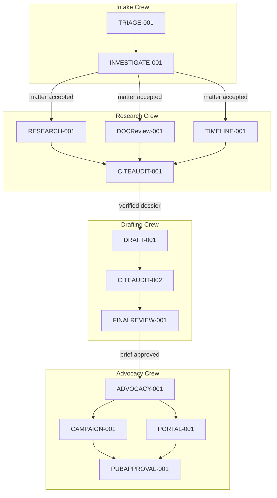

### 3.4.3 Task Pseudocode Template

```python
# Pseudocode — tasks/research_tasks.py
from crewai import Task
from pydantic import BaseModel

class ResearchMemoOutput(BaseModel):
    query_summary: str
    statutes: list[dict]
    cases: list[dict]
    regulations: list[dict]
    provenance: list[dict]
    confidence_score: float

class LegalResearchTask(Task):
    def __init__(self, agent):
        super().__init__(
            description=(
                "Search for controlling statutes, regulations, and case law relevant to "
                "the matter. Use the legal-research-mcp tools. Produce an annotated memo "
                "with full provenance for every source. Do not include PII in queries."
            ),
            expected_output="A ResearchMemoOutput JSON object with all fields populated.",
            agent=agent,
            output_json=ResearchMemoOutput,
        )
```

---

## 3.5 Tool Development Plan

Tools are the boundary between agents and the outside world. The firm uses three tool categories:
1. **MCAS API Tools** — RESTful wrappers around Django/DRF endpoints.
2. **MCP Tool Wrappers** — Dynamic `MCPToolWrapper` instances for `legal-research-mcp`.
3. **Custom CrewAI Tools** — Firm-specific utilities (timeline builder, citation formatter, PII checks).

### 3.5.1 MCAS API Tools (`tools/mcas_tools.py`)

All MCAS tools inherit from `crewai.tools.BaseTool`. They share:
- **Authentication:** JWT bearer token injected via `MCAS_API_TOKEN_<AGENT>`.
- **Base URL:** Resolved from `MCAS_API_URL`.
- **PII Guard:** Tier-0 fields are stripped from responses before they reach the agent’s context window.
- **Audit:** Every write operation appends a row to the MCAS audit log.

```python
# Pseudocode — tools/mcas_tools.py
from crewai.tools import BaseTool
from pydantic import BaseModel, Field
import httpx

class MatterReadInput(BaseModel):
    matter_id: str = Field(..., description="MCAS matter UUID")

class MatterReadTool(BaseTool):
    name: str = "mcas_matter_read"
    description: str = "Read a matter record from MCAS. Tier-0 fields are redacted."
    args_schema: type[BaseModel] = MatterReadInput

    def _run(self, matter_id: str) -> str:
        token = os.environ["MCAS_API_TOKEN"]
        url = f"{os.environ['MCAS_API_URL']}/matters/{matter_id}/"
        with httpx.Client(timeout=30) as client:
            resp = client.get(url, headers={"Authorization": f"Bearer {token}"})
            resp.raise_for_status()
            data = resp.json()
            return self._redact_tier0(data)

    def _redact_tier0(self, data: dict) -> str:
        for field in TIER0_FIELDS:
            data.pop(field, None)
        return json.dumps(data)
```

**Planned MCAS tools:**

| Tool Name | HTTP Method | Endpoint | Agents |
|---|---|---|---|
| `mcas_matter_read` | GET | `/matters/{id}/` | All |
| `mcas_matter_create` | POST | `/matters/` | Avery |
| `mcas_matter_update` | PATCH | `/matters/{id}/` | Avery, Casey, Lex |
| `mcas_person_read` | GET | `/persons/{id}/` | Avery, Casey |
| `mcas_person_create` | POST | `/persons/` | Avery |
| `mcas_document_read` | GET | `/documents/{id}/` | All |
| `mcas_document_create` | POST | `/documents/` | Avery, Iris |
| `mcas_document_draft_write` | POST | `/documents/{id}/drafts/` | Quill |
| `mcas_event_read` | GET | `/events/` (filtered) | Chronology, Casey |
| `mcas_event_create` | POST | `/events/` | Avery, Chronology |
| `mcas_deadline_create` | POST | `/deadlines/` | Ollie |
| `mcas_research_memo_write` | POST | `/research-memos/` | Mira |
| `mcas_audit_log_write` | POST | `/audit-logs/` | All (auto-injected) |

### 3.5.2 MCP Tool Wrappers (`tools/mcp_tool_factory.py`)

The `legal-research-mcp` server exposes 14+ tools (see `services/legal-research-mcp/tools.yaml`). Rather than hardcoding each tool, the factory uses CrewAI’s `MCPToolWrapper` to discover and bind tools at runtime.

```python
# Pseudocode — tools/mcp_tool_factory.py
from crewai.tools import MCPToolWrapper
from mcp import ClientSession, StdioServerParameters
import json

LEGAL_RESEARCH_MCP_PARAMS = {
    "command": "python",
    "args": ["-m", "legal_research_mcp.server"],
    "env": {
        "LEGAL_GATEWAY_BASE_URL": os.environ["LEGAL_GATEWAY_BASE_URL"],
        "LEGAL_GATEWAY_API_KEY": os.environ["LEGAL_GATEWAY_API_KEY"],
    },
}

_TOOL_CACHE: dict[str, MCPToolWrapper] = {}

def create(server_name: str, tool_name: str) -> MCPToolWrapper:
    cache_key = f"{server_name}:{tool_name}"
    if cache_key in _TOOL_CACHE:
        return _TOOL_CACHE[cache_key]

    # Discover tool schema via MCP protocol
    schema = _discover_tool_schema(server_name, tool_name)
    wrapper = MCPToolWrapper(
        mcp_server_params=LEGAL_RESEARCH_MCP_PARAMS,
        tool_name=tool_name,
        tool_schema=schema,
        server_name=server_name,
    )
    _TOOL_CACHE[cache_key] = wrapper
    return wrapper

def _discover_tool_schema(server_name: str, tool_name: str) -> dict:
    # Connects to MCP server, lists tools, returns schema for tool_name
    ...
```

**MCP tools bound per agent:**

| MCP Tool | Bound To | Purpose |
|---|---|---|
| `cases_search` | Mira, Sol | Full-text / semantic case law search |
| `cases_get` | Mira, Lex, Quill, Citation | Retrieve full opinion text |
| `cases_citation_lookup` | Citation | Resolve citation string to canonical case |
| `dockets_search` | Mira | Search RECAP federal dockets |
| `statutes_lookup` | Mira, Quill, Sol | Retrieve USC section text |
| `statutes_search` | Mira | Full-text USC search |
| `regulations_current` | Mira | Retrieve live eCFR text |
| `citations_resolve` | Citation, Lex | Parse and validate citation strings |
| `graph_expand` | Mira, Citation | Traverse Neo4j citation graph |
| `bills_search` | Rae | Search state / federal legislation |
| `legislators_lookup` | Rae | Look up legislators by district |
| `lii_reference` | Mira, Citation | Generate human-readable LII URL |

### 3.5.3 Custom CrewAI Tools (`tools/custom_tools.py`)

```python
# Pseudocode — tools/custom_tools.py
from crewai.tools import BaseTool
from pydantic import BaseModel, Field

class TimelineBuilderInput(BaseModel):
    events: list[dict] = Field(..., description="List of MCAS Event objects")

class TimelineBuilderTool(BaseTool):
    name: str = "timeline_builder"
    description: str = "Sort events chronologically and detect gaps or conflicts."
    args_schema: type[BaseModel] = TimelineBuilderInput

    def _run(self, events: list[dict]) -> str:
        sorted_events = sorted(events, key=lambda e: e["event_date"])
        conflicts = self._detect_conflicts(sorted_events)
        return json.dumps({"timeline": sorted_events, "conflicts": conflicts})

class CitationFormatInput(BaseModel):
    citation: str = Field(..., description="Raw citation string")
    style: str = Field(default="bluebook", description="Citation style")

class CitationFormatTool(BaseTool):
    name: str = "citation_format"
    description: str = "Format a citation per Bluebook or ALWD."
    args_schema: type[BaseModel] = CitationFormatInput

    def _run(self, citation: str, style: str) -> str:
        # Delegates to legal-research-mcp or local formatter
        ...

class Tier3SafetyCheckTool(BaseTool):
    name: str = "tier3_safety_check"
    description: str = "Scan text for Tier-0/1 PII before external publication."

    def _run(self, text: str) -> str:
        # Regex + NemoClaw policy check
        ...
```

**Planned custom tools:**

| Tool Name | Input Schema | Output Schema | Used By |
|---|---|---|---|
| `timeline_builder` | `events: list[dict]` | `{timeline, conflicts}` | Chronology |
| `date_conflict_detector` | `events: list[dict]` | `{conflicts: list[dict]}` | Chronology |
| `citation_format` | `citation: str, style: str` | `formatted_citation: str` | Citation, Quill |
| `hallucination_flag` | `claim: str, sources: list[str]` | `{flagged: bool, reason: str}` | Citation |
| `tier3_safety_check` | `text: str` | `{safe: bool, violations: list[str]}` | Social Media Manager, Webmaster, Rae |
| `cms_publish` | `content: str, slug: str` | `{url: str, published_at: str}` | Webmaster |
| `seo_schema` | `matter_summary: str` | `{json_ld: dict, meta_tags: dict}` | Webmaster |
| `accessibility_lint` | `html: str` | `{issues: list[dict], score: float}` | Webmaster |
| `post_draft` | `narrative: str, platform: str` | `{headline: str, body: str, hashtags: list[str]}` | Social Media Manager |
| `redis_publish` | `channel: str, message: dict` | `{status: str}` | Sol |
| `webhook_dispatch` | `url: str, payload: dict` | `{status_code: int}` | Sol |

### 3.5.4 Web Search Tools (`tools/web_search_tools.py`)

SearXNG is the sole web-search provider. Agents receive tier-scoped tokens that restrict engine groups and result ceilings.

```python
# Pseudocode — tools/web_search_tools.py
from crewai.tools import BaseTool
from pydantic import BaseModel, Field
import httpx

class SearXNGInput(BaseModel):
    query: str = Field(..., description="Search query (no PII)")
    max_results: int = Field(default=10, ge=1, le=50)

class SearXNGSearchTool(BaseTool):
    name: str = "searxng_search"
    description: str = "Search the web via SearXNG. Tier-scoped."
    args_schema: type[BaseModel] = SearXNGInput

    def __init__(self, tier: str):
        self.tier = tier
        self.token = os.environ[f"SEARXNG_TOKEN_{tier}"]
        self.url = os.environ["SEARXNG_API_URL"]

    def _run(self, query: str, max_results: int) -> str:
        with httpx.Client(timeout=30) as client:
            resp = client.get(
                f"{self.url}/search",
                params={"q": query, "format": "json", "max_results": max_results},
                headers={"Authorization": f"Bearer {self.token}"},
            )
            resp.raise_for_status()
            return json.dumps(resp.json()["results"])
```

---

## 3.6 Agent Testing Strategy

Testing is split into **unit tests** (tools in isolation) and **integration tests** (crews with mocked or lightweight backends). All tests run inside the `crewai-orchestrator` container using `pytest`.

### 3.6.1 Testing Pyramid

```
        ┌─────────────┐
        │  E2E Tests  │  5% — Full stack with MCAS + MCP + Redis (CI nightly)
        │  (nightly)  │
        ├─────────────┤
        │ Integration │ 25% — Crew-level with mocked LiteLLM + testcontainers
        │   Tests     │
        ├─────────────┤
        │  Unit Tests │ 70% — Tool logic, agent factories, task schemas
        │             │
        └─────────────┘
```

### 3.6.2 Unit Tests

**Scope:** Individual tools, agent factories, and task output schemas.

| Test Module | Target | Fixtures | Assertions |
|---|---|---|---|
| `test_tools/test_mcas_tools.py` | `MatterReadTool`, `DocumentCreateTool`, etc. | `httpx_mock`, `fake_matter_json` | HTTP method, URL, auth header, Tier-0 redaction |
| `test_tools/test_mcp_tool_factory.py` | `mcp_tool_factory.create()` | `mock_mcp_server` (subprocess) | Tool name prefix, schema presence, `_run` return type |
| `test_tools/test_custom_tools.py` | `TimelineBuilderTool`, `CitationFormatTool`, `Tier3SafetyCheckTool` | Sample events, citations, PII text | Correct sorting, formatting, flagging |
| `test_tools/test_web_search_tools.py` | `SearXNGSearchTool` | `httpx_mock` | Tier token header, query param, result count limit |
| `test_agents/test_agent_factories.py` | All 13 `create_*()` functions | `mock_llm` (LiteLLM proxy stub) | Agent role, tool count, memory flag, fallback model |
| `test_agents/test_task_schemas.py` | All `Task` subclasses | `pydantic` validation samples | Output schema validity, required fields |

**Pseudocode — example unit test:**

```python
# Pseudocode — tests/unit/test_tools/test_mcas_tools.py
import pytest
from misjustice_crews.tools.mcas_tools import MatterReadTool

def test_matter_read_redacts_tier0(httpx_mock, monkeypatch):
    monkeypatch.setenv("MCAS_API_TOKEN", "test-token")
    monkeypatch.setenv("MCAS_API_URL", "http://mcas:8000")

    httpx_mock.add_response(
        url="http://mcas:8000/matters/123/",
        json={
            "id": "123",
            "legal_name": "Jane Doe",        # Tier 0 — must be redacted
            "narrative": "Excessive force complaint",
            "tier": "T1",
        },
    )

    tool = MatterReadTool()
    result = tool._run(matter_id="123")
    data = json.loads(result)

    assert "legal_name" not in data
    assert data["narrative"] == "Excessive force complaint"
```

### 3.6.3 Integration Tests

**Scope:** Full crew execution with mocked LLM responses and real (testcontainer) services where practical.

| Test Module | Crew | Mock Strategy | Real Services |
|---|---|---|---|
| `test_intake_crew.py` | Intake Crew | `mock_llm` returns structured JSON | MCAS testcontainer (PostgreSQL + Django) |
| `test_research_crew.py` | Research Crew | `mock_llm` returns research memo text | MCAS testcontainer, MCP mock server |
| `test_drafting_crew.py` | Drafting Crew | `mock_llm` returns brief draft + approval | MCAS testcontainer |
| `test_advocacy_crew.py` | Advocacy Crew | `mock_llm` returns campaign text + approval | MCAS testcontainer |
| `test_support_crew.py` | Support Crew | `mock_llm` returns filing text + retry log | MCAS testcontainer, Redis testcontainer |

**Integration test conventions:**
- LLM responses are mocked using `crewai.llm.LLM` subclassing or `responses` / `vcrpy` against the LiteLLM proxy.
- MCAS is spun up via `pytest-docker` or `testcontainers-python` with a pre-migrated PostgreSQL instance.
- MCP tools are tested against a lightweight MCP server stub that returns canned tool schemas and responses.
- Redis is used via `testcontainers.redis` for pub/sub and cache assertions.
- Every integration test asserts on **final MCAS state** (e.g., matter status, document count, audit log rows).

**Pseudocode — example integration test:**

```python
# Pseudocode — tests/integration/test_research_crew.py
import pytest
from misjustice_crews.crews.research_crew import create_research_crew

def test_research_crew_produces_verified_dossier(mock_llm, mcas_testcontainer, mcp_stub):
    # Seed MCAS with a matter and two documents
    matter_id = seed_matter(mcas_testcontainer, documents=["complaint.pdf", "witness_stmt.pdf"])

    # Configure mock LLM to return plausible research outputs
    mock_llm.register_response(
        agent_role="Legal Researcher",
        output={"statutes": ["42 U.S.C. § 1983"], "cases": ["Graham v. Connor"]},
    )
    mock_llm.register_response(
        agent_role="Document Analyst",
        output={"entities": ["Officer Smith", "Missoula PD"], "anomalies": []},
    )
    mock_llm.register_response(
        agent_role="Timeline Agent",
        output={"timeline": [{"date": "2025-01-15", "event": "Incident"}]},
    )
    mock_llm.register_response(
        agent_role="Citation Auditor",
        output={"passed": True, "failed": []},
    )

    crew = create_research_crew(matter_id=matter_id)
    result = crew.kickoff(inputs={"matter_id": matter_id})

    # Assertions
    assert result["citation_audit"]["passed"] is True
    assert mcas_testcontainer.count_documents(matter_id) == 2
    assert mcas_testcontainer.count_research_memos(matter_id) == 1
    assert mcas_testcontainer.count_audit_logs(agent_id="citation") >= 1
```

### 3.6.4 Test Configuration

```python
# Pseudocode — pyproject.toml test section
[tool.pytest.ini_options]
minversion = "8.0"
testpaths = ["tests"]
markers = [
    "unit: fast tests with no external services",
    "integration: tests requiring Docker services",
    "e2e: full stack tests (CI nightly only)",
]
```

**CI strategy:**
- **PR gate:** `pytest -m "unit"` (< 2 minutes).
- **Merge gate:** `pytest -m "unit or integration"` with `testcontainers` (< 10 minutes).
- **Nightly:** `pytest -m "e2e"` against a staging Docker Compose stack.

---

## 3.7 Memory Configuration

CrewAI memory is configured per agent tier and operational sensitivity.

| Memory Type | Backend | Scope | Retention | Tier Ceiling |
|---|---|---|---|---|
| **Short-term** | In-context (LLM context window) | Single crew execution | Session | T1 |
| **Long-term (semantic)** | Qdrant (`agent-net`) | Agent-scoped, matter-indexed | 90 days | T2 |
| **Long-term (entity)** | Neo4j (`backend`) | Cross-matter legal entities | Permanent | T3 |
| **Cache** | Redis (`backend`) | Tool results, templates, sessions | LRU / TTL | T1–T3 |

**Configuration pseudocode:**

```python
# Pseudocode — config/memory_config.py
from crewai.memory import LongTermMemory
from misjustice_crews.memory.qdrant_backend import QdrantMemoryBackend

def configure_memory(agent_id: str, tier: str):
    backend = QdrantMemoryBackend(
        url=os.environ["QDRANT_URL"],
        api_key=os.environ["QDRANT_API_KEY"],
        collection=f"memory-{agent_id}",
        vector_size=1536,
    )
    return LongTermMemory(
        backend=backend,
        tier_ceiling=tier,
        encrypt_at_rest=True,
    )
```

---

## 3.8 Key Files & References

| Document | Path | Purpose |
|---|---|---|
| Agent roster & orchestration rules | `AGENTS.md` | Canonical agent definitions and workflow stages |
| MCP tool definitions | `services/legal-research-mcp/tools.yaml` | 14+ legal research tools exposed via MCP |
| MCAS specification | `services/mcas/README.md` | REST API schema and data model |
| Data classification policy | `policies/DATA_CLASSIFICATION.md` | Tier definitions and handling rules |
| Search token policy | `policies/SEARCH_TOKEN_POLICY.md` | Agent-scoped SearXNG/LiteLLM access tiers |
| Architecture overview | `docs/plan-sections/01-architecture.md` | System topology and service dependencies |
| Deployment framework | `docs/plan-sections/02-deployment.md` | Ansible roles and environment progression |

---

*MISJustice Alliance — Legal Research. Civil Rights. Public Record.*

---

# Section 4 — Paperclip Control Plane Integration

> **Scope:** Integration architecture between Paperclip (Layer 2 control plane), the 13 firm agents, CrewAI orchestration, and Hermes human-interface layer. Covers company structure, heartbeat adapters, task lifecycle, monitoring, and security boundaries.  
> **Exclusions:** Infrastructure deployment (see Section 2), implementation source code, CrewAI agent internal logic (see Section 3), MCAS schema (see SPEC.md).  
> **Version:** 1.0  
> **Date:** 2026-04-27

---

## 4.1 Paperclip Company Structure

Paperclip hosts the firm as a single **Company** with a hierarchical org chart, lane-based teams, and explicit manager/report chains. Every agent is an **Employee** with an adapter type, adapter config, and budget allocation.

### 4.1.1 Company Definition

| Property | Value |
|---|---|
| **Company Name** | `MISJustice Alliance Legal Agency` |
| **Paperclip Instance** | `http://100.106.20.102:3100` (authenticated mode) |
| **Board** | Single human operator with full override rights |
| **CEO Agent** | `Atlas` — orchestrates all operational lanes |
| **Budget Currency** | USD + token burn (via LiteLLM telemetry ingestion) |

### 4.1.2 Team Lanes and Org Chart

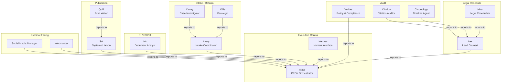

### 4.1.3 Agent Roster as Paperclip Employees

All 13 operational agents plus Hermes and Atlas are registered as employees. The table below maps each agent to its Paperclip team, adapter, and escalation path.

| Employee | Team | Adapter Type | Manager | Reports | Budget Group |
|---|---|---|---|---|---|
| **Atlas** | Executive Control | `openclaw_gateway` | Board | All operational agents | `exec` |
| **Hermes** | Executive Control | `hermes_local` | Board | Atlas | `exec` |
| **Lex** | Legal Research | `openclaw_gateway` | Atlas | Mira, Citation, Chronology | `legal` |
| **Mira** | Legal Research | `openclaw_gateway` | Lex | — | `legal` |
| **Casey** | Intake / Referral | `openclaw_gateway` | Avery | — | `intake` |
| **Avery** | Intake / Referral | `openclaw_gateway` | Atlas | Casey, Ollie | `intake` |
| **Ollie** | Intake / Referral | `openclaw_gateway` | Avery | — | `intake` |
| **Iris** | PI / OSINT | `openclaw_gateway` | Atlas | — | `pi` |
| **Sol** | Publication | `openclaw_gateway` | Atlas | Quill | `publication` |
| **Quill** | Publication | `openclaw_gateway` | Sol | — | `publication` |
| **Rae** | Legal Research | `openclaw_gateway` | Lex | — | `legal` |
| **Citation** | Audit | `openclaw_gateway` | Lex | — | `audit` |
| **Chronology** | Audit | `openclaw_gateway` | Lex | — | `audit` |
| **Social Media Manager** | External Facing | `openclaw_gateway` | Atlas | — | `external` |
| **Webmaster** | External Facing | `openclaw_gateway` | Atlas | — | `external` |
| **Veritas** | Audit | `openclaw_gateway` | Atlas | — | `audit` |

> **Note:** The full roster is 16 employees (13 operational + Atlas + Hermes + Veritas). Veritas is a policy-auditor agent, not a case-worker.

### 4.1.4 Budget Delegation Hierarchy

```
Board (human) ──► Company budget ceiling
    │
    ├──► Atlas ──► exec pool (orchestration, escalation)
    │
    ├──► Hermes ──► exec pool (human-interface compute)
    │
    ├──► Lex ──► legal pool
    │       ├──► Mira
    │       ├──► Citation
    │       └──► Chronology
    │
    ├──► Avery ──► intake pool
    │       ├──► Casey
    │       └──► Ollie
    │
    ├──► Iris ──► pi pool
    │
    ├──► Sol ──► publication pool
    │       └──► Quill
    │
    ├──► Rae ──► legal pool
    │
    ├──► Social Media Manager ──► external pool
    │
    ├──► Webmaster ──► external pool
    │
    └──► Veritas ──► audit pool
```

Budget controls:
- **Soft alert** at 80% of any pool
- **Hard ceiling** auto-pauses the agent; Board notified; Board may override
- Costs reported in USD and tokens; LiteLLM telemetry ingested nightly into Paperclip per-agent cost fields

---

## 4.2 Heartbeat Adapter Design

Paperclip initiates agent work cycles via the **heartbeat protocol**. The adapter defines *how* Paperclip invokes an agent. Paperclip controls **when** and **how**; the agent controls **what** it does and **how long** it runs.

### 4.2.1 Adapter Taxonomy

| Adapter Type | Mechanism | Used By | Payload Mode |
|---|---|---|---|
| `openclaw_gateway` | HTTP POST to OpenClaw Gateway | All 13 operational agents + Atlas + Veritas | Thin ping |
| `hermes_local` | HTTP POST to Hermes Agent TUI / gateway | Hermes | Fat payload |
| `http` | Generic webhook to arbitrary endpoint | Experimental runtimes, third-party tools | Configurable |
| `process` | Fork child process on Paperclip host | Local utility scripts, backup jobs | Fat payload |

### 4.2.2 Adapter Interface Contract

Every adapter implements three methods:

```pseudocode
interface PaperclipAdapter {
  invoke(agentConfig: AdapterConfig, context?: HeartbeatContext) -> void
  status(agentConfig: AdapterConfig) -> AgentStatus
  cancel(agentConfig: AdapterConfig) -> void
}
```

| Method | Purpose | Called By |
|---|---|---|
| `invoke` | Start the agent's work cycle | Paperclip scheduler on heartbeat trigger |
| `status` | Check if running / finished / errored | Paperclip health poller |
| `cancel` | Graceful stop signal (pause/resume) | Board pause action or budget ceiling hit |

### 4.2.3 OpenClaw Gateway Adapter (Operational Agents)

All case-working agents use the `openclaw_gateway` adapter. Paperclip sends a **thin ping**; the agent (via OpenClaw) calls back to Paperclip's REST API for task context.

**Adapter configuration blob:**

```json
{
  "adapterType": "openclaw_gateway",
  "adapterConfig": {
    "gatewayUrl": "http://openclaw-gateway:8080",
    "crewMapping": {
      "Intake:": "IntakeCrew",
      "Research:": "LegalResearchCrew",
      "PI:": "InvestigationCrew",
      "Publication:": "PublicationCrew",
      "Review:": "ReviewCrew"
    },
    "classificationCeiling": "tier_2",
    "sandboxPolicy": "openshell_default",
    "callbackUrl": "http://paperclip:3000/api/webhooks/openclaw",
    "heartbeatFrequency": "300",
    "maxRunSeconds": 1800,
    "gracePeriodSeconds": 60
  }
}
```

**Thin ping payload (Paperclip → OpenClaw):**

```json
{
  "event": "heartbeat",
  "agentId": "AGENT_ID_MIRA",
  "companyId": "COMPANY_ID",
  "timestamp": "2026-04-27T16:00:00Z",
  "context": {
    "mode": "thin",
    "apiBaseUrl": "http://paperclip:3000/api",
    "authTokenRef": "PAPERCLIP_API_TOKEN"
  }
}
```

**Agent cycle on receive:**

```pseudocode
function onHeartbeat(agentId, context):
  1. Authenticate to Paperclip API using injected token
  2. Fetch inbox: issues assigned to agentId with status in [todo, in_progress, blocked]
  3. If no issues: post "no-op" status and exit
  4. If issues exist:
       a. Atomically checkout highest-priority issue
       b. Map issue lane prefix to Crew name via crewMapping
       c. Dispatch CrewAI crew via OpenClaw
       d. Stream progress comments back to Paperclip
       e. On completion: attach output documents, update status, post handoff comment
  5. Report token cost to Paperclip cost endpoint
  6. Exit
```

### 4.2.4 Hermes Local Adapter (Human Interface)

Hermes receives a **fat payload** because it is stateful and may not always be able to call back to Paperclip before rendering a response to the human operator.

**Adapter configuration blob:**

```json
{
  "adapterType": "hermes_local",
  "adapterConfig": {
    "hermesUrl": "http://hermes-agent:3000/paperclip-hook",
    "model": "nous-hermes-3-llama-3.1-70b",
    "provider": "ollama",
    "systemPrompt": "You are the MISJustice Alliance operator interface. Route instructions to Atlas and manage the Paperclip control plane on behalf of the human operator.",
    "heartbeatFrequency": "60",
    "maxRunSeconds": 300,
    "fatPayload": true
  }
}
```

**Fat payload (Paperclip → Hermes):**

```json
{
  "event": "heartbeat",
  "agentId": "AGENT_ID_HERMES",
  "companyId": "COMPANY_ID",
  "timestamp": "2026-04-27T16:00:00Z",
  "context": {
    "mode": "fat",
    "assignedIssues": [
      {
        "id": "ISSUE_ID",
        "title": "Intake: MCAS-2026-00124 triage request",
        "status": "todo",
        "priority": "high",
        "comments": [ /* last 5 comments */ ],
        "documents": [ /* document keys only */ ]
      }
    ],
    "companyState": {
      "activeGoals": 3,
      "monthlySpendUsd": 1247.50,
      "monthlyBudgetUsd": 5000.00
    },
    "pendingHITLGates": [
      { "gateId": "publication_approval", "issueId": "ISSUE_X" }
    ]
  }
}
```

### 4.2.5 Per-Agent Heartbeat Parameters

| Agent | Frequency (s) | Max Run (s) | Grace (s) | Payload Mode | Notes |
|---|---|---|---|---|---|
| Atlas | 120 | 900 | 60 | Thin | High-frequency orchestrator; checks all lanes |
| Hermes | 60 | 300 | 30 | Fat | Human-facing; low latency expected |
| Lex | 300 | 1800 | 60 | Thin | Deep reasoning tasks; longer runs |
| Mira | 300 | 1800 | 60 | Thin | Research tasks |
| Casey | 300 | 1200 | 60 | Thin | Investigation tasks |
| Avery | 300 | 1200 | 60 | Thin | Intake triage |
| Ollie | 300 | 1200 | 60 | Thin | Form/filing prep |
| Iris | 600 | 1800 | 90 | Thin | PI tasks; lower frequency to reduce budget burn |
| Sol | 300 | 1200 | 60 | Thin | Tool orchestration |
| Quill | 300 | 1800 | 60 | Thin | Drafting tasks |
| Rae | 300 | 1800 | 60 | Thin | Advocacy framing |
| Citation | 300 | 1200 | 60 | Thin | Audit tasks |
| Chronology | 300 | 1200 | 60 | Thin | Timeline tasks |
| Social Media Manager | 600 | 900 | 60 | Thin | External-facing; gated by HITL |
| Webmaster | 600 | 900 | 60 | Thin | External-facing; gated by HITL |
| Veritas | 3600 | 1800 | 60 | Thin | Nightly audit + on-demand compliance review |

### 4.2.6 Pause / Resume Behavior

When the Board (or automated budget ceiling) pauses an agent:

```pseudocode
function pauseAgent(agentId):
  1. Signal current execution: POST /cancel to adapter
  2. Wait gracePeriodSeconds for agent to save state and post final comment
  3. If still running after grace period: force-kill via adapter
  4. Stop future heartbeats: remove agent from scheduler queue
  5. Set agent status = "paused" in Paperclip
  6. Notify Board and Atlas

function resumeAgent(agentId):
  1. Set agent status = "active" in Paperclip
  2. Re-add agent to scheduler queue with prior frequency
  3. Send immediate heartbeat to clear backlog
  4. Log resume event to audit trail
```

---

## 4.3 Hermes Agent Integration as Human Interface

Hermes is the **sole human-in-the-loop (HITL) gateway** between the operator and the Paperclip control plane. It does not execute case work directly; it routes operator intent to Atlas/OpenClaw and surfaces Paperclip state back to the operator.

### 4.3.1 Integration Topology

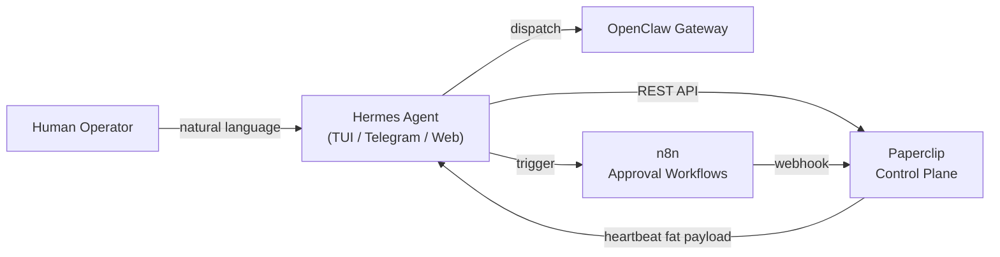

### 4.3.2 Hermes Responsibilities

| Responsibility | Detail |
|---|---|
| **Intent Classification** | Operator NL → structured intent (dispatch, status query, approval, escalation) |
| **Task Dispatch** | Confirmed intents forwarded to OpenClaw with proper crew mapping |
| **HITL Gate Routing** | Publication, PI, and escalation approvals routed through n8n workflows |
| **Status Surfacing** | Pulls Paperclip issue state and presents human-readable summaries |
| **Policy Enforcement** | Hard limits: no autonomous publication, no Tier-0 handling, no legal advice |
| **Memory Continuity** | Cross-session memory via MemoryPalace (Tier-2 ceiling; no case content) |

### 4.3.3 Hermes → Paperclip API Surface

Hermes uses the Paperclip REST API with a dedicated service token scoped to `hermes` identity.

```pseudocode
# Intent: "What's the status of case 124?"
Hermes:
  GET /api/companies/COMPANY_ID/issues?search=MCAS-2026-00124
  → returns issue list with statuses, assignees, latest comments
  → renders human-readable summary to operator

# Intent: "Have Mira research the Montana statute"
Hermes:
  1. Classify intent → dispatch_to_crew
  2. Confirm with operator (Intent Confirmation block)
  3. POST /api/companies/COMPANY_ID/issues
       title: "Research: MCAS-2026-00124 Montana statute review"
       assigneeAgentId: AGENT_ID_MIRA
       parentId: INTAKE_ISSUE_ID
  4. @-mention Mira in comment to trigger heartbeat
  5. Log dispatch to MemoryPalace delegation_history
  6. Confirm to operator: "Dispatched to Mira. Issue #1234."

# Intent: "Approve the publication draft"
Hermes:
  1. Identify pending HITL gate from MemoryPalace or Paperclip comment
  2. POST to n8n approval webhook with decision=approved
  3. n8n updates Paperclip issue status and notifies Quill
  4. Log outcome to MemoryPalace hitl_gate_outcomes
```

### 4.3.4 Hermes Authentication and Scope

| Property | Value |
|---|---|
| **Paperclip Token** | `PAPERCLIP_HERMES_TOKEN` (long-lived, scoped) |
| **Allowed Methods** | GET issues, POST issues, PATCH issues, POST comments, GET documents |
| **Forbidden Methods** | DELETE issues, DELETE agents, modify budgets, modify Board settings |
| **Classification Ceiling** | Tier-2 — Hermes never sees Tier-0 or Tier-1 matter content |
| **n8n Webhook Auth** | HMAC-SHA256 signed with `N8N_HERMES_SECRET` |

---

## 4.4 Task Lifecycle

The canonical task lifecycle spans Paperclip issue creation, CrewAI execution, output review, and completion. All state transitions are mediated by Paperclip; CrewAI is the execution engine, not the system of record.

### 4.4.1 Lifecycle States

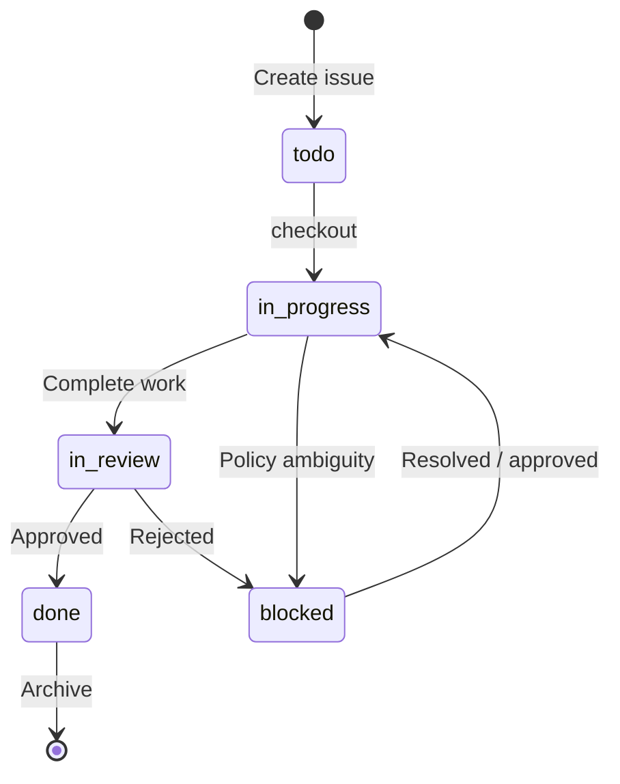

| State | Meaning | Who Can Enter |
|---|---|---|
| `todo` | Created, not yet claimed | Any agent with rights |
| `in_progress` | Checked out and executing | Assignee only (atomic) |
| `in_review` | Work complete, awaiting approval | Assignee or lane policy |
| `blocked` | Paused for policy/HITL/compliance | Assignee, Veritas, Atlas, or n8n |
| `done` | Closed, artifacts stored | Assignee + lane policy (HITL for Publication/PI) |

### 4.4.2 Full Lifecycle Walkthrough

#### Step 1 — Issue Creation (Paperclip)

Triggered by: Hermes operator instruction, Atlas orchestration, or automated intake webhook.

```http
POST /api/companies/COMPANY_ID/issues
Authorization: Bearer PAPERCLIP_API_TOKEN
Content-Type: application/json
X-Paperclip-Run-Id: RUN_ID

{
  "title": "Research: MCAS-2026-00124 Montana unlawful arrest statutes",
  "description": "MCAS Case ID: MCAS-2026-00124\nClassification: Tier-2\nScope: statutory research only\nConstraints: no PI, no outreach",
  "status": "todo",
  "priority": "high",
  "assigneeAgentId": "AGENT_ID_MIRA",
  "parentId": "INTAKE_ISSUE_ID",
  "projectId": "PROJECT_ID_CASE_124",
  "goalId": "GOAL_ID_CASE_DEVELOPMENT"
}
```

#### Step 2 — Heartbeat and Checkout (Paperclip → OpenClaw → CrewAI)

Mira's heartbeat fires. OpenClaw receives the thin ping, Mira authenticates to Paperclip, fetches inbox, and atomically checks out the issue.

```http
POST /api/issues/RESEARCH_ISSUE_ID/checkout
Authorization: Bearer PAPERCLIP_API_TOKEN
Content-Type: application/json
X-Paperclip-Run-Id: RUN_ID

{
  "agentId": "AGENT_ID_MIRA",
  "expectedStatuses": ["todo", "backlog"]
}
```

#### Step 3 — CrewAI Execution (OpenClaw / NemoClaw)

OpenClaw maps the lane prefix `Research:` to `LegalResearchCrew`. The crew executes inside NemoClaw sandbox with `tier_2` classification ceiling.

```pseudocode
OpenClaw.dispatch(issueId, crewName="LegalResearchCrew"):
  1. Validate agent permissions against issue classification
  2. Load crew configuration from CrewAI orchestrator
  3. Spawn sandboxed process in NemoClaw with openshell_default policy
  4. Inject issue metadata (title, description, document keys) into crew context
  5. Execute crew tasks (Mira researches, Chronology sequences, Citation verifies)
  6. Collect outputs: research memo, source list, timeline
  7. Stream progress comments to Paperclip every 5 minutes
  8. On completion: return structured output payload
```

#### Step 4 — Output Storage and Status Update

Mira stores artifacts as keyed documents and transitions to `in_review`.

```http
PUT /api/issues/RESEARCH_ISSUE_ID/documents/research-memo
Authorization: Bearer PAPERCLIP_API_TOKEN
Content-Type: application/json

{
  "title": "Research Memo v1",
  "format": "markdown",
  "body": "# Research Memo..."
}
```

```http
PATCH /api/issues/RESEARCH_ISSUE_ID
Authorization: Bearer PAPERCLIP_API_TOKEN
Content-Type: application/json
X-Paperclip-Run-Id: RUN_ID

{
  "status": "in_review",
  "comment": "## Research complete\n\n- Memo stored as `research-memo`\n- Sources verified by Citation\n- Ready for Lex review"
}
```

#### Step 5 — Output Review (Human or Agent)

| Lane | Reviewer | Mechanism |
|---|---|---|
| Intake | Atlas | Automated validation + spot-check |
| Research | Lex | Agent review; escalates to HITL if ambiguity |
| PI | Veritas + HITL | Mandatory compliance review before `done` |
| Publication | Human operator (via n8n) | Mandatory HITL approval before `done` |
| Audit | Veritas | Automated audit trail verification |

Lex reviews the research memo. If approved:

```http
PATCH /api/issues/RESEARCH_ISSUE_ID
Authorization: Bearer PAPERCLIP_API_TOKEN
Content-Type: application/json
X-Paperclip-Run-Id: RUN_ID

{
  "status": "done",
  "comment": "## Approved by Lex\n\n- Research memo accepted\n- Routing to Quill for brief drafting"
}
```

If rejected or needs revision:

```http
PATCH /api/issues/RESEARCH_ISSUE_ID
Authorization: Bearer PAPERCLIP_API_TOKEN
Content-Type: application/json
X-Paperclip-Run-Id: RUN_ID

{
  "status": "blocked",
  "comment": "## Revision requested by Lex\n\n- Missing 2023 amendment analysis\n- Re-open when supplemented"
}
```

#### Step 6 — Completion and Audit Log

On `done`, Paperclip automatically:
- Archives issue and all comments
- Rolls up token cost to project and company budgets
- Emits webhook to MCAS for case lifecycle sync
- Writes immutable audit entry

### 4.4.3 Handoff Comment Contract

Every status transition that changes assignment or moves between lanes must include a structured comment:

```markdown
## Handoff: [FROM_AGENT] -> [TO_AGENT]

@TargetAgent directive sentence.

- MCAS Case ID: MCAS-YYYY-NNNNN
- Status: what is complete
- Scope: what the next agent may do
- Constraints: what the next agent must not do
- Artifacts: document keys, linked issues, source sets
- Escalate to: @Atlas or @Veritas if blocked

### Needed output
- Deliverable 1
- Deliverable 2
```

---

## 4.5 Monitoring and Observability

Paperclip and its adapters emit metrics, logs, and traces that feed into the firm's unified observability stack (Prometheus, Grafana, Loki, LangSmith).

### 4.5.1 Metrics Hierarchy

| Layer | Metric Prefix | Source | Backend |
|---|---|---|---|
| Paperclip Control Plane | `paperclip_` | Paperclip Prometheus exporter | Prometheus |
| OpenClaw Gateway | `openclaw_` | OpenClaw /gateway/metrics | Prometheus |
| CrewAI Orchestrator | `crewai_` | Custom Prometheus client in orchestrator | Prometheus |
| Hermes Agent | `hermes_` | Hermes /metrics endpoint | Prometheus |
| Individual Agents | `agent_` | Agent-side cost telemetry | Prometheus (via OpenClaw) |

### 4.5.2 Key Paperclip Metrics

| Metric | Type | Description | Alert |
|---|---|---|---|
| `paperclip_issues_total` | Counter | Issues created by lane | — |
| `paperclip_issue_duration_seconds` | Histogram | Time from `todo` to `done` by lane | p95 > SLA → warning |
| `paperclip_checkout_conflicts_total` | Counter | Failed atomic checkouts | > 0 → warning |
| `paperclip_agent_heartbeat_total` | Counter | Heartbeats fired by agent | — |
| `paperclip_agent_heartbeat_failures_total` | Counter | Failed heartbeat invocations by agent | > 3 in 10m → critical |
| `paperclip_agent_paused` | Gauge | Agents currently paused | > 5 → warning |
| `paperclip_budget_used_usd` | Gauge | Monthly spend per agent | > 80% budget → warning; > 100% → critical |
| `paperclip_api_latency_seconds` | Histogram | Paperclip API response time | p95 > 2s → warning |

### 4.5.3 Lane SLA Thresholds

| Lane | Status | SLA | Stale Action |
|---|---|---|---|
| Intake | `in_progress` | 24h | Escalate to Atlas |
| Research | `in_progress` | 48h | Escalate to Atlas |
| PI | `in_progress` | 48h | Escalate to Veritas + Atlas |
| Publication | `in_review` | 24h | Ping human reviewer |
| Any | No comment since checkout | 24h | Post reminder comment |

Stale task monitoring is implemented via n8n polling Paperclip every 30 minutes.

### 4.5.4 Health Check Matrix

| Component | Health Endpoint | Expected | Interval |
|---|---|---|---|
| Paperclip API | `GET /api/health` | HTTP 200 | 15s |
| Paperclip DB | Internal pg_isready | ok | 15s |
| OpenClaw Gateway | `GET /health` | HTTP 200 | 15s |
| CrewAI Orchestrator | `GET /health` | HTTP 200 | 15s |
| Hermes Agent | `GET /health` | HTTP 200 | 15s |

### 4.5.5 Log Correlation

All components inject the following fields for distributed tracing:

| Field | Source | Example |
|---|---|---|
| `run_id` | Paperclip `X-Paperclip-Run-Id` header | `RUN_20260427_160000_abc123` |
| `agent_id` | Paperclip agent identity | `AGENT_ID_MIRA` |
| `issue_id` | Paperclip issue UUID | `ISSUE_UUID` |
| `mcas_case_id` | MCAS matter reference | `MCAS-2026-00124` |
| `lane` | Issue title prefix | `Research:` |

Loki query example:

```logql
{job="paperclip"} |= "MCAS-2026-00124" | json | line_format "{{.timestamp}} {{.level}} {{.message}}"
```

---

## 4.6 Security

Security is enforced at three boundaries: secret management, agent permissions, and immutable audit trails.

### 4.6.1 Secret Management

All secrets are injected at runtime. No credentials are committed to source control.

| Secret | Scope | Injection Method | Rotation |
|---|---|---|---|
| `PAPERCLIP_API_TOKEN` | OpenClaw, Hermes, n8n | Docker secret / env var | 90 days |
| `PAPERCLIP_HERMES_TOKEN` | Hermes only | Docker secret | 90 days |
| `OPENCLAW_API_KEY` | Paperclip adapters, CrewAI | Docker secret | 90 days |
| `MCAS_API_KEY` | All operational agents | Docker secret | 90 days |
| `LITELLM_MASTER_KEY` | LiteLLM proxy | Docker secret | 90 days |
| `N8N_WEBHOOK_SECRET` | n8n ↔ Hermes HMAC | Docker secret | 90 days |
| `MEMORYPALACE_API_KEY` | Hermes, agents with memory | Docker secret | 90 days |

**Secret hygiene rules:**
- Paperclip tokens are scoped per identity (Hermes gets `hermes` token, OpenClaw gets `openclaw` token)
- Tokens are rotated via Ansible playbook with zero-downtime swap
- Old tokens revoked 24h after new token deployment
- Pre-commit hooks scan for credential patterns in `agents/*/`, `crewAI/`, and `services/`

### 4.6.2 Agent Permissions

Permissions are enforced at three levels:

#### Level 1 — Paperclip Role-Based Access

| Role | Create Issues | Checkout Any | Modify Budgets | Pause Agents | Access Audit |
|---|---|---|---|---|---|
| Board (human) | Yes | Yes | Yes | Yes | Yes |
| Atlas | Yes | Yes | No | No | Read |
| Hermes | Yes (on operator intent) | Read | No | No | Read |
| Operational Agent | No (only checkout own) | Own only | No | No | No |
| Veritas | Read | Read | No | No | Read + flag |

#### Level 2 — MCAS Classification Ceiling

| Tier | Description | Agents Allowed |
|---|---|---|
| Tier-0 | Privileged, sealed, attorney-client | None (human only) |
| Tier-1 | Sensitive PII, protected records | Lex, Atlas (read-only), human |
| Tier-2 | Work product, internal research | All operational agents |
| Tier-3 | Public-safe, publishable | All agents + external |

Agents cannot escalate their own tier. Tier promotion requires Atlas or human Board action.

#### Level 3 — OpenShell Sandbox Policy

| Policy | Network | Filesystem | Processes | GPU |
|---|---|---|---|---|
| `openshell_default` | Deny egress; allow LAN | RW /tmp only; RO /app | Max 4 CPU | Shared |
| `openshell_restricted` | Deny all | RO /app only | Max 2 CPU | None |
| `openshell_external` | Allow HTTPS to whitelist | RW /tmp; RO /app | Max 4 CPU | Shared |

- **Publication agents** (Social Media Manager, Webmaster) run under `openshell_external` with URL whitelist
- **PI agents** (Iris) run under `openshell_restricted` with additional audit logging
- **All other agents** run under `openshell_default`

### 4.6.3 Audit Trails

Paperclip maintains an **immutable audit log** of all control-plane events. The audit log is stored in PostgreSQL with append-only guarantees and streamed to MCAS for case-lifecycle correlation.

#### Audit Event Schema

```json
{
  "eventId": "uuid",
  "timestamp": "2026-04-27T16:00:00Z",
  "eventType": "issue.status_changed",
  "actor": {
    "type": "agent",
    "agentId": "AGENT_ID_MIRA",
    "adapterType": "openclaw_gateway"
  },
  "target": {
    "issueId": "ISSUE_UUID",
    "companyId": "COMPANY_ID"
  },
  "payload": {
    "fromStatus": "in_progress",
    "toStatus": "in_review",
    "commentId": "COMMENT_UUID"
  },
  "cost": {
    "tokens": 45200,
    "usd": 1.24
  },
  "mcasCaseId": "MCAS-2026-00124",
  "runId": "RUN_20260427_160000_abc123"
}
```

#### Guaranteed Audit Events

| Event | Trigger | Retention |
|---|---|---|
| `issue.created` | Any issue creation | 7 years |
| `issue.checked_out` | Atomic checkout | 7 years |
| `issue.status_changed` | Any status transition | 7 years |
| `issue.commented` | Any comment posted | 7 years |
| `document.attached` | Keyed document upload | 7 years |
| `agent.heartbeat` | Heartbeat fired | 90 days |
| `agent.paused` | Board or budget pause | 7 years |
| `budget.threshold_crossed` | 80% or 100% budget | 7 years |
| `permission.denied` | Access control rejection | 7 years |

#### Audit Access Control

| Accessor | Read | Export | Delete |
|---|---|---|---|
| Board | All events | Yes | No |
| Veritas | All events | Yes | No |
| Atlas | Own lane + children | No | No |
| Hermes | Summary only | No | No |
| External auditor | Read-only view | Yes (anonymized) | No |

#### Tamper Resistance

- Audit table uses PostgreSQL `GENERATED ALWAYS AS IDENTITY` primary keys
- Hash chain: each row includes `SHA-256(previous_row_hash + event_payload)`
- Daily export to WORM storage (MinIO with object lock)
- Veritas nightly job validates hash chain integrity; any break triggers critical alert

---

## 4.7 Failure Modes and Recovery

| Failure | Impact | Detection | Recovery |
|---|---|---|---|
| Paperclip API unavailable | No new issues, no status updates | Health check fail | Queue in OpenClaw; retry with backoff; alert Board |
| OpenClaw gateway down | Agents cannot execute | `paperclip_heartbeat_failures` spike | Pause all operational agents; Hermes surfaces degraded mode |
| Agent heartbeat loop crash | Single agent stalls | Stale task monitor | Auto-pause agent; Atlas reassigns issue |
| Budget ceiling hit | Agent auto-paused | `paperclip_budget_used_usd` | Board override or wait for next cycle |
| n8n HITL timeout | Publication/PI blocked | `hermes_hitl_timeout` | Escalate to Board; default action = remain blocked |
| Secret rotation mismatch | Auth failures | 401 spikes in logs | Rollback to previous secret; emergency rotation playbook |
| Audit hash chain break | Tamper suspicion | Veritas nightly check | Lock all admin access; forensic investigation |

---

## 4.8 References

- [Paperclip documentation](https://docs.paperclip.ing/)
- [Paperclip heartbeat protocol](https://docs.paperclip.ing/guides/agent-developer/heartbeat-protocol)
- [Paperclip task workflow](https://docs.paperclip.ing/guides/agent-developer/task-workflow)
- [Paperclip comments and communication](https://docs.paperclip.ing/guides/agent-developer/comments-and-communication)
- [Hermes Agent paperclip adapter](https://github.com/NousResearch/hermes-paperclip-adapter)
- `docs/PAPERCLIP_IMPLEMENTATION.md` — Detailed API call sequences and n8n workflows
- `docs/MEMORY_SUBSTRATE.md` — MemoryPalace integration and classification rules
- `SPEC.md` — OpenClaw gateway and MCAS integration specifications
