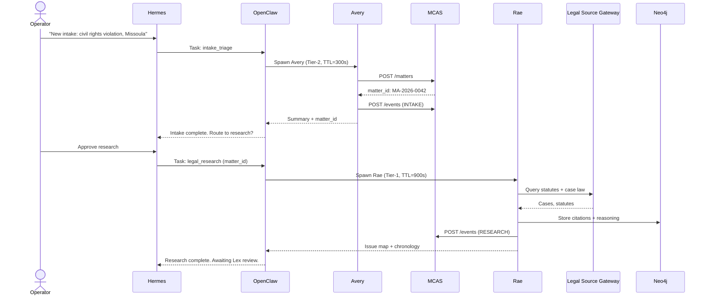
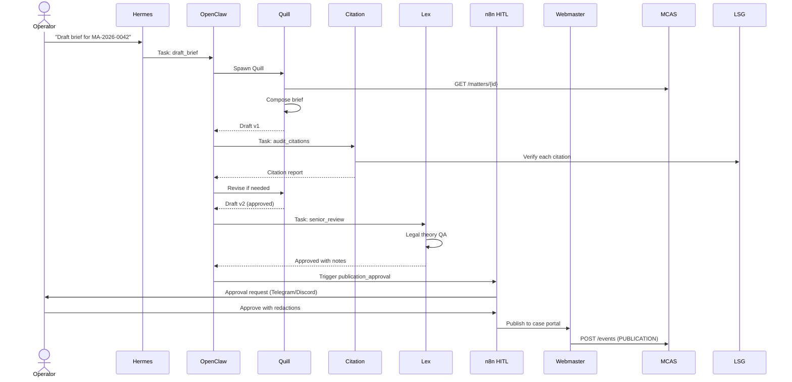

# Architecture & Implementation Design — MISJustice Alliance Firm

**Agent:** Architect  
**Date:** 2026-04-22  
**Status:** DESIGN — Phase 2 Greenfield Output  
**Inputs:** `SPEC.md`, `README.md`, `docs/greenfield/*-report.md` (4 reports)  

---

## Executive Summary

This design translates the MISJustice Alliance Firm specification into an implementable, phased architecture. The platform is a **multi-tier, privacy-first AI legal research and advocacy engine** with strict human-in-the-loop (HITL) gates, role-based data access, and anonymous operator workflows.

**Core principles:**
1. **Privacy by design** — Tiered data access, end-to-end encryption, no cloud LLM for Tier-1 matters.
2. **Human sovereignty** — No external publication or strategy without Lex + human operator sign-off.
3. **Modular agents** — Each agent is a stateless worker with persistent memory via MemoryPalace.
4. **Defense in depth** — OpenShell sandboxes, STRIDE-mitigated surfaces, audit everything.

---

## 1. System Architecture Diagram

```mermaid
flowchart TB
    subgraph HumanLayer["L1 — Human Interface"]
        H[Hermes CLI/TUI]
        TG[Telegram Bot]
        DC[Discord Bot]
        OW[Open Web UI]
    end

    subgraph Orchestration["L2 — Orchestration"]
        OC[OpenClaw Task Router]
        NC[NemoClaw Sandbox Spawner]
        N8N[n8n HITL Workflows]
    end

    subgraph AgentStaff["L3 — Agent Staff"]
        LEX[Lex — Lead Counsel]
        RAE[Rae — Paralegal]
        MIR[Mira — Telephony]
        AVE[Avery — Intake]
        CAS[Casey — Investigator]
        QUI[Quill — Brief Writer]
        CIT[Citation Authority]
        SOL[Sol — Systems Liaison]
        VER[Veritas — Monitor]
    end

    subgraph ToolLayer["L4 — Tools & MCP"]
        ARG[AutoResearchClaw]
        LSG[Legal Source Gateway]
        LG[LawGlance]
        VANE[Vane Search]
    end

    subgraph SearchRAG["L5 — Search & RAG"]
        SX[SearXNG]
        ES[Elasticsearch]
        QD[Qdrant]
        N4J[(Neo4j Citation Graph)]
        OR[OpenRAG]
    end

    subgraph CaseBackend["L6 — Case Backend"]
        MCAS[MCAS API]
        PG[(PostgreSQL)]
        OS3[(Object Store)]
    end

    subgraph PubComms["L7 — Publication & Comms"]
        WP[Webmaster — misjusticealliance.org]
        SM[Social Media Manager]
        ON[Open Notebook]
    end

    H --> OC
    TG --> OC
    DC --> OC
    OW --> OC

    OC --> LEX
    OC --> RAE
    OC --> MIR
    OC --> AVE
    OC --> CAS
    OC --> QUI
    OC --> CIT
    OC --> SOL
    OC --> VER

    LEX -.-> N8N
    RAE -.-> N8N
    QUI -.-> N8N
    SM -.-> N8N

    RAE --> ARG
    RAE --> LSG
    RAE --> LG
    RAE --> VANE
    LEX --> LSG
    CAS --> OR

    ARG --> SX
    ARG --> LSG
    LSG --> ES
    OR --> QD
    OR --> ES
    N4J --> ES

    AVE --> MCAS
    CAS --> MCAS
    RAE --> MCAS
    LEX --> MCAS
    QUI --> MCAS
    VER --> MCAS

    MCAS --> PG
    MCAS --> OS3
    MCAS --> N4J

    LEX --> WP
    LEX --> SM
    RAE --> ON
```



### Deployment Topology

```
├── ingress-nginx (TLS termination, rate limiting)
│   ├── /api/v1/hermes → Hermes API (FastAPI, port 8000)
│   ├── /api/v1/mcas → MCAS API (FastAPI, port 8001)
│   ├── /search → SearXNG (port 8080)
│   └── /n8n → n8n (port 5678, IP-whitelisted)
├── internal-network (mTLS via Linkerd or Cilium)
│   ├── neo4j:7687
│   ├── postgres:5432
│   ├── qdrant:6333
│   ├── elasticsearch:9200
│   ├── litellm-proxy:4000
│   └── mempalace:8002
└── sandbox-network (OpenShell — no egress except to MCAS + MemoryPalace)
```

---

## 2. Service Decomposition and Boundaries

### 2.1 Core Services

| Service | Responsibility | Owner | Exposes |
|---|---|---|---|
| **Hermes API** | Human operator session, auth, approval inbox, subagent spawning | Sol | REST + WebSocket |
| **MCAS API** | Matter lifecycle, document storage, actor registry, audit log | Atlas | REST + GraphQL |
| **OpenClaw Router** | Task queue, agent dispatch, retry, TTL enforcement | Sol | gRPC + REST |
| **MemoryPalace** | Cross-session agent memory, semantic search, tiered access | Sol | gRPC |
| **OpenShell** | Sandbox spawning, policy enforcement, resource limits | Sol | gRPC |
| **n8n** | HITL workflow orchestration, approval gates, notifications | Atlas | REST + Webhooks |

### 2.2 Research Services

| Service | Responsibility | Boundaries |
|---|---|---|
| **AutoResearchClaw** | Multi-source legal research aggregation | No direct DB access; reads via Legal Source Gateway |
| **Legal Source Gateway** | Unified connector for CourtListener, CAP, GovInfo, ECFR, OpenStates | Read-only; caches in Elasticsearch |
| **LawGlance** | Statute/section summarization and cross-reference | Stateless; no case data persistence |
| **Vane** | Operator search interface (tiered results) | Read-only; logs queries to MCAS audit |

### 2.3 Infrastructure Services

| Service | Responsibility |
|---|---|
| **SearXNG** | Privacy-respecting metasearch (self-hosted) |
| **LiteLLM Proxy** | LLM routing, rate limiting, cost tracking, model fallback |
| **Neo4j** | Citation graph, legal reasoning queries |
| **Qdrant** | Vector store for OpenRAG |
| **Elasticsearch** | Full-text legal document index |
| **PostgreSQL** | MCAS relational data, agent config, audit logs |

### 2.4 Boundary Rules

1. **Agents never touch PostgreSQL directly.** All persistence routes through MCAS API.
2. **Tier-1 data never leaves the internal network.** Cloud LLMs are blocked by LiteLLM proxy policy for Tier-1 matters.
3. **OpenShell sandboxes have no egress.** Except whitelisted MCAS API + MemoryPalace endpoints.
4. **n8n workflows are the only HITL gate.** No agent publishes or files without n8n approval node.

---

## 3. Data Model and API Contracts

### 3.1 Core Entities (MCAS)

```yaml
Matter:
  id: uuid
  display_id: str          # e.g., "MA-2026-0042"
  title: str
  classification: enum[T0_PUBLIC, T1_PRIVILEGED, T2_INTERNAL, T3_ADMIN]
  status: enum[INTAKE, RESEARCH, DRAFTING, REVIEW, ADVOCACY, CLOSED]
  jurisdiction: str        # "MT", "WA", "FEDERAL"
  created_at: datetime
  updated_at: datetime
  actors: Actor[]
  events: Event[]
  documents: Document[]
  audit_log: AuditEntry[]

Actor:
  id: uuid
  matter_id: uuid
  actor_type: enum[CLIENT, ATTORNEY, WITNESS, OFFICER, JUDGE, ORGANIZATION]
  pseudonym: str           # Anonymous display name
  real_name_encrypted: bytes  # AES-256-GCM, key in HSM/Vault
  role_in_matter: str
  conflict_flags: str[]

Document:
  id: uuid
  matter_id: uuid
  filename: str
  storage_key: str         # S3/MinIO object key
  checksum_sha256: str
  classification: enum[T0, T1, T2, T3]
  ocr_text: str            # Extracted text
  extracted_entities: json
  redacted_version_key: str|null
  uploaded_by: uuid        # agent or operator ID
  created_at: datetime

Event:
  id: uuid
  matter_id: uuid
  event_type: enum[INTAKE, RESEARCH, DRAFT, REVIEW, PUBLICATION, ESCALATION]
  actor_id: uuid|null
  agent_id: str|null
  description: str
  metadata: json
  timestamp: datetime

AuditEntry:
  id: uuid
  matter_id: uuid
  action: str
  actor: str
  ip_address: str|null
  user_agent: str|null
  timestamp: datetime
  diff: json|null
```

### 3.2 API Contracts (MCAS v0.1)

```yaml
POST /api/v1/matters
  Body: { title, classification, jurisdiction }
  Response: { matter_id, display_id }

GET /api/v1/matters/{id}
  Response: Matter (with actors, events, documents)

POST /api/v1/matters/{id}/documents
  Body: multipart/form-data (file + classification)
  Response: { document_id, storage_key, checksum }

POST /api/v1/matters/{id}/events
  Body: { event_type, description, metadata }
  Response: { event_id }

GET /api/v1/matters/{id}/audit
  Response: AuditEntry[]

POST /api/v1/search
  Body: { query, tier, matter_id?, filters }
  Response: { results[], sources[], confidence }
```

### 3.3 Agent Memory Schema (MemoryPalace)

```yaml
MemoryFragment:
  id: uuid
  agent_id: str
  matter_id: uuid|null
  fragment_type: enum[FACT, HYPOTHESIS, CITATION, DECISION, REMINDER]
  content: str
  embedding: vector[768]
  source_refs: str[]       # e.g., ["doc://uuid", "case://12345"]
  confidence: float        # 0.0–1.0
  tier: enum[T0, T1, T2, T3]
  valid_from: datetime
  valid_until: datetime|null
  created_at: datetime
```

---

## 4. Agent Orchestration Flow

### 4.1 Intake → Research Flow



### 4.2 Draft → Review → Publication Flow



### 4.3 OpenClaw Task Schema

```yaml
Task:
  id: uuid
  task_type: str          # e.g., "intake_triage", "legal_research"
  matter_id: uuid|null
  assigned_agent: str
  tier: enum[T0, T1, T2, T3]
  ttl_seconds: int        # 300 default, 900 for research
  sandbox_profile: str    # "readonly", "network_restricted", "unrestricted"
  input_payload: json
  status: enum[PENDING, RUNNING, AWAITING_HUMAN, COMPLETED, FAILED]
  output_payload: json|null
  created_at: datetime
  started_at: datetime|null
  completed_at: datetime|null
  spawned_subtasks: Task[]
```

---

## 5. Security Architecture

### 5.1 STRIDE Mitigations (from Security Report)

| Threat | Mitigation | Implementation |
|---|---|---|
| **Spoofing** — Fake agent or operator | mTLS between all services; JWT with short expiry; agent identity signed by OpenClaw | Linkerd sidecars + Vault PKI |
| **Tampering** — Document or audit log modification | Immutable audit log (append-only PG table); document checksums on upload; WORM object storage | PostgreSQL RLS + MinIO versioning |
| **Repudiation** — Denial of action | Every action logged to MCAS audit with operator/agent ID, IP, timestamp, diff | Audit middleware on all APIs |
| **Information Disclosure** — Tier-1 data leakage | Tiered network isolation; cloud LLM blocked for T1; field-level encryption for actor real names | LiteLLM proxy policies + Vault transit |
| **Denial of Service** — Queue flooding | Rate limiting at ingress; per-matter event caps; n8n workflow timeouts; circuit breakers | nginx limit_req + OpenClaw backpressure |
| **Elevation of Privilege** — Agent exceeds tier | OpenShell sandbox profiles; Paperclip policy enforcement; subagent Tier ≤ parent Tier | OPA/Rego policies + OpenShell cgroups |

### 5.2 Data Classification Enforcement

```
T0 PUBLIC → Can leave network, publish to web, train models
T1 PRIVILEGED → Internal network only, no cloud LLM, encrypted at rest, HSM keys
T2 INTERNAL → Internal network, cloud LLM allowed with logging disabled, standard encryption
T3 ADMIN → Infrastructure configs, no case data, standard access
```

### 5.3 Critical Security Controls

1. **Cloud LLM ban for Tier-1:** LiteLLM proxy configured with `tier_filter: T1 → block`.
2. **LangSmith disabled for Tier-1:** Agents processing T1 matters set `LANGCHAIN_TRACING_V2=false`.
3. **HITL URL tokens:** n8n approval links use POST body tokens, not query params.
4. **Vane authentication:** Require upstream Hermes JWT before T4-admin search.
5. **MemoryPalace classification:** Reject `tier` field mismatches at write time.

---

## 6. Technology Choices

| Layer | Choice | Justification |
|---|---|---|
| **API Framework** | FastAPI (Python) | Async-native, OpenAPI generation, Python ecosystem for AI/ML |
| **Task Queue** | Redis + celery or arq | OpenClaw needs reliable task routing; arq is async-native |
| **Database** | PostgreSQL 16 | Relational case data, JSONB for flexible metadata, RLS for row security |
| **Vector DB** | Qdrant | Self-hostable, fast, good hybrid search with Elasticsearch |
| **Search** | Elasticsearch 8 + SearXNG | ES for legal text indexing; SearXNG for privacy-respecting web metasearch |
| **Graph DB** | Neo4j 5 | Already most mature component; excellent for citation networks |
| **LLM Proxy** | LiteLLM | Unified routing, model fallback, cost tracking, tier-based blocking |
| **Sandbox** | OpenShell (spec'd) or gVisor | Declarative YAML policies; if OpenShell unavailable, gVisor + OPA as bridge |
| **Workflows** | n8n self-hosted | Visual HITL design, webhook triggers, extensible |
| **Message Queue** | Redis Streams or NATS | Lightweight, fits single-node and clustered deployments |
| **Reverse Proxy** | nginx + certbot | Proven, rate limiting, TLS termination |
| **Secrets** | HashiCorp Vault or Bitwarden SM | Required before production; rotate LLM keys, DB credentials |
| **Observability** | Prometheus + Grafana + Loki | Metrics, logs, traces without SaaS dependency |

---

## 7. Implementation Phases

Aligned with Product Manager roadmap (see `product-manager-report.md`).

### Phase 0 — Foundation (Weeks 1–4)

**Goal:** Operator can create a matter and spawn a single agent.

- [ ] Fix config drift (Vane residue, standardize agent YAML schema)
- [ ] Bootstrap MCAS v0.1 (FastAPI + PostgreSQL + MinIO)
- [ ] Implement OpenClaw minimal task router (Redis + FastAPI)
- [ ] Implement OpenShell fallback (gVisor + OPA policies)
- [ ] Hermes CLI MVP (spawn agent, view output, approve)
- [ ] CI/CD: GitHub Actions (lint, typecheck, test), Docker Compose local dev
- [ ] Secrets: Vault or Bitwarden SM integration

**Success Criteria:**
- `hermes spawn avery --matter "test"` creates a matter and returns a summary.
- All APIs have OpenAPI docs.
- `docker compose up` brings up full local stack.

### Phase 1 — Research Core (Weeks 5–10)

**Goal:** End-to-end research pipeline — intake → research → issue map.

- [ ] SearXNG + LiteLLM proxy deployment
- [ ] Legal Source Gateway v0.5 (CourtListener + CAP connectors live)
- [ ] AutoResearchClaw integration
- [ ] Neo4j ingestion pipeline connects to MCAS document events
- [ ] Rae runtime (research agent)
- [ ] Lex runtime (senior review agent)
- [ ] Citation Authority runtime
- [ ] MemoryPalace v0.1 (server + Python client)

**Success Criteria:**
- Operator uploads a case PDF; Rae returns an issue map with verified citations in <15 min.
- Tier-1 matters route to local LLM only.

### Phase 2 — Memory & Compliance (Weeks 11–16)

**Goal:** Full HITL, compliance monitoring, and search infrastructure.

- [ ] OpenRAG (Qdrant + Elasticsearch hybrid)
- [ ] n8n HITL workflow suite (approval gates, escalation)
- [ ] Veritas monitor (policy compliance checks)
- [ ] Atlas coordinator (human escalation routing)
- [ ] Field-level encryption for actor real names
- [ ] Audit log immutability guarantees
- [ ] Redaction workbench UI (critical per UX report)

**Success Criteria:**
- No publication reaches web without n8n approval node.
- Audit log cannot be modified by operators or agents.

### Phase 3 — Publication & External (Weeks 17–22)

**Goal:** Public case portal and advocacy communications.

- [ ] Webmaster runtime (case file rendering, SEO)
- [ ] Sol QA pipeline (pre-publication verification)
- [ ] Quill brief-to-publication pipeline
- [ ] Social media connectors (X, Bluesky, Reddit, Nostr)
- [ ] Open Notebook integration
- [ ] Anonymous intake portal (public-facing)

**Success Criteria:**
- Approved case file renders to misjusticealliance.org within 5 min of approval.
- Social posts require Lex + operator double-approval.

---

## 8. Critical Integration Points

### 8.1 MCAS ↔ OpenClaw
- **Interface:** REST + webhooks
- **Contract:** OpenClaw updates MCAS task status; MCAS triggers OpenClaw on matter state changes.
- **Risk:** Circular dependency if both call each other synchronously. **Mitigation:** Use event bus (Redis Streams) for async coupling.

### 8.2 OpenClaw ↔ OpenShell
- **Interface:** gRPC
- **Contract:** OpenClaw sends sandbox profile + task payload; OpenShell returns sandbox ID + logs.
- **Risk:** Sandbox spawn latency. **Mitigation:** Pre-warm sandbox pools.

### 8.3 Agents ↔ MemoryPalace
- **Interface:** gRPC
- **Contract:** Agent reads/writes MemoryFragment with matter_id + tier.
- **Risk:** Tier leakage. **Mitigation:** MemoryPalace enforces `agent_tier >= fragment_tier` on read.

### 8.4 Legal Source Gateway ↔ External APIs
- **Interface:** REST (CourtListener, CAP, GovInfo, etc.)
- **Contract:** Unified request/response schema; caching in Elasticsearch.
- **Risk:** External API rate limits and downtime. **Mitigation:** Circuit breaker + local cache fallback.

### 8.5 n8n ↔ Telegram/Discord
- **Interface:** Bot APIs
- **Contract:** n8n sends approval cards; operator replies with `/approve <token>` or `/reject <token> <reason>`.
- **Risk:** Message interception. **Mitigation:** Use bot command verification + HMAC on callback payloads.

---

## 9. Open Questions

1. **OpenClaw availability:** If OpenClaw/NemoClaw are not production-ready, do we fork or build a minimal replacement using crewAI + custom task queue?
2. **LLM hosting:** Do we deploy local LLMs (llama.cpp, vLLM) for Tier-1, or rely on API providers with BAA/data-processing agreements?
3. **Paperclip integration:** Paperclip is spec'd but unimplemented. Do we build a minimal policy engine (OPA/Rego) as a bridge?
4. **Deployment target:** Single-node Docker Compose for MVP, or Kubernetes from day one?
5. **Mobile operator access:** Is Telegram/Discord sufficient, or do we need a mobile web UI?

---

## References

- `docs/greenfield/technical-research-report.md` — Implementation gaps and stack evaluation
- `docs/greenfield/product-manager-report.md` — Roadmap, critical path, risk register
- `docs/greenfield/ux-researcher-report.md` — User journeys, interface gaps, accessibility
- `docs/greenfield/security-engineer-report.md` — STRIDE analysis, compliance, security recommendations
- `SPEC.md` — Canonical architecture specification
- `README.md` — Platform mission and agent role definitions
