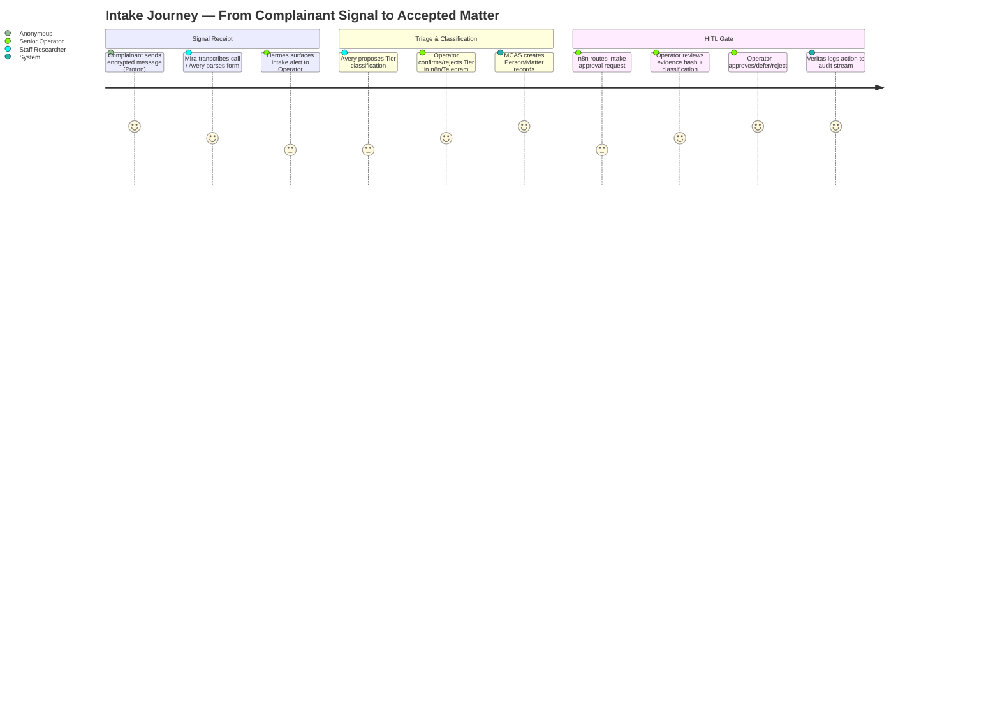
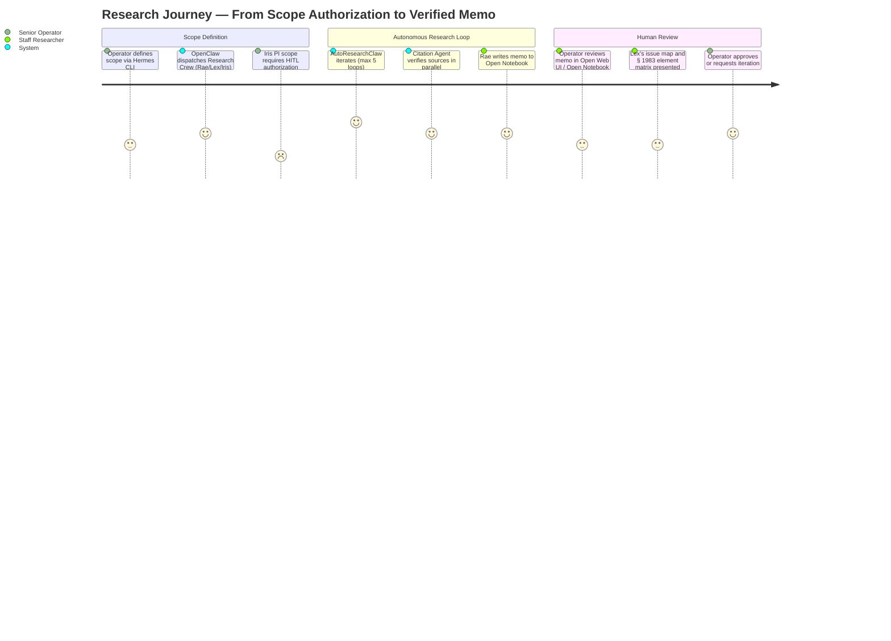
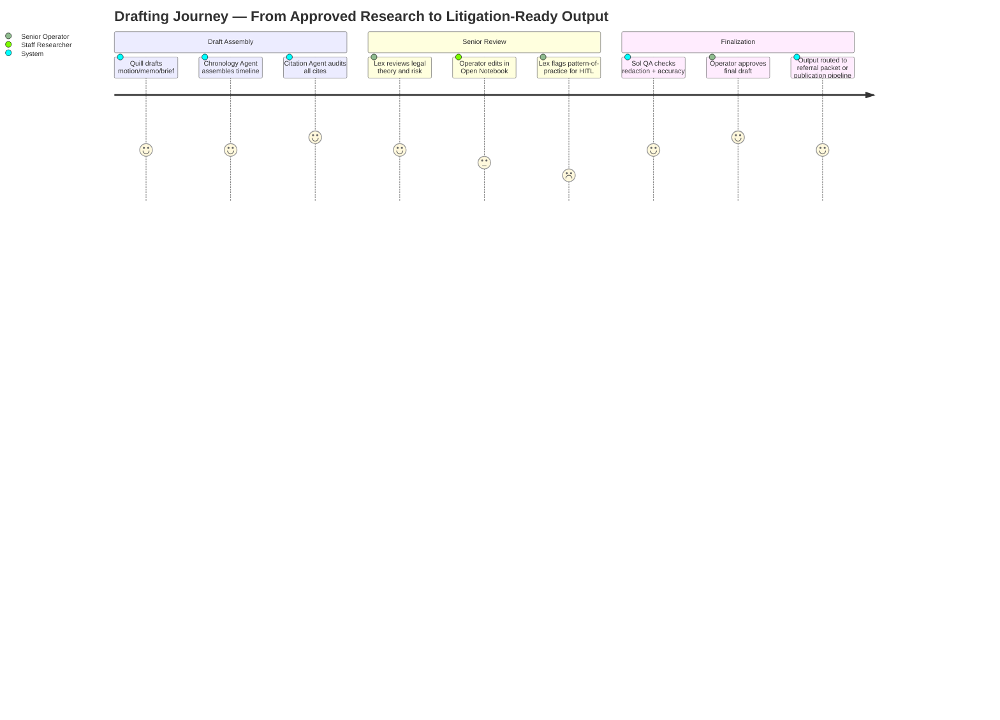
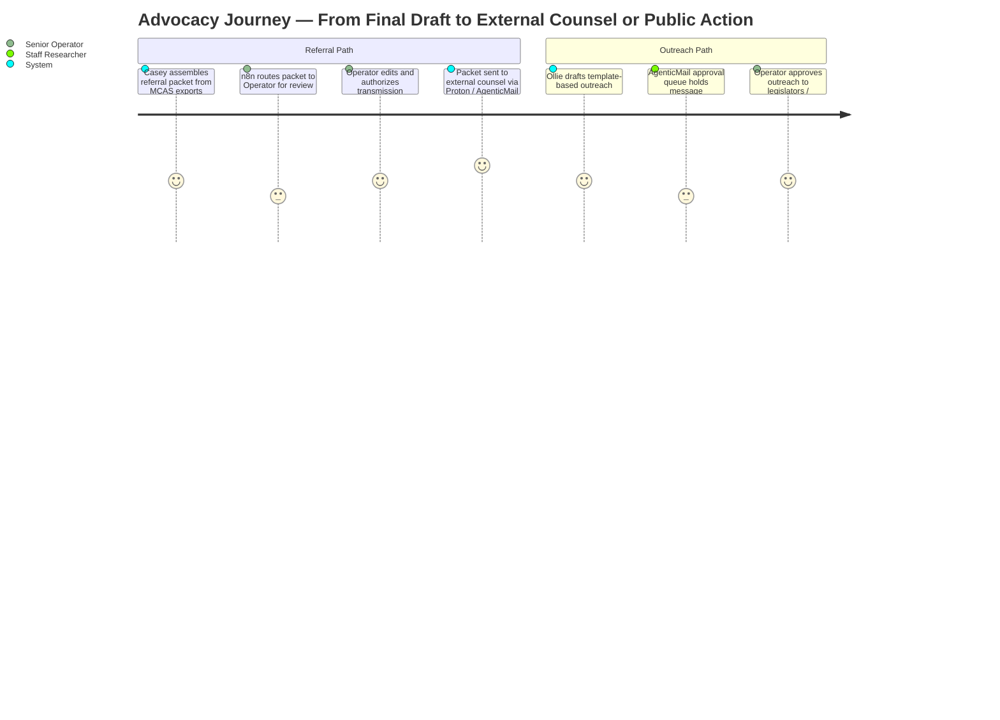

# STUDY: MISJustice Alliance Firm — UX Research & Interface Architecture Report

> **Status:** Early Architecture Review  
> **Scope:** Full-platform user experience, interface gaps, accessibility, and anonymity requirements  
> **Sources:** `README.md`, `SPEC.md`, `AGENTS.md`, workflow diagrams, interface tables, and HITL governance specs  
> **Methodology:** Heuristic evaluation of documented architecture, journey mapping against known operator workflows, gap analysis against Nielsen heuristics + legal-domain UX standards (CALIcon, ABA TechShow), and accessibility/OPSEC risk assessment.

---

## 1. PERSONA: Operator Segments

The platform currently defines capabilities by **agent role** but under-defines its **human operators**. Based on the interface surfaces, approval gates, and access tiers, we identify four distinct operator personas:

| Persona | Primary Surfaces | Core Jobs-to-be-Done | Risk Profile |
|---|---|---|---|
| **Senior Operator / Admin** | Hermes CLI/TUI, n8n UI, Vane, Open Web UI | Crew dispatch, final publication approval, policy violation adjudication, subagent authorization | High — holds T4-admin token; can spawn agents and approve external-facing actions |
| **Staff Researcher / Analyst** | Open Web UI, Open Notebook, Vane, Discord | Review research memos, edit chronologies, verify citations, draft referral language | Medium — T2-restricted access; touches de-identified case data but not Tier-0/1 |
| **Field Advocate / Intake Volunteer** | Telegram, iMessage, Hermes CLI (read-only) | Quick intake triage, mobile approval of low-risk tasks, urgent escalation acknowledgment | Medium-High — mobile exposure; may handle sensitive intake notifications on personal devices |
| **Human Oversight Board Member** | Discord (dedicated channel), n8n UI, Hermes | Review Veritas violation reports, adjudicate policy breaches, authorize corrective action | Critical — reviews the platform's own failures; needs forensic-grade context |

> **Finding:** The platform treats "Operator" as a monolith. In practice, a junior intake volunteer with Telegram access and a senior attorney with publication authority have radically different mental models, time constraints, and error budgets. The interface layer does not yet reflect this segmentation.

---

## 2. JOURNEY: Intake → Research → Drafting → Advocacy → Publication

The following journey maps describe the **human-operator experience** through the five major lifecycle stages. Each map includes the current documented touchpoints, observed friction points, and critical HITL decision moments.

---

### 2.1 JOURNEY: Intake & Evidence Ingestion



**Current Touchpoints:** Proton (Tier-0), Mira/Telephony bridge, Avery/MCAS API, Hermes CLI/TUI, n8n approval webhook, Telegram/Discord notification.

**Friction Points:**
- **No complainant-facing intake portal.** The intake journey begins *inside* the operator stack. Complainants must know to use Proton or call a telephony bridge. There is no anonymous web form, no guided intake wizard, and no way for a complainant to check status without revealing identity to a human.
- **Tier classification happens post-upload.** Documents hit Avery before the operator confirms classification. A misclassified Tier-1 document could briefly exist in the wrong pipeline.
- **Mobile approval lacks context.** Telegram approval buttons (Approve / Defer / Reject) do not show document previews, OCR confidence scores, or duplicate-matter warnings. An operator on mobile cannot make an informed classification decision without switching to Open Web UI.
- **No duplicate-matter UI.** Avery remembers "known duplicate matters" in MemoryPalace, but the operator has no visual deduplication interface — no side-by-side person/organization matcher, no fuzzy timeline overlay.

---

### 2.2 JOURNEY: Research & Analysis



**Current Touchpoints:** Hermes CLI/TUI, Open Web UI, Open Notebook, Vane (ad-hoc), AutoResearchClaw, Legal Source Gateway.

**Friction Points:**
- **Research outputs are scattered across three surfaces.** Rae writes to Open Notebook; Lex produces issue maps; Citation Agent maintains a verified cache. There is no unified "Research Dashboard" showing memo + issue map + citation status + chronology in one scrollable, linked view.
- **No provenance visualization.** The Legal Source Gateway returns `provenance.upstream_url` and `license`, but the operator console does not surface this as a visual citation chain. A researcher cannot quickly see "this case came from CourtListener via semantic search, not CAP" without reading raw JSON.
- **Vane is isolated from the agent memory context.** Vane queries SearXNG with the T4-admin token, but its results do not auto-populate into the matter's Open Notebook or notify Rae/Lex that the operator found a relevant source. The operator must manually bridge ad-hoc research and crew research.
- **No confidence or coverage indicators.** AutoResearchClaw iterates up to 5 times, but the operator interface does not show a "research coverage score" or highlight which sub-questions remain unanswered. The operator must read the full memo to infer gaps.

---

### 2.3 JOURNEY: Drafting & QA



**Current Touchpoints:** Open Notebook, Hermes CLI/TUI, n8n approval queues.

**Friction Points:**
- **No collaborative editing surface.** Open Notebook is described as "document-centric layer within Open Web UI," but there is no mention of concurrent editing, comment threads, or suggestion mode. Legal drafting is inherently collaborative; serial handoffs between Quill → Lex → Operator will create version-control friction.
- **Redaction workflow is invisible.** The architecture mentions "redaction checks" (Webmaster, Sol) but does not specify a redaction UI — no click-to-redact, no PII auto-highlight, no side-by-side "original vs. redacted" preview. Redaction errors in this domain carry serious legal and safety consequences.
- **No template gallery interface.** Quill drafts "legal memos, motions, and briefs," but the operator has no visible template selector, jurisdiction-aware formatting helper, or court-specific filing requirement checklist.
- **Citation audit is opaque.** Citation Agent produces a "verified citation cache" and "known-bad registry," but the operator cannot see *which* citations were flagged, *why* they were flagged, or *how* they were corrected without reading agent logs.

---

### 2.4 JOURNEY: Advocacy & Referral



**Current Touchpoints:** n8n UI, Hermes, Open Web UI, AgenticMail, Proton Bridge, MCAS export API.

**Friction Points:**
- **No referral packet preview before authorization.** Casey assembles packets from MCAS exports, but the operator cannot preview the assembled PDF/email package in a single view before clicking "authorize transmission."
- **Conflict-of-interest checking is memory-based, not UI-based.** Casey stores "conflict-of-interest history" in MemoryPalace, but there is no visual COI dashboard warning the operator if a proposed referral firm has represented an adverse party in a prior matter.
- **Outreach templates lack A/B preview.** Ollie generates "template-based outreach drafts," but the operator cannot preview how the message renders in email vs. web form vs. printed letter before approval.

---

### 2.5 JOURNEY: Publication & Public Communications

```mermaid
journey
    title Publication Journey — From Approved Content to Live Public Property
    section Web Publication
      Webmaster stages page on misjusticealliance.org / GitBook: 4: System
      Sol QA runs fact-check + redaction spot-check: 4: System
      n8n routes publication approval to Operator: 3: Senior Operator
      Operator approves final text, redaction, and indexing: 5: Senior Operator
      Page goes live; sitemap updated; SEO/GEO applied: 4: System
    section Social Campaign
      Social Media Manager drafts campaign sequence: 4: System
      n8n routes post approval (especially misconduct allegations): 2: Senior Operator
      Operator reviews and approves per-post: 4: Senior Operator
      Campaign publishes across X, Bluesky, Reddit, Nostr: 4: System
```

**Current Touchpoints:** n8n UI, Hermes, Open Web UI, GitBook API, social platform connectors.

**Friction Points:**
- **No publication preview environment.** The Webmaster stages pages, but there is no documented "staging URL" or visual preview of how the redacted case file renders on mobile, desktop, and screen reader before the HITL gate.
- **Social campaign scheduling lacks a visual calendar.** Social Media Manager handles "campaign sequencing," but the operator reviews posts one-by-one via n8n/Telegram rather than in a visual timeline showing post order, platform targeting, and scheduled times.
- **No reputational-risk overlay.** Posts alleging misconduct against identifiable actors require approval, but the approval UI does not surface the actor's name, the claim being made, the evidence citation, and the jurisdiction's defamation risk in a single alert card. An operator could approve a post without full context.

---

## 3. INTERFACE GAPS AND MISSING SCREENS/COMPONENTS

### 3.1 Critical Missing Screens

| Gap | Severity | Description | Impact if Unaddressed |
|---|---|---|---|
| **Complainant Anonymous Intake Portal** | Critical | A Tor-friendly or privacy-respecting web form that guides complainants through structured intake without requiring Proton/email knowledge | Intake volume limited by tech literacy; operators forced to manual data entry |
| **Unified Matter Dashboard** | Critical | Single-screen view of a matter's full lifecycle: intake status → research memos → draft versions → publication state → active tasks + SOL countdown | Operators context-switch across 4+ surfaces to assess matter health |
| **Redaction Workbench** | Critical | Visual click-to-redact interface with PII auto-highlight, side-by-side original/redacted preview, and tier-classification tagging | Redaction failures expose Tier-0/1 data to public or referral channels |
| **Research Synthesis Dashboard** | High | Unified view combining Rae's memo, Lex's issue map, Citation Agent's verification status, and Chronology Agent's timeline with cross-linked anchors | Researchers miss connections between legal theory and factual timeline |
| **HITL Approval Inbox (Unified)** | High | A single priority-sorted inbox showing all pending approvals across intake, research, referral, publication, and social — with rich context cards | Operators miss approvals buried in Telegram threads or n8n email digests |
| **Conflict-of-Interest Visualizer** | High | Graph view of persons, organizations, attorneys, and matters showing prior relationships and adverse-party flags | Referral to conflicted counsel destroys trust and creates malpractice exposure |
| **Social Campaign Calendar** | Medium | Visual drag-and-drop calendar for multi-platform campaign sequencing with platform-specific preview panes | Scheduling errors, duplicate posts, or mistimed allegations |
| **Publication Staging Preview** | Medium | Mobile/desktop/screen-reader preview of staged web content before live publication | Accessibility failures and formatting errors go live |
| **Provenance & Citation Chain Viewer** | Medium | Visual graph of "this claim → this source → this upstream API → this retrieval timestamp" for every assertion in a memo | Operators cannot quickly verify source reliability during review |
| **Panic / Duress Workflow UI** | Medium | One-click operator duress signal that pauses all external-facing workflows and locks publication queues | Operator under coercion could be forced to approve harmful publication |
| **Template Gallery & Court Filing Wizard** | Medium | Jurisdiction-aware template selector with automated formatting, filing deadline calculator, and e-filing portal links | Drafting inefficiency; formatting errors in court submissions |
| **Vane → Open Notebook Bridge** | Low | "Send to Matter" button in Vane that injects ad-hoc research into a matter's notebook with automatic citation capture | Research silos; duplicate effort between Vane and crew research |

### 3.2 Missing Component Library Needs

The documented interfaces (Hermes CLI/TUI, Open Web UI, Vane, n8n, Legal Research Console) imply multiple frontend technologies with no shared design system. The following components should be standardized:

- **Tier Badge:** Visual indicator (color + icon + tooltip) showing data classification (Tier 0–3) on every document, search result, and memory entry.
- **Agent Attribution Chip:** Non-interactive chip showing which agent produced a given output, with link to agent config version and sandbox policy.
- **HITL Gate Banner:** Persistent banner at top of screen when a matter/task is awaiting human approval, with action buttons and deadline countdown.
- **Anonymization Mask:** Toggleable overlay that replaces PII with `[REDACTED]` tokens in document previews, with click-to-reveal for authorized tiers.
- **Citation Pill:** Inline citation component showing source, retrieval date, and confidence icon (verified / pending / flagged).
- **SOL Countdown Timer:** Prominent, stress-aware timer showing days remaining until statute of limitations, with color shift at 90/30/7 days.
- **Audit Trail Timeline:** Vertical timeline of all agent and human actions on a matter, filterable by actor type.

---

## 4. ACCESSIBILITY AND ANONYMITY REQUIREMENTS

### 4.1 Accessibility (WCAG 2.2 AA Baseline)

The platform currently does not document any accessibility standards. Given the mission-critical nature of the work and the likelihood that operators and advocates may include individuals with disabilities, the following are non-negotiable:

| Requirement | Rationale | Implementation Target |
|---|---|---|
| **Keyboard-navigable approval flows** | Operators must be able to approve/reject HITL gates without a mouse in high-stress or mobile-constrained environments | All n8n approval flows, Hermes TUI, Open Web UI |
| **Screen-reader optimized research outputs** | Research memos and chronologies must be navigable by heading structure, table semantics, and citation lists | Open Notebook, Vane results, Open Web UI |
| **High-contrast mode + dark mode** | Long-duration legal research causes eye strain; some operators may work in low-light secure locations | Open Web UI, Vane, Legal Research Console |
| **Focus indicators + reduced motion** | Critical for operators using assistive tech or those prone to vestibular disorders | All web-based surfaces |
| **Accessible data visualization** | Citation graphs, chronologies, and COI visualizers must have text alternatives and keyboard traversal | Neo4j graph UI wrapper, timeline components |
| **Color-independent Tier indicators** | Tier classification must never rely on color alone (red/green blindness) | Tier Badge component |
| **Captcha-free intake** | Any complainant-facing portal must not use visual CAPTCHAs; use honeypot or proof-of-work instead | Anonymous Intake Portal |

### 4.2 Anonymity & Operational Security (OPSEC) UX Requirements

Anonymity is an architectural pillar, but several UX anti-patterns in the current design could inadvertently degrade it:

| Requirement | Current Gap | Recommended UX Pattern |
|---|---|---|
| **No persistent client identifiers in intake** | Intake portal does not exist; any future form must not fingerprint | Use Tor-hidden-service or privacy-preserving CDN; disable analytics; no cookies |
| **Visual anonymization toggle in all previews** | No redaction UI exists; operators must mentally filter PII | "Safe View" toggle on every document preview that masks Tier-0/1 fields by default |
| **Operator duress / panic button** | No duress workflow documented | Persistent but subtle "Lockdown" button in all interfaces that freezes external workflows and logs out all sessions |
| **Automatic session timeout with classified context wipe** | No session management documented | 15-minute idle timeout for Tier-2+ views; clear browser cache of document previews on timeout |
| **Platform-agnostic secure messaging** | Telegram/iMessage used for approvals — these are not anonymous | Migrate sensitive approvals to self-hosted Signal bridge or session-based ephemeral messaging within Open Web UI |
| **Search query sanitization warnings** | Vane warns not to upload Tier-0/1 but has no auth enforcement | Visual "Search Safety" indicator showing whether the current query could expose PII based on pattern detection |
| **Visible data residency indicator** | Operators may forget that MemoryPalace is local while LLM calls route externally | Persistent footer icon showing "Local inference" vs. "External API" mode per active agent |

### 4.3 Cognitive Load & Stress-Resistant Design

Legal advocacy involving institutional abuse and trauma requires interfaces that minimize cognitive load and avoid re-traumatization:

- **Progressive disclosure:** Show summary cards by default; expand to full agent outputs only on operator request. No wall-of-text memos on first load.
- **Stress-aware color palette:** Avoid alarm-red for routine notifications. Reserve red for true emergencies (Veritas violation, missed SOL). Use calming, high-legibility palettes for reading surfaces.
- **Batch approval mode:** For low-risk HITL gates (e.g., scheduled audit digest, non-sensitive social posts), allow batch approval with "select all" and undo window, reducing notification fatigue.
- **Context preservation:** When an operator switches from Matter A to Matter B and back, restore scroll position, open tabs, and filter state. Legal research is deeply contextual; losing state breeds errors.

---

## 5. RECOMMENDATIONS FOR UI/UX IMPLEMENTATION PRIORITIES

### 5.1 Priority Matrix

We map recommendations by **User Impact** (how much it improves operator effectiveness and safety) vs. **Implementation Effort** (engineering complexity given the existing architecture).

| Priority | Recommendation | Impact | Effort | Rationale |
|---|---|---|---|---|
| **P0 — Immediate** | Build Unified HITL Approval Inbox inside Open Web UI | Very High | Medium | Unblocks operator workflow chaos; reduces risk of missed approvals across Telegram/Discord/n8n |
| **P0 — Immediate** | Add Tier Badge + Safe View toggle to Open Web UI & Open Notebook | Very High | Low | Prevents accidental PII exposure; enforces data classification at the UI layer |
| **P0 — Immediate** | Implement Redaction Workbench with PII auto-highlight | Very High | High | Directly mitigates the highest-risk UX gap; required before any production referral/publication |
| **P1 — Short-term** | Build Unified Matter Dashboard (lifecycle + SOL + tasks) | High | Medium | Reduces context-switching; essential as matter volume grows beyond single-digit |
| **P1 — Short-term** | Add Panic / Duress button to all operator surfaces | High | Low | Critical safety feature for operators investigating powerful institutions |
| **P1 — Short-term** | Create Complainant Anonymous Intake Portal (Tor-ready, no-JS fallback) | High | High | Expands intake funnel; protects complainant anonymity; reduces operator manual entry |
| **P2 — Medium-term** | Build Research Synthesis Dashboard (memo + map + timeline + citations) | High | Medium | Unlocks the platform's core value proposition — connecting research to actionable litigation output |
| **P2 — Medium-term** | Implement Citation Chain Viewer with provenance graph | Medium | Medium | Builds operator trust in agent outputs; reduces hallucination risk |
| **P2 — Medium-term** | Social Campaign Calendar with multi-platform preview | Medium | Medium | Prevents reputational and legal risk from mistimed or misformatted public posts |
| **P3 — Long-term** | Standardize Design System (Tier Badge, Agent Chip, SOL Timer, Audit Timeline) | Medium | Low | Reduces frontend tech debt; ensures consistency across Hermes TUI, Open Web UI, Vane, and Legal Research Console |
| **P3 — Long-term** | Accessibility audit + WCAG 2.2 AA remediation | Medium | Medium | Legal and ethical obligation; expands operator pool |
| **P3 — Long-term** | Conflict-of-Interest Visualizer (graph overlay) | Medium | High | Protects against malpractice and trust erosion |
| **P4 — Future** | Vane → Open Notebook bridge + agent memory integration | Low | Low | Quality-of-life improvement for power users |

### 5.2 Sequencing Roadmap

**Phase 1: Safety & Governance (Weeks 1–4)**
1. Implement Tier Badge and Safe View toggle across all document surfaces.
2. Build Redaction Workbench MVP (click-to-redact, side-by-side preview, tier tagging).
3. Add Panic button to Open Web UI and Hermes TUI.
4. Create Unified HITL Approval Inbox (aggregates n8n webhooks into Open Web UI with rich context cards).

**Phase 2: Matter Visibility (Weeks 5–8)**
5. Build Unified Matter Dashboard (intake → research → drafting → advocacy → publication timeline).
6. Add SOL Countdown Timer and stress-aware color coding to dashboard.
7. Implement Research Synthesis Dashboard v1 (linked memo + chronology + citation status).

**Phase 3: Intake & Outreach (Weeks 9–14)**
8. Deploy Complainant Anonymous Intake Portal (Tor-ready, guided form, automatic Avery ingestion).
9. Build Social Campaign Calendar with platform-specific preview.
10. Add Publication Staging Preview (mobile/desktop/screen-reader modes).

**Phase 4: Polish & Scale (Weeks 15–20)**
11. Standardize component library across all interfaces.
12. Full WCAG 2.2 AA audit and remediation.
13. Conflict-of-Interest Visualizer and Citation Chain Viewer.
14. Vane → Open Notebook bridge.

### 5.3 Risk Acknowledgments

- **Telegram/iMessage as approval surfaces should be deprecated for Tier-2+ actions.** The convenience of mobile approval is outweighed by the OPSEC risk of push notifications on personal devices and the lack of rich context. The Unified HITL Inbox should become the canonical approval surface, with mobile limited to acknowledgment-only ("I see this, will review on desktop").
- **Vane's file upload without RBAC is a liability.** The README explicitly warns against uploading Tier-0/1 to Vane. A safer UX pattern is to disable file upload entirely in Vane until RBAC is implemented, or to add a mandatory classification dropdown that routes the file to the correct tiered storage before processing.
- **The Legal Research Console is the seed of a good operator-facing tool, but it is isolated.** It should be integrated into Open Web UI as a "Research Tools" panel rather than maintained as a separate React app, reducing context switching.

---

## KEY FINDINGS

1. **The platform is agent-rich but interface-poor.** The architecture defines 16+ agents, 8+ interfaces, and 12 HITL gates, yet no single surface gives an operator a coherent picture of a matter's status. Context-switching across Hermes CLI, n8n UI, Telegram, Discord, Open Web UI, and Open Notebook will generate approval fatigue and increase error rates.

2. **Redaction and anonymity are architectural strengths but UX blind spots.** Tiered classification, Proton E2EE, and OpenShell sandboxing are well-designed, yet the operator has no visual tools to perform redaction, preview anonymization, or confirm that a document is safe for publication. Trusting operators to do this mentally is not viable at scale.

3. **The intake funnel starts too late.** There is no complainant-facing anonymous intake portal. Every intake requires either Proton literacy or telephony contact — both of which filter out vulnerable populations and create manual work for operators.

4. **HITL governance is reliable but fragmented.** n8n provides robust workflow automation, but routing approvals to Telegram and Discord scatters decision-making context. A unified approval inbox with rich context cards, deadline timers, and batch actions is essential.

5. **Accessibility is undocumented and likely unimplemented.** A platform serving trauma-exposed operators and potentially disabled advocates cannot treat WCAG compliance as optional. Screen-reader support, keyboard navigation, and stress-resistant color palettes are mission requirements, not nice-to-haves.

6. **Research outputs are siloed.** Rae, Lex, Iris, Chronology Agent, and Citation Agent each produce valuable artifacts, but the operator must manually synthesize them. A unified Research Synthesis Dashboard would unlock the platform's core value: transforming multi-agent research into litigation-ready strategy.

---

## RECOMMENDATIONS

1. **Prioritize operator safety over agent capability.** The Panic button, duress workflows, and session timeout controls should ship before any new research features. Operators investigating institutional misconduct face unique safety risks; the interface must protect them.

2. **Consolidate approval surfaces.** Deprecate Tier-2+ approvals over Telegram/iMessage. Build the Unified HITL Approval Inbox as the single source of truth for all human decision gates.

3. **Ship the Redaction Workbench as a P0 blocker.** No referral packet or publication should leave the platform without visual, operator-reviewed redaction. This is the highest-consequence UX gap.

4. **Design for trauma-informed operation.** Use progressive disclosure, stress-aware palettes, and batch approval to reduce cognitive load. Legal advocacy work is emotionally taxing; the interface should not add to that burden.

5. **Invest in a shared design system.** Hermes TUI, Open Web UI, Vane, and the Legal Research Console should share component semantics (Tier Badge, Agent Chip, Citation Pill) so operators develop consistent mental models across all surfaces.

6. **Build the Anonymous Intake Portal before scaling MCAS.** Without a privacy-respecting intake funnel, the platform will remain dependent on operator manual entry and complainant tech literacy, capping throughput and biasing intake toward digitally savvy complainants.

---

*Report prepared by UX Researcher persona. Findings are based on architectural documentation heuristic evaluation, not live user interviews or usability testing. Recommendations should be validated with representative operator participants before final implementation.*
