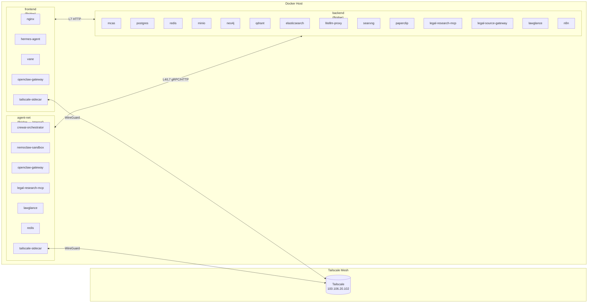
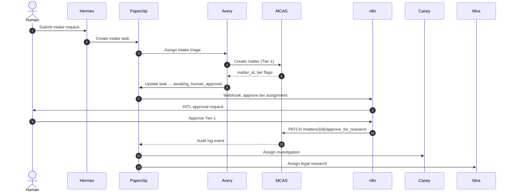
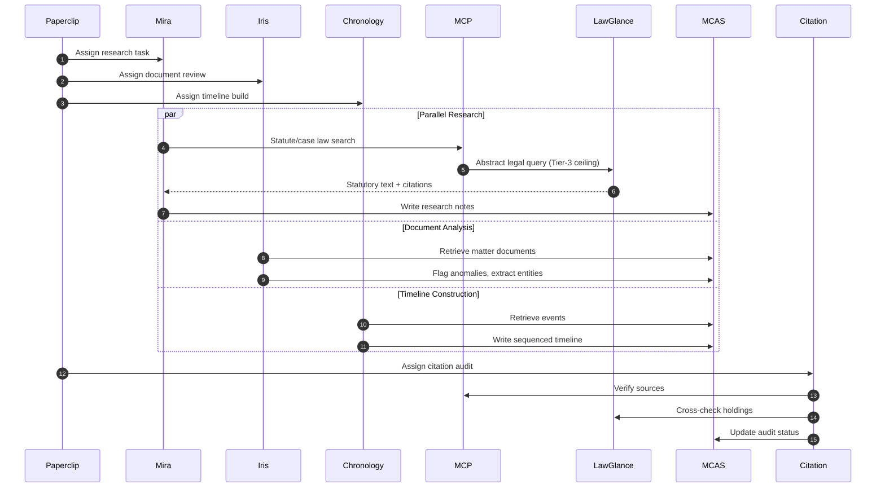
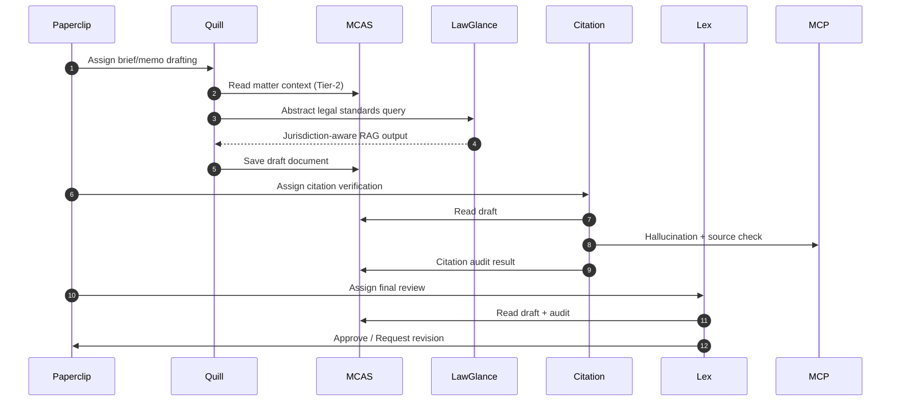
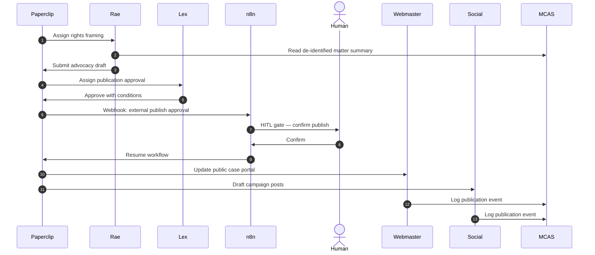
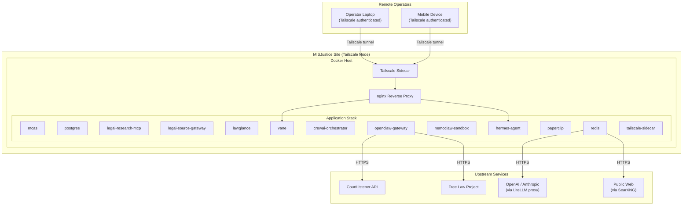

# Section 1 — System Architecture

> **Scope:** High-level structural design of the MISJustice Alliance Firm multi-agent platform.  
> **Exclusions:** Implementation source code, Ansible playbooks, CrewAI agent internal logic.  
> **Version:** 1.0  
> **Date:** 2026-04-27

---

## 1.1 Architectural Overview

The MISJustice Alliance Firm operates as a **seven-layer autonomous legal research and advocacy platform**. The architecture separates human interfaces, governance, orchestration, sandboxed execution, agent frameworks, research infrastructure, and the data plane into distinct layers with explicit trust boundaries.

| Layer | Name | Primary Components |
|---|---|---|
| L1 | Human Interface | Hermes Agent, Vane, Open Web UI, n8n HITL |
| L2 | Control Plane | Paperclip — org chart, budgets, approvals, audit |
| L3 | Orchestration | OpenClaw Gateway, CrewAI AMP Suite |
| L4 | Runtime / Sandbox | NemoClaw (NVIDIA-sandboxed agents), OpenShell |
| L5 | Agent Framework | LangChain / LangSmith, agent skill modules |
| L6 | Memory · Research · Search | MemoryPalace, SearXNG, AutoResearchClaw |
| L7 | Data Plane | MCAS, OpenRAG, LawGlance, LiteLLM, Ollama |

All layers communicate across **Docker bridge networks** inside the host and egress through a **Tailscale overlay** (100.106.20.102/32) for encrypted site-to-site connectivity. No component relies on hardcoded credentials; all secrets are injected at runtime via environment variables or Docker secrets.

---

## 1.2 High-Level System Diagram

### 1.2.1 Component Topology

```mermaid
flowchart TB
    subgraph Tailscale["Tailscale Overlay Network (100.106.20.102)"]
        direction TB
        TS[("Tailscale Sidecar<br/>ts-misjustice")]
    end

    subgraph Human["L1 — Human Interface"]
        direction LR
        HERMES["Hermes Agent<br/>(Human-facing TUI / Web)"]
        VANE["Vane<br/>(Operator Research UI)"]
        N8N["n8n<br/>(HITL Approval Workflows)"]
    end

    subgraph Control["L2 — Control Plane"]
        PAPER["Paperclip<br/>(Tasks, Budgets, Approvals)"]
    end

    subgraph Orch["L3 — Orchestration"]
        direction LR
        OC["OpenClaw Gateway<br/>(Agent Dispatch)"]
        CREW["CrewAI Orchestrator<br/>(Crew Composition)"]
    end

    subgraph Sandbox["L4 — Runtime / Sandbox"]
        NEMO["NemoClaw<br/>(NVIDIA GPU Sandbox)"]
    end

    subgraph Agents["L5 — Agent Framework (13 Agents)"]
        direction TB
        LEX["Lex — Lead Counsel"]
        LEX2["Mira — Legal Researcher"]
        LEX3["Casey — Case Investigator"]
        LEX4["Iris — Document Analyst"]
        LEX5["Avery — Intake Coordinator"]
        LEX6["Ollie — Paralegal"]
        LEX7["Rae — Rights Advocate"]
        LEX8["Sol — Systems Liaison"]
        LEX9["Quill — Brief Writer"]
        LEX10["Citation — Citation Auditor"]
        LEX11["Chronology — Timeline Agent"]
        LEX12["Social Media Manager"]
        LEX13["Webmaster"]
    end

    subgraph Data["L7 — Data Plane"]
        direction TB
        MCAS["MCAS<br/>(Django/DRF + PostgreSQL)"]
        RAG["OpenRAG<br/>(Vector + Graph)"]
        LG["LawGlance<br/>(Public Legal RAG)"]
        LSG["Legal Source Gateway<br/>(Upstream normalizer)"]
        MCP["legal-research-mcp<br/>(MCP Server)"]
        LIT["LiteLLM Proxy"]
        SEAR["SearXNG"]
        REDIS["Redis<br/>(Broker / Cache)"]
        MINIO["MinIO<br/>(Object Store)"]
        NEO["Neo4j<br/>(Citation Graph)"]
        QDRANT["Qdrant<br/>(Vector Store)"]
        ES["Elasticsearch"]
    end

    HERMES -->|HTTP| PAPER
    VANE -->|HTTP| SEAR
    VANE -->|HTTP| LIT
    N8N -->|Webhook| PAPER
    N8N -->|Webhook| MCAS

    PAPER -->|REST| OC
    PAPER -->|REST| CREW

    OC -->|gRPC/HTTP| NEMO
    OC -->|Crew dispatch| CREW
    CREW -->|Tool calls| Agents

    LEX -->|MCAS API| MCAS
    LEX2 -->|MCP| MCP
    LEX3 -->|MCAS API| MCAS
    LEX4 -->|MCAS API| MCAS
    LEX5 -->|MCAS API| MCAS
    LEX6 -->|MCAS API| MCAS
    LEX7 -->|MCAS API| MCAS
    LEX8 -->|Tool orchestration| MCP
    LEX8 -->|MCAS API| MCAS
    LEX9 -->|MCAS API| MCAS
    LEX10 -->|MCP| MCP
    LEX10 -->|LawGlance API| LG
    LEX11 -->|MCAS API| MCAS
    LEX12 -->|MCAS API| MCAS
    LEX13 -->|MCAS API| MCAS

    MCP -->|Upstream| LSG
    MCP -->|Search| SEAR
    MCP -->|LLM| LIT

    LG -->|RAG| QDRANT
    LG -->|Cache| REDIS
    RAG -->|Vector| QDRANT
    RAG -->|Graph| NEO
    RAG -->|Full-text| ES

    MCAS -->|Relational| PG[(PostgreSQL)]
    MCAS -->|Cache| REDIS
    MCAS -->|Objects| MINIO

    TS <-->|Encrypted tunnel| OC
    TS <-->|Encrypted tunnel| HERMES
    TS <-->|Encrypted tunnel| VANE
```

### 1.2.2 Data-Flow Patterns

| Pattern | Flow | Protocol | Notes |
|---|---|---|---|
| **Intake** | Human → Hermes → Paperclip → Avery → MCAS | HTTP/REST | Creates Tier-1 matter record; human approves tier assignment |
| **Research** | Lex/Mira → MCP → legal-source-gateway → SearXNG | MCP / HTTP | Scoped search tokens; results cached in Redis |
| **Drafting** | Quill → MCAS (read) → LawGlance (abstract query) → MCAS (write) | HTTP/REST | LawGlance receives **only** abstract legal questions; PII guard enforced |
| **Citation Audit** | Citation → MCP → LiteLLM → Source verification → MCAS audit log | MCP / HTTP | Hallucination check before Lex sign-off |
| **Publication** | Lex approves → Paperclip → n8n HITL → Webmaster / Social Media Manager | Webhook / HTTP | External publish gated by dual approval |
| **Sandboxed Execution** | OpenClaw → NemoClaw → GPU runtime → Isolated egress | gRPC / HTTP | Network/fs/process policies enforced by NVIDIA OpenShell |

---

## 1.3 Docker Compose Application Stack

The production runtime is defined as a single Docker Compose application with **three bridge networks** and **twelve core services**. Persistent data is stored in named volumes.

### 1.3.1 Compose Service Inventory

| Service | Image / Build | Ports (Host:Container) | Networks | Depends On |
|---|---|---|---|---|
| `mcas` | `services/mcas/Dockerfile` | `8001:8000` | `frontend`, `backend` | postgres, redis, minio |
| `postgres` | `postgres:16-alpine` | `5432:5432` | `backend` | — |
| `legal-research-mcp` | `services/legal-research-mcp/Dockerfile` | `8002:8000` | `backend`, `agent-net` | redis, searxng, litellm-proxy |
| `legal-source-gateway` | `services/legal-source-gateway/Dockerfile` | `8003:8000` | `backend` | elasticsearch, redis |
| `lawglance` | `services/lawglance/Dockerfile` | `8501:8501` | `backend`, `agent-net` | redis |
| `vane` | `services/vane/Dockerfile` | `3001:3000` | `frontend`, `backend` | searxng, litellm-proxy |
| `crewai-orchestrator` | `crewAI/Dockerfile` | `8081:8080` | `agent-net`, `backend` | redis, mcas, litellm-proxy |
| `openclaw-gateway` | `ghcr.io/nemoguard/openclaw:latest` | `8080:8080` | `frontend`, `agent-net` | redis, crewai-orchestrator |
| `nemoclaw-sandbox` | `ghcr.io/nemoguard/nemoclaw:latest` | `—` (no host bind) | `agent-net` | openclaw-gateway |
| `hermes-agent` | `agents/hermes/Dockerfile` | `3000:3000` | `frontend` | openclaw-gateway, paperclip |
| `paperclip` | `ghcr.io/paperclip/paperclip:latest` | `3002:3000` | `frontend`, `backend` | postgres, redis |
| `redis` | `redis:7-alpine` | `6379:6379` | `backend`, `agent-net` | — |
| `tailscale-sidecar` | `tailscale/tailscale:latest` | `—` | `frontend`, `agent-net` | — |

### 1.3.2 Network Design

### 1.3.3 Network Definitions

| Network | Driver | Internal | CIDR / Scope | Purpose |
|---|---|---|---|---|
| `frontend` | bridge | no | `172.28.0.0/16` | Human-facing ingress, reverse proxy, Tailscale sidecar |
| `backend` | bridge | no | `172.29.0.0/16` | Core data plane: databases, caches, object stores, APIs |
| `agent-net` | bridge | **yes** | `172.30.0.0/16` | Inter-agent communication, orchestrator-to-sandbox, MCP traffic |

**Design rationale:**
- `frontend` carries only TLS-terminated or Tailscale-encrypted traffic from operators and external webhooks.
- `backend` isolates databases and storage from direct external exposure; only `mcas`, `paperclip`, and `n8n` speak to `postgres`.
- `agent-net` is **internal-only** (no host port bindings) to prevent accidental external exposure of agent tool calls, MCP sessions, or sandbox runtime APIs.

### 1.3.4 Volume Persistence

| Volume | Driver | Mounted By | Retention |
|---|---|---|---|
| `postgres_data` | local | postgres | Permanent — case records, audit logs, Paperclip state |
| `redis_data` | local | redis | Ephemeral with AOF — session/cache survives restart |
| `minio_data` | local | minio | Permanent — documents, evidence files, exports |
| `neo4j_data` | local | neo4j | Permanent — citation graph, legal reasoning chains |
| `qdrant_data` | local | qdrant | Permanent — vector embeddings for OpenRAG |
| `elasticsearch_data` | local | elasticsearch | Permanent — full-text legal document index |
| `lawglance_chroma` | local | lawglance | Permanent — public legal corpus embeddings |
| `paperclip_data` | local | paperclip | Permanent — task history, budgets, audit context |
| `n8n_data` | local | n8n | Permanent — workflow definitions, execution history |

---

## 1.4 Service Architecture Details

### 1.4.1 MCAS (MISJustice Case & Advocacy Server)

- **Role:** Authoritative system of record for all case data, matters, events, documents, and tasks.
- **Stack:** Django 4.2 + Django REST Framework + PostgreSQL 16.
- **API Surface:** RESTful JSON over HTTP; OAuth2 JWT bearer tokens; agent-scoped access control.
- **Data Handling:** Field-level AES-256 encryption for Tier-0/1 PII; document paths reference MinIO object keys.
- **Integration Points:**
  - All 13 agents read/write matter state via DRF.
  - Webhooks notify Paperclip and n8n on matter lifecycle transitions.
  - Audit logs stream to PostgreSQL and Paperclip audit context.

### 1.4.2 legal-research-mcp (MCP Server)

- **Role:** Model Context Protocol server exposing legal research tools to agents.
- **Stack:** Python FastMCP or TypeScript MCP SDK.
- **Tools:** Statute retrieval, case law search, citation formatting, source verification.
- **Integration Points:**
  - Consumed by Sol, Mira, Citation, and Lex via MCP client connections.
  - Upstream calls routed to `legal-source-gateway` and SearXNG.
  - LLM synthesis routed through `litellm-proxy` for token accounting and tier blocking.

### 1.4.3 legal-source-gateway

- **Role:** Normalization layer between upstream legal data providers (CourtListener, Free Law Project, government repositories) and the firm’s internal services.
- **Stack:** Python/Node.js adapter service.
- **Integration Points:**
  - Ingests bulk data feeds into Elasticsearch and Neo4j.
  - Serves normalized citations to `legal-research-mcp`.
  - No direct agent access; all traffic flows through MCP.

### 1.4.4 LawGlance

- **Role:** Public legal information RAG microservice.
- **Stack:** LangChain + ChromaDB + Redis cache; optional Ollama backend.
- **Data Boundary:** **Public legal materials only.** Tier-0/1 content is rejected at the adapter PII guard.
- **Integration Points:**
  - Queried by Mira, Lex, and Citation for abstract statutory questions.
  - Redis cache namespaced per agent tier to prevent cross-agent pollution.

### 1.4.5 Vane

- **Role:** Human-facing conversational research interface (Perplexity-style).
- **Stack:** Node.js / Python frontend + backend.
- **Access Scope:** Tier-2/3 material only for document upload; T4-admin search via SearXNG.
- **Integration Points:**
  - SearXNG for ad-hoc web Q&A.
  - LiteLLM proxy for LLM inference.
  - Open Notebook export for research output.

### 1.4.6 CrewAI Orchestrator

- **Role:** Crew composition and intra-crew message routing.
- **Stack:** CrewAI framework container.
- **Integration Points:**
  - Receives dispatch from OpenClaw gateway.
  - Manages parallel agent execution (Mira + Iris + Chronology during Research stage).
  - Publishes task completion events to Redis pub/sub for Paperclip consumption.

### 1.4.7 OpenClaw Gateway

- **Role:** Agent workflow dispatch and crew invocation gateway.
- **Stack:** OpenClaw runtime container.
- **Integration Points:**
  - Accepts tasks from Paperclip control plane.
  - Routes execution to CrewAI or NemoClaw sandbox based on classification ceiling.
  - Callback webhooks return run state to Paperclip.

### 1.4.8 NemoClaw Sandbox

- **Role:** GPU-accelerated, sandboxed agent runtime with network/fs/process policy enforcement.
- **Stack:** NVIDIA OpenShell + container runtime.
- **Security Model:**
  - No direct outbound internet; egress proxied through OpenClaw.
  - Filesystem restricted to ephemeral workspaces; no host mounts.
  - GPU access controlled by cgroup and NVIDIA Container Toolkit.
- **Integration Points:**
  - Receives sandboxed workloads from OpenClaw gateway.
  - Returns sandbox exit codes, logs, and artifacts to OpenClaw.

### 1.4.9 Hermes Agent (Human Interface)

- **Role:** Primary human operator interface for the firm.
- **Stack:** Containerized TUI and web interface.
- **Integration Points:**
  - Authenticates operators and routes instructions to Paperclip.
  - Displays agent status, task queues, and approval gates.
  - No direct database access; all operations mediated by Paperclip or MCAS APIs.

### 1.4.10 Paperclip Control Plane

- **Role:** Supervisory governance layer — org chart, issues, budgets, approvals, audit logs.
- **Stack:** Paperclip open-source control plane container.
- **Integration Points:**
  - REST API consumed by Hermes and OpenClaw.
  - Webhook callbacks to n8n for HITL approval routing.
  - Budget telemetry ingested from LiteLLM cost streams.

### 1.4.11 Redis (Message Broker)

- **Role:** Task queue, caching layer, session store, and pub/sub bus.
- **Stack:** Redis 7 with AOF persistence and LRU eviction.
- **Integration Points:**
  - CrewAI task queue via Redis Streams or List.
  - LawGlance query cache with per-agent-tier namespacing.
  - MCAS session and rate-limit storage.
  - Paperclip heartbeat and status pub/sub.

### 1.4.12 Tailscale Sidecar

- **Role:** Encrypted mesh networking sidecar for site-to-site and remote operator access.
- **Stack:** Tailscale userspace networking container.
- **Integration Points:**
  - Exposes `frontend` and `agent-net` services over the Tailscale tailnet.
  - Authenticated device policy restricts which operators and remote peers can reach Hermes, Vane, and OpenClaw.
  - No direct data plane access; acts as an encrypted transport overlay.

---

## 1.5 Agent-to-Service Data Flow

### 1.5.1 Workflow Stage Mapping

The firm operates four canonical workflow stages. Each stage defines which agents run, which services they touch, and the data classification ceiling enforced.

#### Stage 1 — Intake

#### Stage 2 — Research

#### Stage 3 — Drafting

#### Stage 4 — Advocacy

### 1.5.2 Service Dependency Matrix

| Agent | MCAS | MCP | LawGlance | SearXNG (via MCP) | LiteLLM | Redis | Paperclip |
|---|---|---|---|---|---|---|---|
| Lex | R/W | — | Query | — | — | — | R/W |
| Mira | R/W | Query | Query | Query | Via MCP | — | R/W |
| Casey | R/W | — | — | — | — | — | R/W |
| Iris | R/W | — | — | — | — | — | R/W |
| Avery | R/W | — | — | — | — | — | R/W |
| Ollie | R/W | — | — | — | — | — | R/W |
| Rae | R/W | — | — | — | — | — | R/W |
| Sol | R/W | Orchestrate | — | — | — | — | R/W |
| Quill | R/W | — | Query | — | — | — | R/W |
| Citation | R/W | Query | Query | Query | Via MCP | — | R/W |
| Chronology | R/W | — | — | — | — | — | R/W |
| Social Media Manager | R/W | — | — | — | — | — | R/W |
| Webmaster | R/W | — | — | — | — | — | R/W |

---

## 1.6 Security Boundaries

### 1.6.1 Tiered Data Classification

All data in the firm is classified into four tiers. Each tier determines where data may reside, which agents may access it, and which network paths it may traverse.

| Tier | Label | Storage | Encryption | Agent Access | Network |
|---|---|---|---|---|---|
| **Tier 0** | Privileged / PII | Proton Mail / E2EE only; **never enters agent pipelines** | Client-side E2EE | None | Out-of-band only |
| **Tier 1** | Restricted PII | MCAS PostgreSQL (field-level encrypted) | AES-256 at field level | Lex, Avery, Casey, Iris | `backend` only |
| **Tier 2** | De-identified | MCAS + OpenRAG + MinIO | AES-256 at rest | All 13 agents | `backend` + `agent-net` |
| **Tier 3** | Public-safe | LawGlance corpus, public portal, exports | TLS in transit | Mira, Lex, Citation, Quill, Webmaster, Social Media Manager | `frontend` + `backend` |

**Rules:**
- Tier-0 material is never stored in Docker volumes, Redis, or any agent context window.
- Tier-1 material exits MCAS only over authenticated, encrypted APIs with agent-scoped JWTs.
- Tier-2 material may enter agent pipelines and vector stores but must be de-identified (no names, addresses, case numbers).
- Tier-3 material is the only tier permitted in LawGlance queries, public portals, and external publications.

### 1.6.2 Sandboxing & Runtime Isolation

| Layer | Mechanism | Enforcement |
|---|---|---|
| **Container** | Docker bridge networks + `internal: true` on `agent-net` | Prevents accidental external exposure of agent APIs |
| **Process** | NemoClaw / OpenShell seccomp-bpf + cgroup v2 | Restricts syscalls, CPU/memory limits, no host namespace sharing |
| **Network** | NemoClaw egress proxy through OpenClaw | Blocked direct outbound; all traffic inspected and logged |
| **Filesystem** | Ephemeral overlayfs per sandbox task | No host bind mounts; artifacts extracted via signed tarball |
| **GPU** | NVIDIA Container Toolkit + MIG (optional) | GPU time-sliced or partitioned per sandbox instance |

### 1.6.3 Network Policies

```mermaid
flowchart TB
    subgraph INGRESS["Ingress Policy"]
        direction TB
        IN1["nginx → frontend:80/443<br/>Allowed: Any (TLS)"]
        IN2["Tailscale → frontend<br/>Allowed: Authenticated tailnet peers only"]
        IN3["agent-net<br/>Allowed: No host port bindings"]
    end
    subgraph EGRESS["Egress Policy"]
        direction TB
        OUT1["frontend → Internet<br/>Allowed: nginx, Tailscale sidecar"]
        OUT2["backend → Internet<br/>Denied by default; SearXNG + LiteLLM proxy whitelisted"]
        OUT3["agent-net → Internet<br/>Denied; all egress via OpenClaw gateway proxy"]
    end
    subgraph INTER["Inter-Service Policy"]
        direction TB
        IS1["mcas ↔ postgres<br/>Allowed: backend net only"]
        IS2["lawglance ↔ qdrant<br/>Allowed: backend net only"]
        IS3["nemoclaw ↔ openclaw<br/>Allowed: agent-net only"]
        IS4["hermes ↔ paperclip<br/>Allowed: frontend net only"]
    end
```

### 1.6.4 Authentication & Authorization

| Component | Auth Method | Identity Source |
|---|---|---|
| Human operators | OAuth2 / SSO | Hermes login → Paperclip org chart |
| Agent-to-MCAS | JWT Bearer | MCAS token endpoint; scopes per agent role |
| Agent-to-MCP | MCP protocol auth | Session-scoped tokens issued by Sol |
| OpenClaw dispatch | mTLS + API key | Paperclip ↔ OpenClaw pre-shared credentials |
| Tailscale mesh | WireGuard + ACL | Tailscale control plane; device tagging by role |

### 1.6.5 Audit & Compliance

| Event | Log Destination | Retention |
|---|---|---|
| Matter creation / tier change | MCAS audit table + Paperclip issue comment | 7 years |
| Agent search query (hashed) | MCP adapter log + Paperclip budget telemetry | 2 years |
| LawGlance query (agent, jurisdiction) | LawGlance adapter log | 1 year |
| External publication | MCAS + Paperclip + n8n execution log | 7 years |
| HITL approval / rejection | n8n execution log + Paperclip comment | 7 years |
| LiteLLM token usage | LiteLLM telemetry → Paperclip budget | 2 years |
| Sandbox execution | NemoClaw stdout/stderr → OpenClaw → Paperclip | 90 days |

---

## 1.7 Deployment Topology

---

## 1.8 Scalability & Resilience Notes

| Concern | Strategy |
|---|---|
| **Stateless services** | MCAS, legal-research-mcp, legal-source-gateway, lawglance, vane, OpenClaw gateway are horizontally scalable behind nginx or a load balancer. |
| **Stateful services** | PostgreSQL, Redis, Neo4j, Qdrant, Elasticsearch use named volumes and should be replicated via their native clustering mechanisms (not Docker Compose replication). |
| **GPU sandbox** | NemoClaw is singleton per GPU node. Multiple sandbox instances require multiple GPU workers or NVIDIA MIG partitioning. |
| **CrewAI orchestrator** | Single coordinator per crew; multiple crews may run concurrently if Redis queue depth permits. |
| **Tailscale** | Sidecar is stateless; multiple site nodes may join the same tailnet for multi-region presence. |

---

## 1.9 Key Files & References

| Document | Path | Purpose |
|---|---|---|
| Agent roster & rules | `AGENTS.md` | Canonical agent definitions and orchestration rules |
| Data classification policy | `policies/DATA_CLASSIFICATION.md` | Tier definitions and handling rules |
| Search token policy | `policies/SEARCH_TOKEN_POLICY.md` | Agent-scoped SearXNG/LiteLLM access tiers |
| Incident response | `policies/INCIDENT_RESPONSE.md` | Security incident procedures |
| MCAS specification | `services/mcas/README.md` | Case server API and data model |
| LawGlance integration | `services/lawglance/README.md` | Public legal RAG service boundary |
| Vane configuration | `services/vane/vane.yaml` | Operator UI runtime settings |
| Paperclip implementation | `docs/PAPERCLIP_IMPLEMENTATION.md` | Control plane adapter map and handoff workflows |
| Docker Compose (local dev) | `docker-compose.yml` | Full local stack with additional data services |

---

*MISJustice Alliance — Legal Research. Civil Rights. Public Record.*
