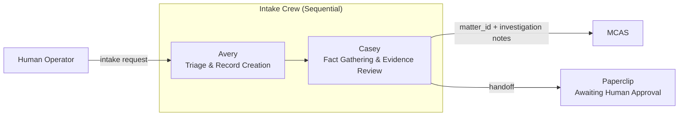
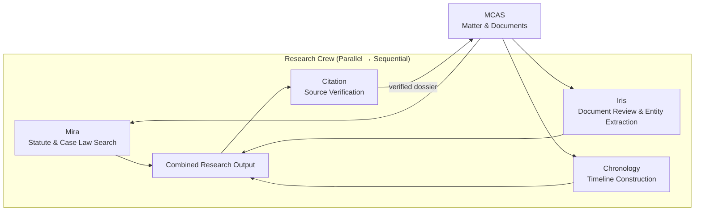
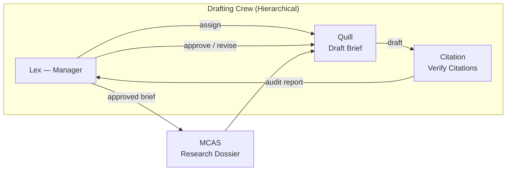
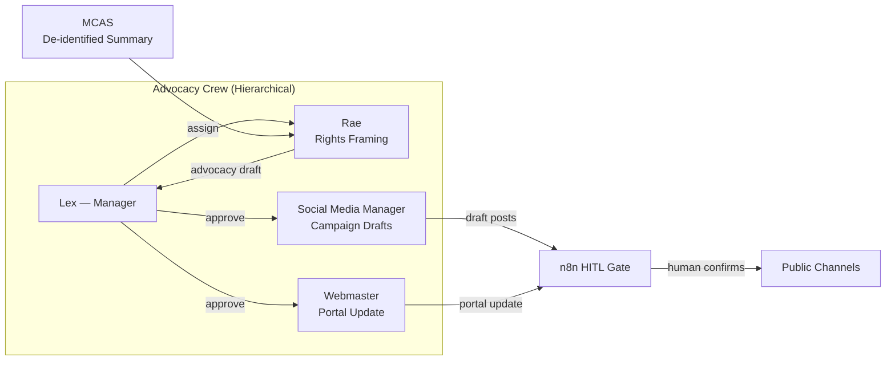
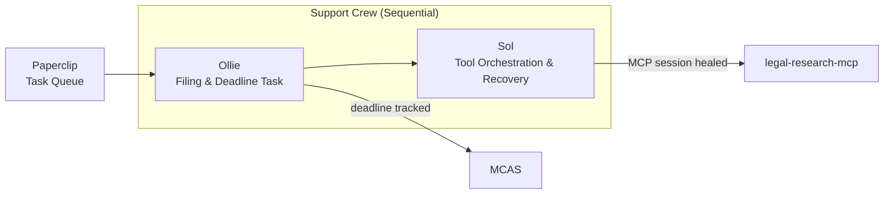
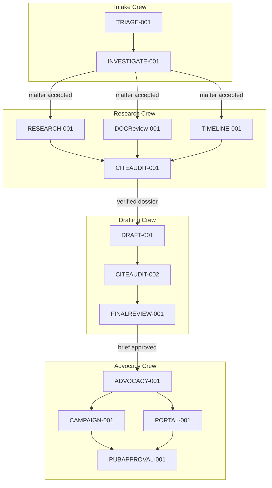

# Section 3 — CrewAI Agent Development

> **Scope:** Agent framework design, crew orchestration, task definitions, tool wrappers, and testing strategy for the MISJustice Alliance Firm.  
> **Exclusions:** Infrastructure, deployment, full Python implementation, frontend code.  
> **Version:** 1.0  
> **Date:** 2026-04-27

---

## 3.1 CrewAI Project Structure

The firm’s CrewAI runtime lives in `crewai-orchestrator/` (container: `crewai-orchestrator`). Source is organised into functional layers that mirror CrewAI’s native conventions while adding firm-specific boundaries (MCP, MCAS, tier gating, and NemoClaw policy enforcement).

```
crewai-orchestrator/
├── pyproject.toml                  # Dependencies: crewai, mcp, httpx, pydantic
├── src/
│   └── misjustice_crews/
│       ├── __init__.py
│       ├── config/
│       │   ├── __init__.py
│       │   ├── llm_config.py       # LiteLLM proxy routing, fallback chains
│       │   ├── memory_config.py    # LanceDB / Qdrant / Redis backends per agent tier
│       │   └── settings.py         # Pydantic-settings: env var validation
│       ├── agents/
│       │   ├── __init__.py
│       │   ├── lex.py              # Lead Counsel
│       │   ├── mira.py             # Legal Researcher
│       │   ├── casey.py            # Case Investigator
│       │   ├── iris.py             # Document Analyst
│       │   ├── avery.py            # Intake Coordinator
│       │   ├── ollie.py            # Paralegal
│       │   ├── rae.py              # Rights Advocate
│       │   ├── sol.py              # Systems Liaison / tool orchestrator
│       │   ├── quill.py            # Brief Writer
│       │   ├── citation.py         # Citation Auditor
│       │   ├── chronology.py       # Timeline Agent
│       │   ├── social_media_manager.py
│       │   └── webmaster.py
│       ├── crews/
│       │   ├── __init__.py
│       │   ├── intake_crew.py
│       │   ├── research_crew.py
│       │   ├── drafting_crew.py
│       │   ├── advocacy_crew.py
│       │   └── support_crew.py
│       ├── tasks/
│       │   ├── __init__.py
│       │   ├── intake_tasks.py
│       │   ├── research_tasks.py
│       │   ├── drafting_tasks.py
│       │   ├── advocacy_tasks.py
│       │   └── support_tasks.py
│       ├── tools/
│       │   ├── __init__.py
│       │   ├── mcas_tools.py       # DRF CRUD wrappers + entity helpers
│       │   ├── mcp_tool_factory.py # MCPToolWrapper factory per legal-research-mcp
│       │   ├── web_search_tools.py # SearXNG wrapper (tier-scoped)
│       │   ├── document_tools.py   # OCR, anomaly detection, PII redaction
│       │   └── custom_tools.py     # Firm-specific: timeline builder, citation formatter
│       └── main.py                 # OpenClaw dispatch entrypoint
├── tests/
│   ├── unit/
│   │   ├── test_tools/
│   │   └── test_agents/
│   └── integration/
│       ├── test_intake_crew.py
│       ├── test_research_crew.py
│       ├── test_drafting_crew.py
│       ├── test_advocacy_crew.py
│       └── test_support_crew.py
└── Dockerfile
```

**Design rules:**
- One Python module per agent under `agents/`. Each module exports a factory function `create_<name>()` that returns a configured `Agent` instance.
- One Python module per crew under `crews/`. Each module exports a factory function `create_<crew_name>()` that returns a configured `Crew` instance.
- Task modules under `tasks/` export `Task` objects with explicit `context` dependencies; they are wired into crews by the crew factory, not by global import side-effects.
- All tool modules under `tools/` expose CrewAI `BaseTool` subclasses. MCP tools are dynamically wrapped via `MCPToolWrapper` at crew creation time, not at module import time.

---

## 3.2 Agent Definitions

Each agent is defined by a **role**, **goal**, **backstory**, **LLM configuration**, **tool inventory**, and **memory policy**. The definitions below are canonical; they are the single source of truth for the CrewAI runtime and for NemoClaw policy enforcement.

### 3.2.1 Agent Roster Summary

| # | Agent | Role | Primary Crew | Data Tier | MCP Access |
|---|---|---|---|---|---|
| 1 | **Lex** | Lead Counsel | Drafting (lead) | T1–T2 | Query only |
| 2 | **Mira** | Legal Researcher | Research | T1–T3 | Full |
| 3 | **Casey** | Case Investigator | Intake / Research | T1–T2 | — |
| 4 | **Iris** | Document Analyst | Research | T1–T2 | — |
| 5 | **Avery** | Intake Coordinator | Intake | T1 | — |
| 6 | **Ollie** | Paralegal | Support | T1–T2 | — |
| 7 | **Rae** | Rights Advocate | Advocacy | T2–T3 | — |
| 8 | **Sol** | Systems Liaison | Support (lead) | T1–T3 | Orchestrate |
| 9 | **Quill** | Brief Writer | Drafting | T2–T3 | — |
| 10 | **Citation** | Citation Auditor | Drafting / Research | T1–T3 | Full |
| 11 | **Chronology** | Timeline Agent | Research | T1–T2 | — |
| 12 | **Social Media Manager** | Public Advocate | Advocacy | T3 | — |
| 13 | **Webmaster** | Site Manager | Advocacy | T3 | — |

### 3.2.2 LLM Configuration Matrix

All LLM traffic routes through the **LiteLLM proxy** (`litellm-proxy` on `backend` network). Agents never hold provider API keys. Temperature and max tokens are tuned per role.

| Agent | Primary Model | Fallback Model | Temperature | Max Tokens | Timeout |
|---|---|---|---|---|---|
| Lex | `anthropic/claude-3-5-sonnet-20241022` | `openai/gpt-4o` | 0.2 | 8192 | 180s |
| Mira | `anthropic/claude-3-5-sonnet-20241022` | `openai/gpt-4o` | 0.1 | 4096 | 120s |
| Casey | `openai/gpt-4o` | `anthropic/claude-3-5-sonnet-20241022` | 0.1 | 4096 | 120s |
| Iris | `openai/gpt-4o-mini` | `openai/gpt-4o` | 0.1 | 4096 | 120s |
| Avery | `openai/gpt-4o` | `anthropic/claude-3-5-sonnet-20241022` | 0.1 | 4096 | 120s |
| Ollie | `openai/gpt-4o-mini` | `openai/gpt-4o` | 0.1 | 4096 | 90s |
| Rae | `anthropic/claude-3-5-sonnet-20241022` | `openai/gpt-4o` | 0.3 | 4096 | 120s |
| Sol | `openai/gpt-4o` | `anthropic/claude-3-5-sonnet-20241022` | 0.1 | 4096 | 120s |
| Quill | `anthropic/claude-3-5-sonnet-20241022` | `openai/gpt-4o` | 0.2 | 8192 | 180s |
| Citation | `openai/gpt-4o` | `anthropic/claude-3-5-sonnet-20241022` | 0.0 | 4096 | 120s |
| Chronology | `openai/gpt-4o-mini` | `openai/gpt-4o` | 0.1 | 4096 | 90s |
| Social Media Manager | `openai/gpt-4o-mini` | `openai/gpt-4o` | 0.4 | 2048 | 60s |
| Webmaster | `openai/gpt-4o-mini` | `openai/gpt-4o` | 0.2 | 4096 | 90s |

**Fallback behaviour:**
1. LiteLLM proxy returns `5xx` or times out.
2. CrewAI `LLM` class catches the exception and swaps to `fallback_model` for the current task.
3. If fallback also fails, the agent returns an error string; the crew’s `process` (sequential or hierarchical) determines whether to retry, halt, or escalate to Sol.

### 3.2.3 Detailed Agent Definitions

---

#### Lex — Lead Counsel

| Attribute | Definition |
|---|---|
| **Role** | Lead Counsel |
| **Goal** | Synthesise legal research, case facts, and procedural data into coherent strategy; author or approve all final briefs and external publications. |
| **Backstory** | Former public-interest litigator with deep constitutional and civil-rights experience. Lex does not tolerate unsupported conclusions. Every output must be defensible in adversarial review. |
| **Process** | `Process.hierarchical` — Lex acts as manager in Drafting Crew and Advocacy Crew. |
| **Memory** | Short-term: full context within a single crew execution. Long-term: matter-scoped Qdrant vector store (Tier-2 ceiling). |

```python
# Pseudocode — agents/lex.py
from crewai import Agent
from crewai.llm import LLM
from misjustice_crews.tools import mcas_tools, mcp_tool_factory

def create_lex(matter_id: str):
    return Agent(
        role="Lead Counsel",
        goal=(
            "Synthesise legal research, case facts, and procedural data into "
            "coherent strategy; author or approve all final briefs and external publications."
        ),
        backstory=(
            "Former public-interest litigator with deep constitutional and civil-rights "
            "experience. Lex does not tolerate unsupported conclusions. Every output must be "
            "defensible in adversarial review."
        ),
        llm=LLM(
            model="anthropic/claude-3-5-sonnet-20241022",
            temperature=0.2,
            max_tokens=8192,
            base_url="${LITELLM_PROXY_URL}",
            api_key="${LITELLM_API_KEY}",
        ),
        tools=[
            mcas_tools.MatterReadTool(matter_id),
            mcas_tools.DocumentReadTool(matter_id),
            mcas_tools.AuditLogWriteTool(agent_id="lex"),
            mcp_tool_factory.create("legal_research_mcp", "cases_get"),
            mcp_tool_factory.create("legal_research_mcp", "citations_resolve"),
        ],
        memory=True,
        verbose=True,
        allow_delegation=True,
        max_iter=5,
    )
```

---

#### Mira — Legal Researcher

| Attribute | Definition |
|---|---|
| **Role** | Legal Researcher |
| **Goal** | Retrieve controlling statutes, regulations, and precedent; analyse jurisdictional trends; produce annotated research memos with full provenance. |
| **Backstory** | Methodical research librarian turned AI. Mira believes a single missed case can lose a motion. She queries every source twice and cross-checks holdings. |
| **Process** | `Process.sequential` within Research Crew; runs in parallel with Iris and Chronology. |
| **Memory** | Session memory enabled; cross-session memory scoped to `research-index` in Qdrant. |

```python
# Pseudocode — agents/mira.py
from crewai import Agent
from crewai.llm import LLM
from misjustice_crews.tools import mcas_tools, mcp_tool_factory, web_search_tools

def create_mira(matter_id: str):
    return Agent(
        role="Legal Researcher",
        goal=(
            "Retrieve controlling statutes, regulations, and precedent; analyse "
            "jurisdictional trends; produce annotated research memos with full provenance."
        ),
        backstory=(
            "Methodical research librarian turned AI. Mira believes a single missed case "
            "can lose a motion. She queries every source twice and cross-checks holdings."
        ),
        llm=LLM(
            model="anthropic/claude-3-5-sonnet-20241022",
            temperature=0.1,
            max_tokens=4096,
            base_url="${LITELLM_PROXY_URL}",
            api_key="${LITELLM_API_KEY}",
        ),
        tools=[
            mcas_tools.ResearchMemoWriteTool(matter_id),
            mcp_tool_factory.create("legal_research_mcp", "cases_search"),
            mcp_tool_factory.create("legal_research_mcp", "cases_get"),
            mcp_tool_factory.create("legal_research_mcp", "statutes_lookup"),
            mcp_tool_factory.create("legal_research_mcp", "statutes_search"),
            mcp_tool_factory.create("legal_research_mcp", "regulations_current"),
            mcp_tool_factory.create("legal_research_mcp", "graph_expand"),
            web_search_tools.SearXNGSearchTool(tier="T3"),
        ],
        memory=True,
        verbose=True,
        allow_delegation=False,
        max_iter=5,
    )
```

---

#### Casey — Case Investigator

| Attribute | Definition |
|---|---|
| **Role** | Case Investigator |
| **Goal** | Gather facts, evaluate evidence credibility, summarise witness accounts, and flag evidentiary gaps for Lex. |
| **Backstory** | Ex-investigative journalist with a nose for inconsistency. Casey treats every complainant narrative as a hypothesis to be tested against documents and third-party records. |
| **Process** | `Process.sequential` within Intake Crew; collaborates with Avery. |
| **Memory** | Session memory only; no long-term persistence of investigation notes without human approval. |

```python
# Pseudocode — agents/casey.py
def create_casey(matter_id: str):
    return Agent(
        role="Case Investigator",
        goal=(
            "Gather facts, evaluate evidence credibility, summarise witness accounts, "
            "and flag evidentiary gaps for Lex."
        ),
        backstory=(
            "Ex-investigative journalist with a nose for inconsistency. Casey treats every "
            "complainant narrative as a hypothesis to be tested against documents and "
            "third-party records."
        ),
        llm=LLM(model="openai/gpt-4o", temperature=0.1, max_tokens=4096),
        tools=[
            mcas_tools.MatterReadTool(matter_id),
            mcas_tools.DocumentReadTool(matter_id),
            mcas_tools.EventReadTool(matter_id),
            mcas_tools.InvestigationNoteWriteTool(matter_id),
            web_search_tools.SearXNGSearchTool(tier="T1"),
        ],
        memory=True,
        allow_delegation=False,
        max_iter=4,
    )
```

---

#### Iris — Document Analyst

| Attribute | Definition |
|---|---|
| **Role** | Document Analyst |
| **Goal** | Review contracts, filings, and evidence documents; extract entities; flag anomalies; produce structured document summaries. |
| **Backstory** | Forensic accountant turned document reviewer. Iris can spot a forged signature or a redacted paragraph that should not have been redacted. |
| **Process** | `Process.sequential` within Research Crew; runs in parallel with Mira and Chronology. |
| **Memory** | Session memory enabled; long-term document embeddings stored in Qdrant `document-index`. |

```python
# Pseudocode — agents/iris.py
def create_iris(matter_id: str):
    return Agent(
        role="Document Analyst",
        goal=(
            "Review contracts, filings, and evidence documents; extract entities; "
            "flag anomalies; produce structured document summaries."
        ),
        backstory=(
            "Forensic accountant turned document reviewer. Iris can spot a forged signature "
            "or a redacted paragraph that should not have been redacted."
        ),
        llm=LLM(model="openai/gpt-4o-mini", temperature=0.1, max_tokens=4096),
        tools=[
            mcas_tools.DocumentReadTool(matter_id),
            mcas_tools.DocumentEntityExtractTool(matter_id),
            document_tools.OCRSubmitTool(),
            document_tools.AnomalyFlagTool(),
            document_tools.PIIRedactionCheckTool(),
        ],
        memory=True,
        allow_delegation=False,
        max_iter=4,
    )
```

---

#### Avery — Intake Coordinator

| Attribute | Definition |
|---|---|
| **Role** | Intake Coordinator |
| **Goal** | Triage all new matters; create foundational MCAS records; route cases to the correct crew; never conduct legal analysis. |
| **Backstory** | Seasoned legal intake specialist. Avery knows the difference between a case the firm can help and a case that needs referral—within three minutes of reading a form. |
| **Process** | `Process.sequential` within Intake Crew; first agent invoked on `new_matter_intake`. |
| **Memory** | Session memory enabled; cross-session memory scoped to `avery-matter-context` (Tier-1 floor). |

```python
# Pseudocode — agents/avery.py
def create_avery():
    return Agent(
        role="Intake Coordinator",
        goal=(
            "Triage all new matters; create foundational MCAS records; route cases to "
            "the correct crew; never conduct legal analysis."
        ),
        backstory=(
            "Seasoned legal intake specialist. Avery knows the difference between a case "
            "the firm can help and a case that needs referral—within three minutes of "
            "reading a form."
        ),
        llm=LLM(model="openai/gpt-4o", temperature=0.1, max_tokens=4096),
        tools=[
            mcas_tools.PersonCreateTool(),
            mcas_tools.OrganizationCreateTool(),
            mcas_tools.MatterCreateTool(),
            mcas_tools.EventCreateTool(),
            mcas_tools.DocumentCreateTool(),
            document_tools.OCRSubmitTool(),
            web_search_tools.SearXNGSearchTool(tier="T1"),
        ],
        memory=True,
        allow_delegation=False,
        max_iter=3,
    )
```

---

#### Ollie — Paralegal

| Attribute | Definition |
|---|---|
| **Role** | Paralegal |
| **Goal** | Prepare filings, track deadlines, complete forms, and maintain matter calendars. No legal advice. |
| **Backstory** | Detail-obsessed paralegal who colour-codes deadlines by risk. Ollie has never missed a statute-of-limitations date and intends to keep it that way. |
| **Process** | `Process.sequential` within Support Crew. |
| **Memory** | Session memory enabled; deadline reminders pushed to MCAS calendar API. |

```python
# Pseudocode — agents/ollie.py
def create_ollie(matter_id: str):
    return Agent(
        role="Paralegal",
        goal="Prepare filings, track deadlines, complete forms, and maintain matter calendars. No legal advice.",
        backstory=(
            "Detail-obsessed paralegal who colour-codes deadlines by risk. Ollie has never "
            "missed a statute-of-limitations date and intends to keep it that way."
        ),
        llm=LLM(model="openai/gpt-4o-mini", temperature=0.1, max_tokens=4096),
        tools=[
            mcas_tools.MatterReadTool(matter_id),
            mcas_tools.DeadlineCreateTool(matter_id),
            mcas_tools.FormDraftTool(matter_id),
            mcas_tools.CalendarEventTool(matter_id),
        ],
        memory=True,
        allow_delegation=False,
        max_iter=3,
    )
```

---

#### Rae — Rights Advocate

| Attribute | Definition |
|---|---|
| **Role** | Rights Advocate |
| **Goal** | Frame victim impact, civil rights violations, and policy context; draft advocacy narratives for public and legislative audiences. |
| **Backstory** | Community organiser turned legal advocate. Rae translates case facts into systemic change narratives without compromising client dignity or privacy. |
| **Process** | `Process.sequential` within Advocacy Crew; outputs require Lex sign-off before publication. |
| **Memory** | Session memory enabled; long-term memory in `advocacy-index` (Tier-3 only). |

```python
# Pseudocode — agents/rae.py
def create_rae(matter_id: str):
    return Agent(
        role="Rights Advocate",
        goal=(
            "Frame victim impact, civil rights violations, and policy context; draft "
            "advocacy narratives for public and legislative audiences."
        ),
        backstory=(
            "Community organiser turned legal advocate. Rae translates case facts into "
            "systemic change narratives without compromising client dignity or privacy."
        ),
        llm=LLM(model="anthropic/claude-3-5-sonnet-20241022", temperature=0.3, max_tokens=4096),
        tools=[
            mcas_tools.MatterReadDeidentifiedTool(matter_id),
            mcp_tool_factory.create("legal_research_mcp", "bills_search"),
            mcp_tool_factory.create("legal_research_mcp", "legislators_lookup"),
            web_search_tools.SearXNGSearchTool(tier="T3"),
        ],
        memory=True,
        allow_delegation=False,
        max_iter=4,
    )
```

---

#### Sol — Systems Liaison

| Attribute | Definition |
|---|---|
| **Role** | Systems Liaison |
| **Goal** | Orchestrate tool calls, manage MCP session lifecycle, broker inter-agent handoffs, and automate workflow plumbing so other agents focus on legal work. |
| **Backstory** | DevOps engineer turned agent. Sol speaks MCP, REST, and Redis pub/sub fluently. When a tool fails, Sol retries with exponential backoff and escalates only when exhausted. |
| **Process** | `Process.sequential` within Support Crew; also invoked by OpenClaw as a fallback handler. |
| **Memory** | Session memory enabled; system-state cache in Redis (ephemeral). |

```python
# Pseudocode — agents/sol.py
def create_sol():
    return Agent(
        role="Systems Liaison",
        goal=(
            "Orchestrate tool calls, manage MCP session lifecycle, broker inter-agent "
            "handoffs, and automate workflow plumbing so other agents focus on legal work."
        ),
        backstory=(
            "DevOps engineer turned agent. Sol speaks MCP, REST, and Redis pub/sub fluently. "
            "When a tool fails, Sol retries with exponential backoff and escalates only when exhausted."
        ),
        llm=LLM(model="openai/gpt-4o", temperature=0.1, max_tokens=4096),
        tools=[
            mcas_tools.HealthCheckTool(),
            mcp_tool_factory.create("legal_research_mcp", "cases_search"),
            mcp_tool_factory.create("legal_research_mcp", "statutes_lookup"),
            mcp_tool_factory.create("legal_research_mcp", "citations_resolve"),
            mcp_tool_factory.create("legal_research_mcp", "graph_expand"),
            custom_tools.RedisPublishTool(),
            custom_tools.WebhookDispatchTool(),
        ],
        memory=True,
        allow_delegation=True,
        max_iter=5,
    )
```

---

#### Quill — Brief Writer

| Attribute | Definition |
|---|---|
| **Role** | Brief Writer |
| **Goal** | Draft legal memos, motions, and briefs that are jurisdictionally accurate, procedurally compliant, and stylistically consistent with firm templates. |
| **Backstory** | Former clerk to a federal judge. Quill writes in IRAC without being told, cites every proposition, and never uses the passive voice when the active voice will do. |
| **Process** | `Process.sequential` within Drafting Crew; drafts are passed to Citation, then Lex. |
| **Memory** | Session memory enabled; template cache in Redis. |

```python
# Pseudocode — agents/quill.py
def create_quill(matter_id: str):
    return Agent(
        role="Brief Writer",
        goal=(
            "Draft legal memos, motions, and briefs that are jurisdictionally accurate, "
            "procedurally compliant, and stylistically consistent with firm templates."
        ),
        backstory=(
            "Former clerk to a federal judge. Quill writes in IRAC without being told, "
            "cites every proposition, and never uses the passive voice when the active voice will do."
        ),
        llm=LLM(model="anthropic/claude-3-5-sonnet-20241022", temperature=0.2, max_tokens=8192),
        tools=[
            mcas_tools.MatterReadTool(matter_id),
            mcas_tools.ResearchMemoReadTool(matter_id),
            mcas_tools.DocumentDraftWriteTool(matter_id),
            mcp_tool_factory.create("legal_research_mcp", "cases_get"),
            mcp_tool_factory.create("legal_research_mcp", "statutes_lookup"),
            document_tools.TemplateLoadTool(),
        ],
        memory=True,
        allow_delegation=False,
        max_iter=5,
    )
```

---

#### Citation — Citation Auditor

| Attribute | Definition |
|---|---|
| **Role** | Citation Auditor |
| **Goal** | Verify every legal citation for accuracy, formatting, and hallucination risk; reject any brief containing an unverified citation. |
| **Backstory** | Citation is the firm’s immune system. A single fabricated case can destroy credibility; Citation treats every footnote as a potential pathogen. |
| **Process** | `Process.sequential` within Drafting Crew; gate agent before Lex review. |
| **Memory** | Session memory enabled; no long-term persistence of audited content (privacy). |

```python
# Pseudocode — agents/citation.py
def create_citation(matter_id: str):
    return Agent(
        role="Citation Auditor",
        goal=(
            "Verify every legal citation for accuracy, formatting, and hallucination risk; "
            "reject any brief containing an unverified citation."
        ),
        backstory=(
            "Citation is the firm's immune system. A single fabricated case can destroy "
            "credibility; Citation treats every footnote as a potential pathogen."
        ),
        llm=LLM(model="openai/gpt-4o", temperature=0.0, max_tokens=4096),
        tools=[
            mcas_tools.DocumentReadTool(matter_id),
            mcp_tool_factory.create("legal_research_mcp", "citations_resolve"),
            mcp_tool_factory.create("legal_research_mcp", "cases_citation_lookup"),
            mcp_tool_factory.create("legal_research_mcp", "cases_get"),
            mcp_tool_factory.create("legal_research_mcp", "graph_expand"),
            custom_tools.CitationFormatTool(),
            custom_tools.HallucinationFlagTool(),
        ],
        memory=True,
        allow_delegation=False,
        max_iter=5,
    )
```

---

#### Chronology — Timeline Agent

| Attribute | Definition |
|---|---|
| **Role** | Timeline Agent |
| **Goal** | Sequence all matter events; detect date conflicts; produce a canonical timeline document for use by Quill and Lex. |
| **Backstory** | Historian by training. Chronology believes that causation is hidden in the gaps between dates. No two events with conflicting timestamps escape notice. |
| **Process** | `Process.sequential` within Research Crew; runs in parallel with Mira and Iris. |
| **Memory** | Session memory enabled; timeline state persisted to MCAS `Event` table. |

```python
# Pseudocode — agents/chronology.py
def create_chronology(matter_id: str):
    return Agent(
        role="Timeline Agent",
        goal=(
            "Sequence all matter events; detect date conflicts; produce a canonical "
            "timeline document for use by Quill and Lex."
        ),
        backstory=(
            "Historian by training. Chronology believes that causation is hidden in the "
            "gaps between dates. No two events with conflicting timestamps escape notice."
        ),
        llm=LLM(model="openai/gpt-4o-mini", temperature=0.1, max_tokens=4096),
        tools=[
            mcas_tools.EventReadTool(matter_id),
            mcas_tools.EventCreateTool(matter_id),
            mcas_tools.EventUpdateTool(matter_id),
            custom_tools.TimelineBuilderTool(),
            custom_tools.DateConflictDetectorTool(),
        ],
        memory=True,
        allow_delegation=False,
        max_iter=4,
    )
```

---

#### Social Media Manager — Public Advocate

| Attribute | Definition |
|---|---|
| **Role** | Public Advocate |
| **Goal** | Draft campaign posts, public narrative content, and outreach copy; ensure all external content is Tier-3 safe and Lex-approved. |
| **Backstory** | Veteran communications director. Social Media Manager knows that a tweet can be Exhibit A in a defamation suit, so every character is vetted. |
| **Process** | `Process.sequential` within Advocacy Crew; final publish gated by n8n HITL. |
| **Memory** | Session memory only; no persistent storage of draft posts. |

```python
# Pseudocode — agents/social_media_manager.py
def create_social_media_manager(matter_id: str):
    return Agent(
        role="Public Advocate",
        goal=(
            "Draft campaign posts, public narrative content, and outreach copy; ensure "
            "all external content is Tier-3 safe and Lex-approved."
        ),
        backstory=(
            "Veteran communications director. Social Media Manager knows that a tweet can "
            "be Exhibit A in a defamation suit, so every character is vetted."
        ),
        llm=LLM(model="openai/gpt-4o-mini", temperature=0.4, max_tokens=2048),
        tools=[
            mcas_tools.MatterReadDeidentifiedTool(matter_id),
            custom_tools.PostDraftTool(),
            custom_tools.Tier3SafetyCheckTool(),
        ],
        memory=True,
        allow_delegation=False,
        max_iter=3,
    )
```

---

#### Webmaster — Site Manager

| Attribute | Definition |
|---|---|
| **Role** | Site Manager |
| **Goal** | Update the public case portal; publish de-identified matter summaries; maintain SEO and accessibility compliance. |
| **Backstory** | Full-stack developer turned public-interest technologist. Webmaster treats every HTML tag as a potential liability and every alt-text as a civil-rights issue. |
| **Process** | `Process.sequential` within Advocacy Crew; publishes only after Lex + n8n approval. |
| **Memory** | Session memory only; content published to external CMS via API. |

```python
# Pseudocode — agents/webmaster.py
def create_webmaster(matter_id: str):
    return Agent(
        role="Site Manager",
        goal=(
            "Update the public case portal; publish de-identified matter summaries; "
            "maintain SEO and accessibility compliance."
        ),
        backstory=(
            "Full-stack developer turned public-interest technologist. Webmaster treats "
            "every HTML tag as a potential liability and every alt-text as a civil-rights issue."
        ),
        llm=LLM(model="openai/gpt-4o-mini", temperature=0.2, max_tokens=4096),
        tools=[
            mcas_tools.MatterReadDeidentifiedTool(matter_id),
            custom_tools.CMSPublishTool(),
            custom_tools.SEOSchemaTool(),
            custom_tools.AccessibilityLintTool(),
        ],
        memory=True,
        allow_delegation=False,
        max_iter=3,
    )
```

---

## 3.3 Crew Orchestration Design

Crews are composed using CrewAI’s `Crew` class. The firm uses **two process models**:
- **`Process.sequential`** — tasks run in order; downstream tasks receive upstream output via `context`.
- **`Process.hierarchical`** — a manager agent (Lex) delegates tasks to worker agents and reviews their output.

All crews are instantiated by factory functions in `crews/` and executed by OpenClaw dispatch or direct invocation from `main.py`.

### 3.3.1 Crew Composition Overview

| Crew | Process | Manager | Workers | Entry Trigger |
|---|---|---|---|---|
| **Intake Crew** | Sequential | — | Avery → Casey | `new_matter_intake` |
| **Research Crew** | Sequential | — | Mira ∥ Iris ∥ Chronology → Citation | `intake_accepted` |
| **Drafting Crew** | Hierarchical | Lex | Quill → Citation → Lex | `research_complete` |
| **Advocacy Crew** | Hierarchical | Lex | Rae → Social Media Manager + Webmaster | `brief_approved` |
| **Support Crew** | Sequential | — | Ollie → Sol | `deadline_due` or `tool_failure` |

> **Note:** Parallel execution (`∥`) is achieved by assigning tasks the same priority and omitting `context` dependencies between them. Citation’s audit task in Research Crew depends on the **combined** output of Mira, Iris, and Chronology.

### 3.3.2 Intake Crew

**Purpose:** Convert a human-submitted intake request into a structured, tier-classified MCAS matter record.



**Task flow:**
1. **Avery** creates `Person`, `Organization`, `Matter`, `Event`, and `Document` records (status=`draft`).
2. **Casey** reads the draft matter, evaluates evidence, writes investigation notes, and updates the matter with a preliminary tier proposal.
3. Output is written to MCAS and a Paperclip task is created awaiting human approval.

```python
# Pseudocode — crews/intake_crew.py
from crewai import Crew, Process
from misjustice_crews.agents import avery, casey
from misjustice_crews.tasks import intake_tasks

def create_intake_crew(intake_context: dict):
    agent_avery = avery.create_avery()
    agent_casey = casey.create_casey(matter_id=intake_context["matter_id"])

    task_triage = intake_tasks.TriageTask(
        agent=agent_avery,
        context=intake_context,
    )
    task_investigate = intake_tasks.InvestigateTask(
        agent=agent_casey,
        context={task_triage.output},  # sequential dependency
    )

    return Crew(
        agents=[agent_avery, agent_casey],
        tasks=[task_triage, task_investigate],
        process=Process.sequential,
        memory=True,
        verbose=True,
    )
```

### 3.3.3 Research Crew

**Purpose:** Produce a verified research dossier (statutes, case law, document analysis, timeline) before drafting begins.



**Task flow:**
1. **Mira**, **Iris**, and **Chronology** run in parallel. Each reads from MCAS and writes to their respective output channels (research memos, document summaries, timeline records).
2. A **synthesis task** aggregates the three parallel outputs into a single research dossier object.
3. **Citation** audits every legal citation in the dossier using `citations_resolve` and `cases_citation_lookup`. Failed citations are flagged for human review.

```python
# Pseudocode — crews/research_crew.py
from crewai import Crew, Process
from misjustice_crews.agents import mira, iris, chronology, citation
from misjustice_crews.tasks import research_tasks

def create_research_crew(matter_id: str):
    agents = [
        mira.create_mira(matter_id),
        iris.create_iris(matter_id),
        chronology.create_chronology(matter_id),
        citation.create_citation(matter_id),
    ]
    tasks = [
        research_tasks.LegalResearchTask(agent=agents[0]),
        research_tasks.DocumentReviewTask(agent=agents[1]),
        research_tasks.TimelineBuildTask(agent=agents[2]),
        research_tasks.CitationAuditTask(
            agent=agents[3],
            context=[
                research_tasks.LegalResearchTask,
                research_tasks.DocumentReviewTask,
                research_tasks.TimelineBuildTask,
            ],
        ),
    ]
    return Crew(
        agents=agents,
        tasks=tasks,
        process=Process.sequential,  # parallel tasks have no inter-context deps
        memory=True,
        verbose=True,
    )
```

### 3.3.4 Drafting Crew

**Purpose:** Produce a citation-verified brief ready for Lex’s final sign-off.



**Task flow:**
1. **Lex** (manager) reads the verified research dossier and delegates a brief-drafting task to **Quill**.
2. **Quill** drafts the brief using MCAS data and LawGlance (abstract queries only).
3. **Citation** audits the draft; if citations fail, the draft is returned to Quill with correction notes.
4. **Lex** reviews the audited draft and either approves it or requests revision.

```python
# Pseudocode — crews/drafting_crew.py
from crewai import Crew, Process
from misjustice_crews.agents import lex, quill, citation
from misjustice_crews.tasks import drafting_tasks

def create_drafting_crew(matter_id: str):
    agent_lex = lex.create_lex(matter_id)
    agent_quill = quill.create_quill(matter_id)
    agent_citation = citation.create_citation(matter_id)

    return Crew(
        agents=[agent_lex, agent_quill, agent_citation],
        tasks=[
            drafting_tasks.DraftBriefTask(agent=agent_quill),
            drafting_tasks.AuditCitationsTask(
                agent=agent_citation,
                context=[drafting_tasks.DraftBriefTask],
            ),
            drafting_tasks.FinalReviewTask(agent=agent_lex),
        ],
        process=Process.hierarchical,
        manager_agent=agent_lex,
        memory=True,
        verbose=True,
    )
```

### 3.3.5 Advocacy Crew

**Purpose:** Convert an approved brief into public advocacy content, gated by dual approval (Lex + human).



**Task flow:**
1. **Lex** (manager) assigns a rights-framing task to **Rae** using a de-identified matter summary.
2. **Rae** produces an advocacy narrative.
3. **Lex** approves the narrative and delegates parallel tasks to **Social Media Manager** (campaign drafts) and **Webmaster** (portal update).
4. Both external-facing outputs are routed through **n8n HITL** for human confirmation before publication.

```python
# Pseudocode — crews/advocacy_crew.py
from crewai import Crew, Process
from misjustice_crews.agents import lex, rae, social_media_manager, webmaster
from misjustice_crews.tasks import advocacy_tasks

def create_advocacy_crew(matter_id: str):
    agent_lex = lex.create_lex(matter_id)
    agent_rae = rae.create_rae(matter_id)
    agent_sm = social_media_manager.create_social_media_manager(matter_id)
    agent_wm = webmaster.create_webmaster(matter_id)

    return Crew(
        agents=[agent_lex, agent_rae, agent_sm, agent_wm],
        tasks=[
            advocacy_tasks.RightsFramingTask(agent=agent_rae),
            advocacy_tasks.CampaignDraftTask(
                agent=agent_sm,
                context=[advocacy_tasks.RightsFramingTask],
            ),
            advocacy_tasks.PortalUpdateTask(
                agent=agent_wm,
                context=[advocacy_tasks.RightsFramingTask],
            ),
            advocacy_tasks.PublicationApprovalTask(agent=agent_lex),
        ],
        process=Process.hierarchical,
        manager_agent=agent_lex,
        memory=True,
        verbose=True,
    )
```

### 3.3.6 Support Crew

**Purpose:** Handle paralegal tasks, deadline tracking, and system/tool recovery.



**Task flow:**
1. **Ollie** picks up filing-prep or deadline-tracking tasks from the Paperclip queue, writes to MCAS, and hands off to Sol if any tool integration is required.
2. **Sol** manages MCP session lifecycle, retries failed tool calls, and dispatches webhooks to n8n or Paperclip.

```python
# Pseudocode — crews/support_crew.py
from crewai import Crew, Process
from misjustice_crews.agents import ollie, sol
from misjustice_crews.tasks import support_tasks

def create_support_crew(matter_id: str, task_type: str):
    agent_ollie = ollie.create_ollie(matter_id)
    agent_sol = sol.create_sol()

    return Crew(
        agents=[agent_ollie, agent_sol],
        tasks=[
            support_tasks.ParalegalTask(agent=agent_ollie, task_type=task_type),
            support_tasks.ToolOrchestrationTask(
                agent=agent_sol,
                context=[support_tasks.ParalegalTask],
            ),
        ],
        process=Process.sequential,
        memory=True,
        verbose=True,
    )
```

---

## 3.4 Task Definitions

Tasks are defined as `Task` subclasses (or configured `Task` instances) in `tasks/`. Each task specifies an explicit `description`, `expected_output`, `agent`, `context` dependencies, and optional `output_json` / `output_pydantic` schemas.

### 3.4.1 Task Inventory by Crew

#### Intake Tasks

| Task ID | Agent | Description | Expected Output | Depends On |
|---|---|---|---|---|
| `TRIAGE-001` | Avery | Read intake form; create MCAS Person, Org, Matter, Event, Document records (draft). | `IntakeSummary` JSON with record IDs and tier proposals. | — |
| `INVESTIGATE-001` | Casey | Read draft matter; evaluate evidence credibility; summarise witness accounts; flag gaps. | `InvestigationReport` markdown with evidence matrix and tier recommendation. | `TRIAGE-001` |

#### Research Tasks

| Task ID | Agent | Description | Expected Output | Depends On |
|---|---|---|---|---|
| `RESEARCH-001` | Mira | Search statutes, case law, and regulations; produce annotated research memo. | `ResearchMemo` markdown with citations and provenance blocks. | — |
| `DOCReview-001` | Iris | Retrieve and review all matter documents; extract entities; flag anomalies. | `DocumentSummary` JSON per document + anomaly flags. | — |
| `TIMELINE-001` | Chronology | Retrieve all matter events; sequence chronologically; detect date conflicts. | `CanonicalTimeline` JSON with conflict warnings. | — |
| `CITEAUDIT-001` | Citation | Verify every citation in the combined research output; reject hallucinations. | `CitationAuditReport` JSON: `passed`, `failed`, `needs_human_review`. | `RESEARCH-001`, `DOCReview-001`, `TIMELINE-001` |

#### Drafting Tasks

| Task ID | Agent | Description | Expected Output | Depends On |
|---|---|---|---|---|
| `DRAFT-001` | Quill | Draft legal brief/memo using research dossier and firm templates. | `BriefDraft` markdown (IRAC structure, fully cited). | `CITEAUDIT-001` (research dossier) |
| `CITEAUDIT-002` | Citation | Verify every citation in the brief draft; format per Bluebook. | `CitationAuditReport` JSON. | `DRAFT-001` |
| `FINALREVIEW-001` | Lex | Review audited brief; approve or request revision with written feedback. | `BriefApproval` JSON: `status`, `revision_notes`, `approved_version_id`. | `CITEAUDIT-002` |

#### Advocacy Tasks

| Task ID | Agent | Description | Expected Output | Depends On |
|---|---|---|---|---|
| `ADVOCACY-001` | Rae | Frame victim impact and civil rights context; draft advocacy narrative. | `AdvocacyNarrative` markdown (Tier-3 safe). | `FINALREVIEW-001` |
| `CAMPAIGN-001` | Social Media Manager | Draft campaign posts based on approved advocacy narrative. | `CampaignDrafts` JSON array of posts with platform tags. | `ADVOCACY-001` |
| `PORTAL-001` | Webmaster | Update public case portal with de-identified summary and advocacy narrative. | `PortalUpdate` JSON: `url`, `published_at`, `checksum`. | `ADVOCACY-001` |
| `PUBAPPROVAL-001` | Lex | Review campaign drafts and portal update; approve for HITL gate. | `PublicationApproval` JSON: `status`, `conditions`. | `CAMPAIGN-001`, `PORTAL-001` |

#### Support Tasks

| Task ID | Agent | Description | Expected Output | Depends On |
|---|---|---|---|---|
| `PARALEGAL-001` | Ollie | Prepare filing, track deadline, or complete form per Paperclip task spec. | `ParalegalWorkProduct` JSON: `document_ref`, `deadline_id`, `status`. | — |
| `TOOLFIX-001` | Sol | Diagnose failed tool call; retry or escalate; heal MCP session if needed. | `ToolRecoveryReport` JSON: `action`, `retry_count`, `final_status`. | `PARALEGAL-001` (if tool failure) |

### 3.4.2 Task Dependency Graph



### 3.4.3 Task Pseudocode Template

```python
# Pseudocode — tasks/research_tasks.py
from crewai import Task
from pydantic import BaseModel

class ResearchMemoOutput(BaseModel):
    query_summary: str
    statutes: list[dict]
    cases: list[dict]
    regulations: list[dict]
    provenance: list[dict]
    confidence_score: float

class LegalResearchTask(Task):
    def __init__(self, agent):
        super().__init__(
            description=(
                "Search for controlling statutes, regulations, and case law relevant to "
                "the matter. Use the legal-research-mcp tools. Produce an annotated memo "
                "with full provenance for every source. Do not include PII in queries."
            ),
            expected_output="A ResearchMemoOutput JSON object with all fields populated.",
            agent=agent,
            output_json=ResearchMemoOutput,
        )
```

---

## 3.5 Tool Development Plan

Tools are the boundary between agents and the outside world. The firm uses three tool categories:
1. **MCAS API Tools** — RESTful wrappers around Django/DRF endpoints.
2. **MCP Tool Wrappers** — Dynamic `MCPToolWrapper` instances for `legal-research-mcp`.
3. **Custom CrewAI Tools** — Firm-specific utilities (timeline builder, citation formatter, PII checks).

### 3.5.1 MCAS API Tools (`tools/mcas_tools.py`)

All MCAS tools inherit from `crewai.tools.BaseTool`. They share:
- **Authentication:** JWT bearer token injected via `MCAS_API_TOKEN_<AGENT>`.
- **Base URL:** Resolved from `MCAS_API_URL`.
- **PII Guard:** Tier-0 fields are stripped from responses before they reach the agent’s context window.
- **Audit:** Every write operation appends a row to the MCAS audit log.

```python
# Pseudocode — tools/mcas_tools.py
from crewai.tools import BaseTool
from pydantic import BaseModel, Field
import httpx

class MatterReadInput(BaseModel):
    matter_id: str = Field(..., description="MCAS matter UUID")

class MatterReadTool(BaseTool):
    name: str = "mcas_matter_read"
    description: str = "Read a matter record from MCAS. Tier-0 fields are redacted."
    args_schema: type[BaseModel] = MatterReadInput

    def _run(self, matter_id: str) -> str:
        token = os.environ["MCAS_API_TOKEN"]
        url = f"{os.environ['MCAS_API_URL']}/matters/{matter_id}/"
        with httpx.Client(timeout=30) as client:
            resp = client.get(url, headers={"Authorization": f"Bearer {token}"})
            resp.raise_for_status()
            data = resp.json()
            return self._redact_tier0(data)

    def _redact_tier0(self, data: dict) -> str:
        for field in TIER0_FIELDS:
            data.pop(field, None)
        return json.dumps(data)
```

**Planned MCAS tools:**

| Tool Name | HTTP Method | Endpoint | Agents |
|---|---|---|---|
| `mcas_matter_read` | GET | `/matters/{id}/` | All |
| `mcas_matter_create` | POST | `/matters/` | Avery |
| `mcas_matter_update` | PATCH | `/matters/{id}/` | Avery, Casey, Lex |
| `mcas_person_read` | GET | `/persons/{id}/` | Avery, Casey |
| `mcas_person_create` | POST | `/persons/` | Avery |
| `mcas_document_read` | GET | `/documents/{id}/` | All |
| `mcas_document_create` | POST | `/documents/` | Avery, Iris |
| `mcas_document_draft_write` | POST | `/documents/{id}/drafts/` | Quill |
| `mcas_event_read` | GET | `/events/` (filtered) | Chronology, Casey |
| `mcas_event_create` | POST | `/events/` | Avery, Chronology |
| `mcas_deadline_create` | POST | `/deadlines/` | Ollie |
| `mcas_research_memo_write` | POST | `/research-memos/` | Mira |
| `mcas_audit_log_write` | POST | `/audit-logs/` | All (auto-injected) |

### 3.5.2 MCP Tool Wrappers (`tools/mcp_tool_factory.py`)

The `legal-research-mcp` server exposes 14+ tools (see `services/legal-research-mcp/tools.yaml`). Rather than hardcoding each tool, the factory uses CrewAI’s `MCPToolWrapper` to discover and bind tools at runtime.

```python
# Pseudocode — tools/mcp_tool_factory.py
from crewai.tools import MCPToolWrapper
from mcp import ClientSession, StdioServerParameters
import json

LEGAL_RESEARCH_MCP_PARAMS = {
    "command": "python",
    "args": ["-m", "legal_research_mcp.server"],
    "env": {
        "LEGAL_GATEWAY_BASE_URL": os.environ["LEGAL_GATEWAY_BASE_URL"],
        "LEGAL_GATEWAY_API_KEY": os.environ["LEGAL_GATEWAY_API_KEY"],
    },
}

_TOOL_CACHE: dict[str, MCPToolWrapper] = {}

def create(server_name: str, tool_name: str) -> MCPToolWrapper:
    cache_key = f"{server_name}:{tool_name}"
    if cache_key in _TOOL_CACHE:
        return _TOOL_CACHE[cache_key]

    # Discover tool schema via MCP protocol
    schema = _discover_tool_schema(server_name, tool_name)
    wrapper = MCPToolWrapper(
        mcp_server_params=LEGAL_RESEARCH_MCP_PARAMS,
        tool_name=tool_name,
        tool_schema=schema,
        server_name=server_name,
    )
    _TOOL_CACHE[cache_key] = wrapper
    return wrapper

def _discover_tool_schema(server_name: str, tool_name: str) -> dict:
    # Connects to MCP server, lists tools, returns schema for tool_name
    ...
```

**MCP tools bound per agent:**

| MCP Tool | Bound To | Purpose |
|---|---|---|
| `cases_search` | Mira, Sol | Full-text / semantic case law search |
| `cases_get` | Mira, Lex, Quill, Citation | Retrieve full opinion text |
| `cases_citation_lookup` | Citation | Resolve citation string to canonical case |
| `dockets_search` | Mira | Search RECAP federal dockets |
| `statutes_lookup` | Mira, Quill, Sol | Retrieve USC section text |
| `statutes_search` | Mira | Full-text USC search |
| `regulations_current` | Mira | Retrieve live eCFR text |
| `citations_resolve` | Citation, Lex | Parse and validate citation strings |
| `graph_expand` | Mira, Citation | Traverse Neo4j citation graph |
| `bills_search` | Rae | Search state / federal legislation |
| `legislators_lookup` | Rae | Look up legislators by district |
| `lii_reference` | Mira, Citation | Generate human-readable LII URL |

### 3.5.3 Custom CrewAI Tools (`tools/custom_tools.py`)

```python
# Pseudocode — tools/custom_tools.py
from crewai.tools import BaseTool
from pydantic import BaseModel, Field

class TimelineBuilderInput(BaseModel):
    events: list[dict] = Field(..., description="List of MCAS Event objects")

class TimelineBuilderTool(BaseTool):
    name: str = "timeline_builder"
    description: str = "Sort events chronologically and detect gaps or conflicts."
    args_schema: type[BaseModel] = TimelineBuilderInput

    def _run(self, events: list[dict]) -> str:
        sorted_events = sorted(events, key=lambda e: e["event_date"])
        conflicts = self._detect_conflicts(sorted_events)
        return json.dumps({"timeline": sorted_events, "conflicts": conflicts})

class CitationFormatInput(BaseModel):
    citation: str = Field(..., description="Raw citation string")
    style: str = Field(default="bluebook", description="Citation style")

class CitationFormatTool(BaseTool):
    name: str = "citation_format"
    description: str = "Format a citation per Bluebook or ALWD."
    args_schema: type[BaseModel] = CitationFormatInput

    def _run(self, citation: str, style: str) -> str:
        # Delegates to legal-research-mcp or local formatter
        ...

class Tier3SafetyCheckTool(BaseTool):
    name: str = "tier3_safety_check"
    description: str = "Scan text for Tier-0/1 PII before external publication."

    def _run(self, text: str) -> str:
        # Regex + NemoClaw policy check
        ...
```

**Planned custom tools:**

| Tool Name | Input Schema | Output Schema | Used By |
|---|---|---|---|
| `timeline_builder` | `events: list[dict]` | `{timeline, conflicts}` | Chronology |
| `date_conflict_detector` | `events: list[dict]` | `{conflicts: list[dict]}` | Chronology |
| `citation_format` | `citation: str, style: str` | `formatted_citation: str` | Citation, Quill |
| `hallucination_flag` | `claim: str, sources: list[str]` | `{flagged: bool, reason: str}` | Citation |
| `tier3_safety_check` | `text: str` | `{safe: bool, violations: list[str]}` | Social Media Manager, Webmaster, Rae |
| `cms_publish` | `content: str, slug: str` | `{url: str, published_at: str}` | Webmaster |
| `seo_schema` | `matter_summary: str` | `{json_ld: dict, meta_tags: dict}` | Webmaster |
| `accessibility_lint` | `html: str` | `{issues: list[dict], score: float}` | Webmaster |
| `post_draft` | `narrative: str, platform: str` | `{headline: str, body: str, hashtags: list[str]}` | Social Media Manager |
| `redis_publish` | `channel: str, message: dict` | `{status: str}` | Sol |
| `webhook_dispatch` | `url: str, payload: dict` | `{status_code: int}` | Sol |

### 3.5.4 Web Search Tools (`tools/web_search_tools.py`)

SearXNG is the sole web-search provider. Agents receive tier-scoped tokens that restrict engine groups and result ceilings.

```python
# Pseudocode — tools/web_search_tools.py
from crewai.tools import BaseTool
from pydantic import BaseModel, Field
import httpx

class SearXNGInput(BaseModel):
    query: str = Field(..., description="Search query (no PII)")
    max_results: int = Field(default=10, ge=1, le=50)

class SearXNGSearchTool(BaseTool):
    name: str = "searxng_search"
    description: str = "Search the web via SearXNG. Tier-scoped."
    args_schema: type[BaseModel] = SearXNGInput

    def __init__(self, tier: str):
        self.tier = tier
        self.token = os.environ[f"SEARXNG_TOKEN_{tier}"]
        self.url = os.environ["SEARXNG_API_URL"]

    def _run(self, query: str, max_results: int) -> str:
        with httpx.Client(timeout=30) as client:
            resp = client.get(
                f"{self.url}/search",
                params={"q": query, "format": "json", "max_results": max_results},
                headers={"Authorization": f"Bearer {self.token}"},
            )
            resp.raise_for_status()
            return json.dumps(resp.json()["results"])
```

---

## 3.6 Agent Testing Strategy

Testing is split into **unit tests** (tools in isolation) and **integration tests** (crews with mocked or lightweight backends). All tests run inside the `crewai-orchestrator` container using `pytest`.

### 3.6.1 Testing Pyramid

```
        ┌─────────────┐
        │  E2E Tests  │  5% — Full stack with MCAS + MCP + Redis (CI nightly)
        │  (nightly)  │
        ├─────────────┤
        │ Integration │ 25% — Crew-level with mocked LiteLLM + testcontainers
        │   Tests     │
        ├─────────────┤
        │  Unit Tests │ 70% — Tool logic, agent factories, task schemas
        │             │
        └─────────────┘
```

### 3.6.2 Unit Tests

**Scope:** Individual tools, agent factories, and task output schemas.

| Test Module | Target | Fixtures | Assertions |
|---|---|---|---|
| `test_tools/test_mcas_tools.py` | `MatterReadTool`, `DocumentCreateTool`, etc. | `httpx_mock`, `fake_matter_json` | HTTP method, URL, auth header, Tier-0 redaction |
| `test_tools/test_mcp_tool_factory.py` | `mcp_tool_factory.create()` | `mock_mcp_server` (subprocess) | Tool name prefix, schema presence, `_run` return type |
| `test_tools/test_custom_tools.py` | `TimelineBuilderTool`, `CitationFormatTool`, `Tier3SafetyCheckTool` | Sample events, citations, PII text | Correct sorting, formatting, flagging |
| `test_tools/test_web_search_tools.py` | `SearXNGSearchTool` | `httpx_mock` | Tier token header, query param, result count limit |
| `test_agents/test_agent_factories.py` | All 13 `create_*()` functions | `mock_llm` (LiteLLM proxy stub) | Agent role, tool count, memory flag, fallback model |
| `test_agents/test_task_schemas.py` | All `Task` subclasses | `pydantic` validation samples | Output schema validity, required fields |

**Pseudocode — example unit test:**

```python
# Pseudocode — tests/unit/test_tools/test_mcas_tools.py
import pytest
from misjustice_crews.tools.mcas_tools import MatterReadTool

def test_matter_read_redacts_tier0(httpx_mock, monkeypatch):
    monkeypatch.setenv("MCAS_API_TOKEN", "test-token")
    monkeypatch.setenv("MCAS_API_URL", "http://mcas:8000")

    httpx_mock.add_response(
        url="http://mcas:8000/matters/123/",
        json={
            "id": "123",
            "legal_name": "Jane Doe",        # Tier 0 — must be redacted
            "narrative": "Excessive force complaint",
            "tier": "T1",
        },
    )

    tool = MatterReadTool()
    result = tool._run(matter_id="123")
    data = json.loads(result)

    assert "legal_name" not in data
    assert data["narrative"] == "Excessive force complaint"
```

### 3.6.3 Integration Tests

**Scope:** Full crew execution with mocked LLM responses and real (testcontainer) services where practical.

| Test Module | Crew | Mock Strategy | Real Services |
|---|---|---|---|
| `test_intake_crew.py` | Intake Crew | `mock_llm` returns structured JSON | MCAS testcontainer (PostgreSQL + Django) |
| `test_research_crew.py` | Research Crew | `mock_llm` returns research memo text | MCAS testcontainer, MCP mock server |
| `test_drafting_crew.py` | Drafting Crew | `mock_llm` returns brief draft + approval | MCAS testcontainer |
| `test_advocacy_crew.py` | Advocacy Crew | `mock_llm` returns campaign text + approval | MCAS testcontainer |
| `test_support_crew.py` | Support Crew | `mock_llm` returns filing text + retry log | MCAS testcontainer, Redis testcontainer |

**Integration test conventions:**
- LLM responses are mocked using `crewai.llm.LLM` subclassing or `responses` / `vcrpy` against the LiteLLM proxy.
- MCAS is spun up via `pytest-docker` or `testcontainers-python` with a pre-migrated PostgreSQL instance.
- MCP tools are tested against a lightweight MCP server stub that returns canned tool schemas and responses.
- Redis is used via `testcontainers.redis` for pub/sub and cache assertions.
- Every integration test asserts on **final MCAS state** (e.g., matter status, document count, audit log rows).

**Pseudocode — example integration test:**

```python
# Pseudocode — tests/integration/test_research_crew.py
import pytest
from misjustice_crews.crews.research_crew import create_research_crew

def test_research_crew_produces_verified_dossier(mock_llm, mcas_testcontainer, mcp_stub):
    # Seed MCAS with a matter and two documents
    matter_id = seed_matter(mcas_testcontainer, documents=["complaint.pdf", "witness_stmt.pdf"])

    # Configure mock LLM to return plausible research outputs
    mock_llm.register_response(
        agent_role="Legal Researcher",
        output={"statutes": ["42 U.S.C. § 1983"], "cases": ["Graham v. Connor"]},
    )
    mock_llm.register_response(
        agent_role="Document Analyst",
        output={"entities": ["Officer Smith", "Missoula PD"], "anomalies": []},
    )
    mock_llm.register_response(
        agent_role="Timeline Agent",
        output={"timeline": [{"date": "2025-01-15", "event": "Incident"}]},
    )
    mock_llm.register_response(
        agent_role="Citation Auditor",
        output={"passed": True, "failed": []},
    )

    crew = create_research_crew(matter_id=matter_id)
    result = crew.kickoff(inputs={"matter_id": matter_id})

    # Assertions
    assert result["citation_audit"]["passed"] is True
    assert mcas_testcontainer.count_documents(matter_id) == 2
    assert mcas_testcontainer.count_research_memos(matter_id) == 1
    assert mcas_testcontainer.count_audit_logs(agent_id="citation") >= 1
```

### 3.6.4 Test Configuration

```python
# Pseudocode — pyproject.toml test section
[tool.pytest.ini_options]
minversion = "8.0"
testpaths = ["tests"]
markers = [
    "unit: fast tests with no external services",
    "integration: tests requiring Docker services",
    "e2e: full stack tests (CI nightly only)",
]
```

**CI strategy:**
- **PR gate:** `pytest -m "unit"` (< 2 minutes).
- **Merge gate:** `pytest -m "unit or integration"` with `testcontainers` (< 10 minutes).
- **Nightly:** `pytest -m "e2e"` against a staging Docker Compose stack.

---

## 3.7 Memory Configuration

CrewAI memory is configured per agent tier and operational sensitivity.

| Memory Type | Backend | Scope | Retention | Tier Ceiling |
|---|---|---|---|---|
| **Short-term** | In-context (LLM context window) | Single crew execution | Session | T1 |
| **Long-term (semantic)** | Qdrant (`agent-net`) | Agent-scoped, matter-indexed | 90 days | T2 |
| **Long-term (entity)** | Neo4j (`backend`) | Cross-matter legal entities | Permanent | T3 |
| **Cache** | Redis (`backend`) | Tool results, templates, sessions | LRU / TTL | T1–T3 |

**Configuration pseudocode:**

```python
# Pseudocode — config/memory_config.py
from crewai.memory import LongTermMemory
from misjustice_crews.memory.qdrant_backend import QdrantMemoryBackend

def configure_memory(agent_id: str, tier: str):
    backend = QdrantMemoryBackend(
        url=os.environ["QDRANT_URL"],
        api_key=os.environ["QDRANT_API_KEY"],
        collection=f"memory-{agent_id}",
        vector_size=1536,
    )
    return LongTermMemory(
        backend=backend,
        tier_ceiling=tier,
        encrypt_at_rest=True,
    )
```

---

## 3.8 Key Files & References

| Document | Path | Purpose |
|---|---|---|
| Agent roster & orchestration rules | `AGENTS.md` | Canonical agent definitions and workflow stages |
| MCP tool definitions | `services/legal-research-mcp/tools.yaml` | 14+ legal research tools exposed via MCP |
| MCAS specification | `services/mcas/README.md` | REST API schema and data model |
| Data classification policy | `policies/DATA_CLASSIFICATION.md` | Tier definitions and handling rules |
| Search token policy | `policies/SEARCH_TOKEN_POLICY.md` | Agent-scoped SearXNG/LiteLLM access tiers |
| Architecture overview | `docs/plan-sections/01-architecture.md` | System topology and service dependencies |
| Deployment framework | `docs/plan-sections/02-deployment.md` | Ansible roles and environment progression |

---

*MISJustice Alliance — Legal Research. Civil Rights. Public Record.*
