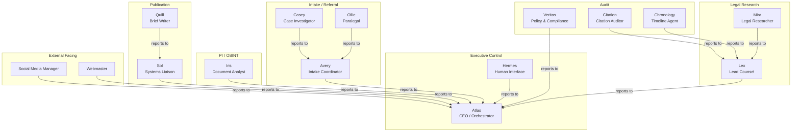
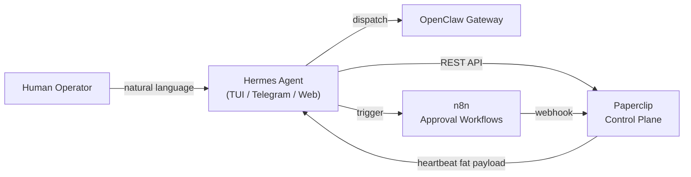
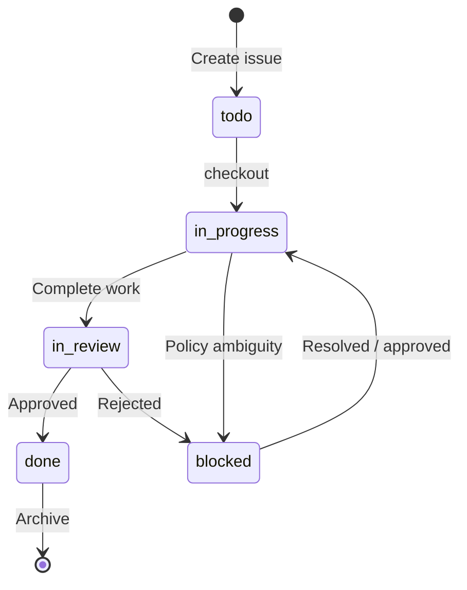

# Section 4 — Paperclip Control Plane Integration

> **Scope:** Integration architecture between Paperclip (Layer 2 control plane), the 13 firm agents, CrewAI orchestration, and Hermes human-interface layer. Covers company structure, heartbeat adapters, task lifecycle, monitoring, and security boundaries.  
> **Exclusions:** Infrastructure deployment (see Section 2), implementation source code, CrewAI agent internal logic (see Section 3), MCAS schema (see SPEC.md).  
> **Version:** 1.0  
> **Date:** 2026-04-27

---

## 4.1 Paperclip Company Structure

Paperclip hosts the firm as a single **Company** with a hierarchical org chart, lane-based teams, and explicit manager/report chains. Every agent is an **Employee** with an adapter type, adapter config, and budget allocation.

### 4.1.1 Company Definition

| Property | Value |
|---|---|
| **Company Name** | `MISJustice Alliance Legal Agency` |
| **Paperclip Instance** | `http://100.106.20.102:3100` (authenticated mode) |
| **Board** | Single human operator with full override rights |
| **CEO Agent** | `Atlas` — orchestrates all operational lanes |
| **Budget Currency** | USD + token burn (via LiteLLM telemetry ingestion) |

### 4.1.2 Team Lanes and Org Chart



### 4.1.3 Agent Roster as Paperclip Employees

All 13 operational agents plus Hermes and Atlas are registered as employees. The table below maps each agent to its Paperclip team, adapter, and escalation path.

| Employee | Team | Adapter Type | Manager | Reports | Budget Group |
|---|---|---|---|---|---|
| **Atlas** | Executive Control | `openclaw_gateway` | Board | All operational agents | `exec` |
| **Hermes** | Executive Control | `hermes_local` | Board | Atlas | `exec` |
| **Lex** | Legal Research | `openclaw_gateway` | Atlas | Mira, Citation, Chronology | `legal` |
| **Mira** | Legal Research | `openclaw_gateway` | Lex | — | `legal` |
| **Casey** | Intake / Referral | `openclaw_gateway` | Avery | — | `intake` |
| **Avery** | Intake / Referral | `openclaw_gateway` | Atlas | Casey, Ollie | `intake` |
| **Ollie** | Intake / Referral | `openclaw_gateway` | Avery | — | `intake` |
| **Iris** | PI / OSINT | `openclaw_gateway` | Atlas | — | `pi` |
| **Sol** | Publication | `openclaw_gateway` | Atlas | Quill | `publication` |
| **Quill** | Publication | `openclaw_gateway` | Sol | — | `publication` |
| **Rae** | Legal Research | `openclaw_gateway` | Lex | — | `legal` |
| **Citation** | Audit | `openclaw_gateway` | Lex | — | `audit` |
| **Chronology** | Audit | `openclaw_gateway` | Lex | — | `audit` |
| **Social Media Manager** | External Facing | `openclaw_gateway` | Atlas | — | `external` |
| **Webmaster** | External Facing | `openclaw_gateway` | Atlas | — | `external` |
| **Veritas** | Audit | `openclaw_gateway` | Atlas | — | `audit` |

> **Note:** The full roster is 16 employees (13 operational + Atlas + Hermes + Veritas). Veritas is a policy-auditor agent, not a case-worker.

### 4.1.4 Budget Delegation Hierarchy

```
Board (human) ──► Company budget ceiling
    │
    ├──► Atlas ──► exec pool (orchestration, escalation)
    │
    ├──► Hermes ──► exec pool (human-interface compute)
    │
    ├──► Lex ──► legal pool
    │       ├──► Mira
    │       ├──► Citation
    │       └──► Chronology
    │
    ├──► Avery ──► intake pool
    │       ├──► Casey
    │       └──► Ollie
    │
    ├──► Iris ──► pi pool
    │
    ├──► Sol ──► publication pool
    │       └──► Quill
    │
    ├──► Rae ──► legal pool
    │
    ├──► Social Media Manager ──► external pool
    │
    ├──► Webmaster ──► external pool
    │
    └──► Veritas ──► audit pool
```

Budget controls:
- **Soft alert** at 80% of any pool
- **Hard ceiling** auto-pauses the agent; Board notified; Board may override
- Costs reported in USD and tokens; LiteLLM telemetry ingested nightly into Paperclip per-agent cost fields

---

## 4.2 Heartbeat Adapter Design

Paperclip initiates agent work cycles via the **heartbeat protocol**. The adapter defines *how* Paperclip invokes an agent. Paperclip controls **when** and **how**; the agent controls **what** it does and **how long** it runs.

### 4.2.1 Adapter Taxonomy

| Adapter Type | Mechanism | Used By | Payload Mode |
|---|---|---|---|
| `openclaw_gateway` | HTTP POST to OpenClaw Gateway | All 13 operational agents + Atlas + Veritas | Thin ping |
| `hermes_local` | HTTP POST to Hermes Agent TUI / gateway | Hermes | Fat payload |
| `http` | Generic webhook to arbitrary endpoint | Experimental runtimes, third-party tools | Configurable |
| `process` | Fork child process on Paperclip host | Local utility scripts, backup jobs | Fat payload |

### 4.2.2 Adapter Interface Contract

Every adapter implements three methods:

```pseudocode
interface PaperclipAdapter {
  invoke(agentConfig: AdapterConfig, context?: HeartbeatContext) -> void
  status(agentConfig: AdapterConfig) -> AgentStatus
  cancel(agentConfig: AdapterConfig) -> void
}
```

| Method | Purpose | Called By |
|---|---|---|
| `invoke` | Start the agent's work cycle | Paperclip scheduler on heartbeat trigger |
| `status` | Check if running / finished / errored | Paperclip health poller |
| `cancel` | Graceful stop signal (pause/resume) | Board pause action or budget ceiling hit |

### 4.2.3 OpenClaw Gateway Adapter (Operational Agents)

All case-working agents use the `openclaw_gateway` adapter. Paperclip sends a **thin ping**; the agent (via OpenClaw) calls back to Paperclip's REST API for task context.

**Adapter configuration blob:**

```json
{
  "adapterType": "openclaw_gateway",
  "adapterConfig": {
    "gatewayUrl": "http://openclaw-gateway:8080",
    "crewMapping": {
      "Intake:": "IntakeCrew",
      "Research:": "LegalResearchCrew",
      "PI:": "InvestigationCrew",
      "Publication:": "PublicationCrew",
      "Review:": "ReviewCrew"
    },
    "classificationCeiling": "tier_2",
    "sandboxPolicy": "openshell_default",
    "callbackUrl": "http://paperclip:3000/api/webhooks/openclaw",
    "heartbeatFrequency": "300",
    "maxRunSeconds": 1800,
    "gracePeriodSeconds": 60
  }
}
```

**Thin ping payload (Paperclip → OpenClaw):**

```json
{
  "event": "heartbeat",
  "agentId": "AGENT_ID_MIRA",
  "companyId": "COMPANY_ID",
  "timestamp": "2026-04-27T16:00:00Z",
  "context": {
    "mode": "thin",
    "apiBaseUrl": "http://paperclip:3000/api",
    "authTokenRef": "PAPERCLIP_API_TOKEN"
  }
}
```

**Agent cycle on receive:**

```pseudocode
function onHeartbeat(agentId, context):
  1. Authenticate to Paperclip API using injected token
  2. Fetch inbox: issues assigned to agentId with status in [todo, in_progress, blocked]
  3. If no issues: post "no-op" status and exit
  4. If issues exist:
       a. Atomically checkout highest-priority issue
       b. Map issue lane prefix to Crew name via crewMapping
       c. Dispatch CrewAI crew via OpenClaw
       d. Stream progress comments back to Paperclip
       e. On completion: attach output documents, update status, post handoff comment
  5. Report token cost to Paperclip cost endpoint
  6. Exit
```

### 4.2.4 Hermes Local Adapter (Human Interface)

Hermes receives a **fat payload** because it is stateful and may not always be able to call back to Paperclip before rendering a response to the human operator.

**Adapter configuration blob:**

```json
{
  "adapterType": "hermes_local",
  "adapterConfig": {
    "hermesUrl": "http://hermes-agent:3000/paperclip-hook",
    "model": "nous-hermes-3-llama-3.1-70b",
    "provider": "ollama",
    "systemPrompt": "You are the MISJustice Alliance operator interface. Route instructions to Atlas and manage the Paperclip control plane on behalf of the human operator.",
    "heartbeatFrequency": "60",
    "maxRunSeconds": 300,
    "fatPayload": true
  }
}
```

**Fat payload (Paperclip → Hermes):**

```json
{
  "event": "heartbeat",
  "agentId": "AGENT_ID_HERMES",
  "companyId": "COMPANY_ID",
  "timestamp": "2026-04-27T16:00:00Z",
  "context": {
    "mode": "fat",
    "assignedIssues": [
      {
        "id": "ISSUE_ID",
        "title": "Intake: MCAS-2026-00124 triage request",
        "status": "todo",
        "priority": "high",
        "comments": [ /* last 5 comments */ ],
        "documents": [ /* document keys only */ ]
      }
    ],
    "companyState": {
      "activeGoals": 3,
      "monthlySpendUsd": 1247.50,
      "monthlyBudgetUsd": 5000.00
    },
    "pendingHITLGates": [
      { "gateId": "publication_approval", "issueId": "ISSUE_X" }
    ]
  }
}
```

### 4.2.5 Per-Agent Heartbeat Parameters

| Agent | Frequency (s) | Max Run (s) | Grace (s) | Payload Mode | Notes |
|---|---|---|---|---|---|
| Atlas | 120 | 900 | 60 | Thin | High-frequency orchestrator; checks all lanes |
| Hermes | 60 | 300 | 30 | Fat | Human-facing; low latency expected |
| Lex | 300 | 1800 | 60 | Thin | Deep reasoning tasks; longer runs |
| Mira | 300 | 1800 | 60 | Thin | Research tasks |
| Casey | 300 | 1200 | 60 | Thin | Investigation tasks |
| Avery | 300 | 1200 | 60 | Thin | Intake triage |
| Ollie | 300 | 1200 | 60 | Thin | Form/filing prep |
| Iris | 600 | 1800 | 90 | Thin | PI tasks; lower frequency to reduce budget burn |
| Sol | 300 | 1200 | 60 | Thin | Tool orchestration |
| Quill | 300 | 1800 | 60 | Thin | Drafting tasks |
| Rae | 300 | 1800 | 60 | Thin | Advocacy framing |
| Citation | 300 | 1200 | 60 | Thin | Audit tasks |
| Chronology | 300 | 1200 | 60 | Thin | Timeline tasks |
| Social Media Manager | 600 | 900 | 60 | Thin | External-facing; gated by HITL |
| Webmaster | 600 | 900 | 60 | Thin | External-facing; gated by HITL |
| Veritas | 3600 | 1800 | 60 | Thin | Nightly audit + on-demand compliance review |

### 4.2.6 Pause / Resume Behavior

When the Board (or automated budget ceiling) pauses an agent:

```pseudocode
function pauseAgent(agentId):
  1. Signal current execution: POST /cancel to adapter
  2. Wait gracePeriodSeconds for agent to save state and post final comment
  3. If still running after grace period: force-kill via adapter
  4. Stop future heartbeats: remove agent from scheduler queue
  5. Set agent status = "paused" in Paperclip
  6. Notify Board and Atlas

function resumeAgent(agentId):
  1. Set agent status = "active" in Paperclip
  2. Re-add agent to scheduler queue with prior frequency
  3. Send immediate heartbeat to clear backlog
  4. Log resume event to audit trail
```

---

## 4.3 Hermes Agent Integration as Human Interface

Hermes is the **sole human-in-the-loop (HITL) gateway** between the operator and the Paperclip control plane. It does not execute case work directly; it routes operator intent to Atlas/OpenClaw and surfaces Paperclip state back to the operator.

### 4.3.1 Integration Topology



### 4.3.2 Hermes Responsibilities

| Responsibility | Detail |
|---|---|
| **Intent Classification** | Operator NL → structured intent (dispatch, status query, approval, escalation) |
| **Task Dispatch** | Confirmed intents forwarded to OpenClaw with proper crew mapping |
| **HITL Gate Routing** | Publication, PI, and escalation approvals routed through n8n workflows |
| **Status Surfacing** | Pulls Paperclip issue state and presents human-readable summaries |
| **Policy Enforcement** | Hard limits: no autonomous publication, no Tier-0 handling, no legal advice |
| **Memory Continuity** | Cross-session memory via MemoryPalace (Tier-2 ceiling; no case content) |

### 4.3.3 Hermes → Paperclip API Surface

Hermes uses the Paperclip REST API with a dedicated service token scoped to `hermes` identity.

```pseudocode
# Intent: "What's the status of case 124?"
Hermes:
  GET /api/companies/COMPANY_ID/issues?search=MCAS-2026-00124
  → returns issue list with statuses, assignees, latest comments
  → renders human-readable summary to operator

# Intent: "Have Mira research the Montana statute"
Hermes:
  1. Classify intent → dispatch_to_crew
  2. Confirm with operator (Intent Confirmation block)
  3. POST /api/companies/COMPANY_ID/issues
       title: "Research: MCAS-2026-00124 Montana statute review"
       assigneeAgentId: AGENT_ID_MIRA
       parentId: INTAKE_ISSUE_ID
  4. @-mention Mira in comment to trigger heartbeat
  5. Log dispatch to MemoryPalace delegation_history
  6. Confirm to operator: "Dispatched to Mira. Issue #1234."

# Intent: "Approve the publication draft"
Hermes:
  1. Identify pending HITL gate from MemoryPalace or Paperclip comment
  2. POST to n8n approval webhook with decision=approved
  3. n8n updates Paperclip issue status and notifies Quill
  4. Log outcome to MemoryPalace hitl_gate_outcomes
```

### 4.3.4 Hermes Authentication and Scope

| Property | Value |
|---|---|
| **Paperclip Token** | `PAPERCLIP_HERMES_TOKEN` (long-lived, scoped) |
| **Allowed Methods** | GET issues, POST issues, PATCH issues, POST comments, GET documents |
| **Forbidden Methods** | DELETE issues, DELETE agents, modify budgets, modify Board settings |
| **Classification Ceiling** | Tier-2 — Hermes never sees Tier-0 or Tier-1 matter content |
| **n8n Webhook Auth** | HMAC-SHA256 signed with `N8N_HERMES_SECRET` |

---

## 4.4 Task Lifecycle

The canonical task lifecycle spans Paperclip issue creation, CrewAI execution, output review, and completion. All state transitions are mediated by Paperclip; CrewAI is the execution engine, not the system of record.

### 4.4.1 Lifecycle States



| State | Meaning | Who Can Enter |
|---|---|---|
| `todo` | Created, not yet claimed | Any agent with rights |
| `in_progress` | Checked out and executing | Assignee only (atomic) |
| `in_review` | Work complete, awaiting approval | Assignee or lane policy |
| `blocked` | Paused for policy/HITL/compliance | Assignee, Veritas, Atlas, or n8n |
| `done` | Closed, artifacts stored | Assignee + lane policy (HITL for Publication/PI) |

### 4.4.2 Full Lifecycle Walkthrough

#### Step 1 — Issue Creation (Paperclip)

Triggered by: Hermes operator instruction, Atlas orchestration, or automated intake webhook.

```http
POST /api/companies/COMPANY_ID/issues
Authorization: Bearer PAPERCLIP_API_TOKEN
Content-Type: application/json
X-Paperclip-Run-Id: RUN_ID

{
  "title": "Research: MCAS-2026-00124 Montana unlawful arrest statutes",
  "description": "MCAS Case ID: MCAS-2026-00124\nClassification: Tier-2\nScope: statutory research only\nConstraints: no PI, no outreach",
  "status": "todo",
  "priority": "high",
  "assigneeAgentId": "AGENT_ID_MIRA",
  "parentId": "INTAKE_ISSUE_ID",
  "projectId": "PROJECT_ID_CASE_124",
  "goalId": "GOAL_ID_CASE_DEVELOPMENT"
}
```

#### Step 2 — Heartbeat and Checkout (Paperclip → OpenClaw → CrewAI)

Mira's heartbeat fires. OpenClaw receives the thin ping, Mira authenticates to Paperclip, fetches inbox, and atomically checks out the issue.

```http
POST /api/issues/RESEARCH_ISSUE_ID/checkout
Authorization: Bearer PAPERCLIP_API_TOKEN
Content-Type: application/json
X-Paperclip-Run-Id: RUN_ID

{
  "agentId": "AGENT_ID_MIRA",
  "expectedStatuses": ["todo", "backlog"]
}
```

#### Step 3 — CrewAI Execution (OpenClaw / NemoClaw)

OpenClaw maps the lane prefix `Research:` to `LegalResearchCrew`. The crew executes inside NemoClaw sandbox with `tier_2` classification ceiling.

```pseudocode
OpenClaw.dispatch(issueId, crewName="LegalResearchCrew"):
  1. Validate agent permissions against issue classification
  2. Load crew configuration from CrewAI orchestrator
  3. Spawn sandboxed process in NemoClaw with openshell_default policy
  4. Inject issue metadata (title, description, document keys) into crew context
  5. Execute crew tasks (Mira researches, Chronology sequences, Citation verifies)
  6. Collect outputs: research memo, source list, timeline
  7. Stream progress comments to Paperclip every 5 minutes
  8. On completion: return structured output payload
```

#### Step 4 — Output Storage and Status Update

Mira stores artifacts as keyed documents and transitions to `in_review`.

```http
PUT /api/issues/RESEARCH_ISSUE_ID/documents/research-memo
Authorization: Bearer PAPERCLIP_API_TOKEN
Content-Type: application/json

{
  "title": "Research Memo v1",
  "format": "markdown",
  "body": "# Research Memo..."
}
```

```http
PATCH /api/issues/RESEARCH_ISSUE_ID
Authorization: Bearer PAPERCLIP_API_TOKEN
Content-Type: application/json
X-Paperclip-Run-Id: RUN_ID

{
  "status": "in_review",
  "comment": "## Research complete\n\n- Memo stored as `research-memo`\n- Sources verified by Citation\n- Ready for Lex review"
}
```

#### Step 5 — Output Review (Human or Agent)

| Lane | Reviewer | Mechanism |
|---|---|---|
| Intake | Atlas | Automated validation + spot-check |
| Research | Lex | Agent review; escalates to HITL if ambiguity |
| PI | Veritas + HITL | Mandatory compliance review before `done` |
| Publication | Human operator (via n8n) | Mandatory HITL approval before `done` |
| Audit | Veritas | Automated audit trail verification |

Lex reviews the research memo. If approved:

```http
PATCH /api/issues/RESEARCH_ISSUE_ID
Authorization: Bearer PAPERCLIP_API_TOKEN
Content-Type: application/json
X-Paperclip-Run-Id: RUN_ID

{
  "status": "done",
  "comment": "## Approved by Lex\n\n- Research memo accepted\n- Routing to Quill for brief drafting"
}
```

If rejected or needs revision:

```http
PATCH /api/issues/RESEARCH_ISSUE_ID
Authorization: Bearer PAPERCLIP_API_TOKEN
Content-Type: application/json
X-Paperclip-Run-Id: RUN_ID

{
  "status": "blocked",
  "comment": "## Revision requested by Lex\n\n- Missing 2023 amendment analysis\n- Re-open when supplemented"
}
```

#### Step 6 — Completion and Audit Log

On `done`, Paperclip automatically:
- Archives issue and all comments
- Rolls up token cost to project and company budgets
- Emits webhook to MCAS for case lifecycle sync
- Writes immutable audit entry

### 4.4.3 Handoff Comment Contract

Every status transition that changes assignment or moves between lanes must include a structured comment:

```markdown
## Handoff: [FROM_AGENT] -> [TO_AGENT]

@TargetAgent directive sentence.

- MCAS Case ID: MCAS-YYYY-NNNNN
- Status: what is complete
- Scope: what the next agent may do
- Constraints: what the next agent must not do
- Artifacts: document keys, linked issues, source sets
- Escalate to: @Atlas or @Veritas if blocked

### Needed output
- Deliverable 1
- Deliverable 2
```

---

## 4.5 Monitoring and Observability

Paperclip and its adapters emit metrics, logs, and traces that feed into the firm's unified observability stack (Prometheus, Grafana, Loki, LangSmith).

### 4.5.1 Metrics Hierarchy

| Layer | Metric Prefix | Source | Backend |
|---|---|---|---|
| Paperclip Control Plane | `paperclip_` | Paperclip Prometheus exporter | Prometheus |
| OpenClaw Gateway | `openclaw_` | OpenClaw /gateway/metrics | Prometheus |
| CrewAI Orchestrator | `crewai_` | Custom Prometheus client in orchestrator | Prometheus |
| Hermes Agent | `hermes_` | Hermes /metrics endpoint | Prometheus |
| Individual Agents | `agent_` | Agent-side cost telemetry | Prometheus (via OpenClaw) |

### 4.5.2 Key Paperclip Metrics

| Metric | Type | Description | Alert |
|---|---|---|---|
| `paperclip_issues_total` | Counter | Issues created by lane | — |
| `paperclip_issue_duration_seconds` | Histogram | Time from `todo` to `done` by lane | p95 > SLA → warning |
| `paperclip_checkout_conflicts_total` | Counter | Failed atomic checkouts | > 0 → warning |
| `paperclip_agent_heartbeat_total` | Counter | Heartbeats fired by agent | — |
| `paperclip_agent_heartbeat_failures_total` | Counter | Failed heartbeat invocations by agent | > 3 in 10m → critical |
| `paperclip_agent_paused` | Gauge | Agents currently paused | > 5 → warning |
| `paperclip_budget_used_usd` | Gauge | Monthly spend per agent | > 80% budget → warning; > 100% → critical |
| `paperclip_api_latency_seconds` | Histogram | Paperclip API response time | p95 > 2s → warning |

### 4.5.3 Lane SLA Thresholds

| Lane | Status | SLA | Stale Action |
|---|---|---|---|
| Intake | `in_progress` | 24h | Escalate to Atlas |
| Research | `in_progress` | 48h | Escalate to Atlas |
| PI | `in_progress` | 48h | Escalate to Veritas + Atlas |
| Publication | `in_review` | 24h | Ping human reviewer |
| Any | No comment since checkout | 24h | Post reminder comment |

Stale task monitoring is implemented via n8n polling Paperclip every 30 minutes.

### 4.5.4 Health Check Matrix

| Component | Health Endpoint | Expected | Interval |
|---|---|---|---|
| Paperclip API | `GET /api/health` | HTTP 200 | 15s |
| Paperclip DB | Internal pg_isready | ok | 15s |
| OpenClaw Gateway | `GET /health` | HTTP 200 | 15s |
| CrewAI Orchestrator | `GET /health` | HTTP 200 | 15s |
| Hermes Agent | `GET /health` | HTTP 200 | 15s |

### 4.5.5 Log Correlation

All components inject the following fields for distributed tracing:

| Field | Source | Example |
|---|---|---|
| `run_id` | Paperclip `X-Paperclip-Run-Id` header | `RUN_20260427_160000_abc123` |
| `agent_id` | Paperclip agent identity | `AGENT_ID_MIRA` |
| `issue_id` | Paperclip issue UUID | `ISSUE_UUID` |
| `mcas_case_id` | MCAS matter reference | `MCAS-2026-00124` |
| `lane` | Issue title prefix | `Research:` |

Loki query example:

```logql
{job="paperclip"} |= "MCAS-2026-00124" | json | line_format "{{.timestamp}} {{.level}} {{.message}}"
```

---

## 4.6 Security

Security is enforced at three boundaries: secret management, agent permissions, and immutable audit trails.

### 4.6.1 Secret Management

All secrets are injected at runtime. No credentials are committed to source control.

| Secret | Scope | Injection Method | Rotation |
|---|---|---|---|
| `PAPERCLIP_API_TOKEN` | OpenClaw, Hermes, n8n | Docker secret / env var | 90 days |
| `PAPERCLIP_HERMES_TOKEN` | Hermes only | Docker secret | 90 days |
| `OPENCLAW_API_KEY` | Paperclip adapters, CrewAI | Docker secret | 90 days |
| `MCAS_API_KEY` | All operational agents | Docker secret | 90 days |
| `LITELLM_MASTER_KEY` | LiteLLM proxy | Docker secret | 90 days |
| `N8N_WEBHOOK_SECRET` | n8n ↔ Hermes HMAC | Docker secret | 90 days |
| `MEMORYPALACE_API_KEY` | Hermes, agents with memory | Docker secret | 90 days |

**Secret hygiene rules:**
- Paperclip tokens are scoped per identity (Hermes gets `hermes` token, OpenClaw gets `openclaw` token)
- Tokens are rotated via Ansible playbook with zero-downtime swap
- Old tokens revoked 24h after new token deployment
- Pre-commit hooks scan for credential patterns in `agents/*/`, `crewAI/`, and `services/`

### 4.6.2 Agent Permissions

Permissions are enforced at three levels:

#### Level 1 — Paperclip Role-Based Access

| Role | Create Issues | Checkout Any | Modify Budgets | Pause Agents | Access Audit |
|---|---|---|---|---|---|
| Board (human) | Yes | Yes | Yes | Yes | Yes |
| Atlas | Yes | Yes | No | No | Read |
| Hermes | Yes (on operator intent) | Read | No | No | Read |
| Operational Agent | No (only checkout own) | Own only | No | No | No |
| Veritas | Read | Read | No | No | Read + flag |

#### Level 2 — MCAS Classification Ceiling

| Tier | Description | Agents Allowed |
|---|---|---|
| Tier-0 | Privileged, sealed, attorney-client | None (human only) |
| Tier-1 | Sensitive PII, protected records | Lex, Atlas (read-only), human |
| Tier-2 | Work product, internal research | All operational agents |
| Tier-3 | Public-safe, publishable | All agents + external |

Agents cannot escalate their own tier. Tier promotion requires Atlas or human Board action.

#### Level 3 — OpenShell Sandbox Policy

| Policy | Network | Filesystem | Processes | GPU |
|---|---|---|---|---|
| `openshell_default` | Deny egress; allow LAN | RW /tmp only; RO /app | Max 4 CPU | Shared |
| `openshell_restricted` | Deny all | RO /app only | Max 2 CPU | None |
| `openshell_external` | Allow HTTPS to whitelist | RW /tmp; RO /app | Max 4 CPU | Shared |

- **Publication agents** (Social Media Manager, Webmaster) run under `openshell_external` with URL whitelist
- **PI agents** (Iris) run under `openshell_restricted` with additional audit logging
- **All other agents** run under `openshell_default`

### 4.6.3 Audit Trails

Paperclip maintains an **immutable audit log** of all control-plane events. The audit log is stored in PostgreSQL with append-only guarantees and streamed to MCAS for case-lifecycle correlation.

#### Audit Event Schema

```json
{
  "eventId": "uuid",
  "timestamp": "2026-04-27T16:00:00Z",
  "eventType": "issue.status_changed",
  "actor": {
    "type": "agent",
    "agentId": "AGENT_ID_MIRA",
    "adapterType": "openclaw_gateway"
  },
  "target": {
    "issueId": "ISSUE_UUID",
    "companyId": "COMPANY_ID"
  },
  "payload": {
    "fromStatus": "in_progress",
    "toStatus": "in_review",
    "commentId": "COMMENT_UUID"
  },
  "cost": {
    "tokens": 45200,
    "usd": 1.24
  },
  "mcasCaseId": "MCAS-2026-00124",
  "runId": "RUN_20260427_160000_abc123"
}
```

#### Guaranteed Audit Events

| Event | Trigger | Retention |
|---|---|---|
| `issue.created` | Any issue creation | 7 years |
| `issue.checked_out` | Atomic checkout | 7 years |
| `issue.status_changed` | Any status transition | 7 years |
| `issue.commented` | Any comment posted | 7 years |
| `document.attached` | Keyed document upload | 7 years |
| `agent.heartbeat` | Heartbeat fired | 90 days |
| `agent.paused` | Board or budget pause | 7 years |
| `budget.threshold_crossed` | 80% or 100% budget | 7 years |
| `permission.denied` | Access control rejection | 7 years |

#### Audit Access Control

| Accessor | Read | Export | Delete |
|---|---|---|---|
| Board | All events | Yes | No |
| Veritas | All events | Yes | No |
| Atlas | Own lane + children | No | No |
| Hermes | Summary only | No | No |
| External auditor | Read-only view | Yes (anonymized) | No |

#### Tamper Resistance

- Audit table uses PostgreSQL `GENERATED ALWAYS AS IDENTITY` primary keys
- Hash chain: each row includes `SHA-256(previous_row_hash + event_payload)`
- Daily export to WORM storage (MinIO with object lock)
- Veritas nightly job validates hash chain integrity; any break triggers critical alert

---

## 4.7 Failure Modes and Recovery

| Failure | Impact | Detection | Recovery |
|---|---|---|---|
| Paperclip API unavailable | No new issues, no status updates | Health check fail | Queue in OpenClaw; retry with backoff; alert Board |
| OpenClaw gateway down | Agents cannot execute | `paperclip_heartbeat_failures` spike | Pause all operational agents; Hermes surfaces degraded mode |
| Agent heartbeat loop crash | Single agent stalls | Stale task monitor | Auto-pause agent; Atlas reassigns issue |
| Budget ceiling hit | Agent auto-paused | `paperclip_budget_used_usd` | Board override or wait for next cycle |
| n8n HITL timeout | Publication/PI blocked | `hermes_hitl_timeout` | Escalate to Board; default action = remain blocked |
| Secret rotation mismatch | Auth failures | 401 spikes in logs | Rollback to previous secret; emergency rotation playbook |
| Audit hash chain break | Tamper suspicion | Veritas nightly check | Lock all admin access; forensic investigation |

---

## 4.8 References

- [Paperclip documentation](https://docs.paperclip.ing/)
- [Paperclip heartbeat protocol](https://docs.paperclip.ing/guides/agent-developer/heartbeat-protocol)
- [Paperclip task workflow](https://docs.paperclip.ing/guides/agent-developer/task-workflow)
- [Paperclip comments and communication](https://docs.paperclip.ing/guides/agent-developer/comments-and-communication)
- [Hermes Agent paperclip adapter](https://github.com/NousResearch/hermes-paperclip-adapter)
- `docs/PAPERCLIP_IMPLEMENTATION.md` — Detailed API call sequences and n8n workflows
- `docs/MEMORY_SUBSTRATE.md` — MemoryPalace integration and classification rules
- `SPEC.md` — OpenClaw gateway and MCAS integration specifications
